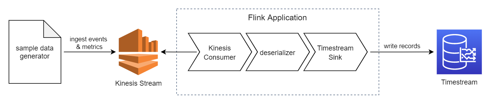

<!-- This sample application is part of the Timestream prerelease documentation. The prerelease documentation is confidential and is provided under the terms of your nondisclosure agreement with Amazon Web Services (AWS) or other agreement governing your receipt of AWS confidential information. -->

# Amazon Timestream Sink for Apache Flink

Write records to Timestream from Flink.

----
## Overview

This is the root directory for samples which show you end-to-end process of working with Kinesis and Timestream.
The directory contains:
 - [sample data generator](/integrations/flink_connector/sample-data-generator) - python script which generates and ingests sample data to Kinesis
 - [sample Kinesis to Timestream Application](/integrations/flink_connector/sample-kinesis-to-timestream-app) - sample Flink application which reads records from Kinesis and uses the Timestream Sink to ingest data to Timestream
 - [Amazon Timestream Flink Sink](/integrations/flink_connector/flink-connector-timestream) - Timestream Flink Sink as Maven module




## Getting Started

### 1. Install prerequisites

 - Java 11 is the recommended version for using Kinesis Data Analytics for Apache Flink Application. If you have multiple Java versions ensure to export Java 11 to your `JAVA_HOME` environment variable.
 - Install [Apache Maven](https://maven.apache.org/install.html). You can test your Apache Maven install with the following command:
```
mvn -version
```

### 2. Setup Environment

Create an Amazon Kinesis Data Stream with the name "TimestreamTestStream". You can use the below AWS CLI command:
```
aws kinesis create-stream --stream-name TimestreamTestStream --shard-count 1
```

### 3 (option A). Run Sample Flink Application locally
1. Compile and run the sample application. The application will create target Timestream database/table upon launch automatically, and will start pooling records from Kinesis and writing them to Timestream:
```
cd ../sample-kinesis-to-timestream-app
mvn clean compile && mvn package
mvn install exec:java -Dexec.mainClass="com.amazonaws.samples.kinesis2timestream.StreamingJob" -Dexec.args="--InputStreamName TimestreamTestStream --Region us-east-1 --TimestreamDbName kdaflink --TimestreamTableName kinesisdata" -Dexec.classpathScope=test
```

2. Follow **Getting Started** section from [sample data generator](/integrations/flink_connector/sample-data-generator) to send records to Kinesis.
3. The records now should be consumed by the sample application and written to Timestream table.
4. Query Timestream table using [AWS Console](https://docs.aws.amazon.com/timestream/latest/developerguide/console_timestream.html#console_timestream.queries.using-console) or AWS CLI:
```
aws timestream-query query --query-string "SELECT * FROM kdaflink.kinesisdata WHERE time >= ago (15m) LIMIT 10"
```

## 3 (option B). Run Sample Flink Application on Amazon Kinesis Data Analytics
1. Compile the sample application:
```shell
cd ../sample-kinesis-to-timestream-app
mvn clean compile && mvn package
```
2. Upload Flink Application Jar file to S3 bucket: 
```shell
cd ../sample-kinesis-to-timestream-app
aws s3 cp target/sample-kinesis-to-timestream-app-0.1-SNAPSHOT.jar s3://YOUR_BUCKET_NAME/sample-kinesis-to-timestream-app-0.1-SNAPSHOT.jar
```
3. In the AWS Console, navigate to [Managed Apache Flink](https://console.aws.amazon.com/flink/home) to create the Apache Flink application
 - Choose `Apache Flink Applications` in the navigation side bar
 - Choose `Create streaming application`
 - pick Apache Flink version 1.18
 - Enter an application name and optional description
 - Choose `Create streaming application`

4. In the `Application details` pane of your new application
 - Choose `IAM role` to add the required permissions to the application role
 - From the IAM Role of your application, choose the `Policy name`
 - From the selected policy, choose `Edit`
 - Append the following permissions to the role policy `Statement`, replacing `<region>` with the region of your deployed application and `<account-id>` with the AWS account ID:

    ```json
        {
          "Effect": "Allow",
          "Action": [
            "timestream:CreateDatabase"
          ],
          "Resource": "arn:aws:timestream:<region>:<account-id>:database/kdaflink"
        },
        {
          "Effect": "Allow",
          "Action": [
            "timestream:WriteRecords",
            "timestream:CreateTable"
          ],
          "Resource": "arn:aws:timestream:<region>:<account-id>:database/kdaflink/table/kinesisdata"
        },
        {
          "Effect": "Allow",
          "Action": [
            "timestream:DescribeEndpoints"
          ],
          "Resource": "*"
        },
        {
          "Effect": "Allow",
          "Action": [
            "kinesis:GetShardIterator",
            "kinesis:GetRecords",
            "kinesis:ListShards"
          ],
          "Resource": "arn:aws:kinesis:<region>:<account-id>:stream/TimestreamTestStream"
        }
    ```

5. From the `Apache Flink applications` page, choose the application you previously created
6. Choose `Configure`
7. Under `Amazon S3 bucket` in `Application Code Location`, choose the S3 bucket that the application was uploaded to in `Step 2`
8. Under `Path to S3 object`, input the path to the application jar file
9. Choose `Save changes`
10. Choose `Run` and choose `Run` again
11. Follow **Getting Started** section from [sample data generator](/integrations/flink_connector/sample-data-generator) to send records to Kinesis.
12. The records now should be consumed by the sample application and written to Timestream table.
13. Query Timestream table using [AWS Console](https://docs.aws.amazon.com/timestream/latest/developerguide/console_timestream.html#console_timestream.queries.using-console) or AWS CLI:
```
aws timestream-query query --query-string "SELECT * FROM kdaflink.kinesisdata WHERE time >= ago (15m) LIMIT 10"
```
