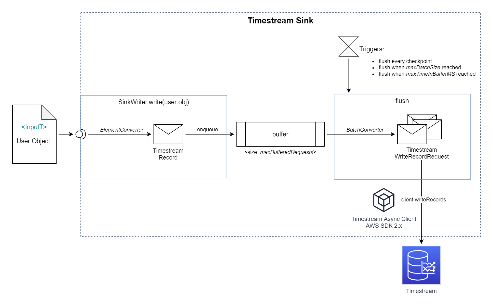

# Amazon Timestream Connector for Apache Flink

This project contains Timestream Sink connector for Apache Flink. The sink will buffer, batch, and write data in parallel to Timestream database.

## Features
* Buffering: buffer records in a fixed size buffer
* Flushing: flush when buffer becomes full or when records become old to guarantee timely records delivery
* Batching: batch multiple records together
* Multithreaded/Parallel: ingest data to Timestream asynchronously
* Conversion: support user defined function to convert user input data to Timestream objects

## Getting Started

This readme focuses on the Timestream Sink design and explains in detail the sink configuration options.

For usage example see [sample-kinesis-to-timestream-app](../sample-kinesis-to-timestream-app). It shows how to read records from Kinesis and write to Timestream using this sink.
 
This directory contains the sink code itself - a reusable component which you can use in your applications, rather than the functional application.

## Using Timestream Sink in a new project

### Install to local Maven repository

First, you need to make Timestream Sink available for other Maven projects. ** Note: this is a necessary step if you want to use the sink in other projects as Maven module.**. Execute the following command in this directory to install the sink to local Maven repository:

```
mvn install
```

### Define Maven dependency

After the Sink is installed locally, you can use it as any other Maven module. Define the Maven dependency on the sink as follows:

```
<dependency>
    <groupId>com.amazonaws.samples.connectors.timestream</groupId>
    <artifactId>flink-connector-timestream</artifactId>
    <version>0.1-SNAPSHOT</version>
</dependency>
```

## Design


(See images folder for drawio file.)

The sink accepts custom user objects. Individual objects are delivered by the Flink to sink `write` method. In this method, _ElementConverter_ provided by the user is used to convert the user object to Timestream Record, after which the Timestream Record is stored in sink buffer.

The buffer holds the elements, until one of the following conditions occur:
1. When a new checkpoint is generated by Flink.
2. When number of elements in buffer reaches _maxBatchSize_
   - configured by _TimestreamSinkConfig_, default 100 - which is the current Timestream limit of max number of records inside each request. Above 100 records you will get rejected record exception.
3. When last flush was more then _maxTimeInBufferMS_ ago, and records in buffer are becoming "old".

The records in buffer then gets converted into a batch by _BatchConverter_ (provided by user) into a TimestreamWriteRequest. The request is written to Timestream using async write client in a separate thread, so it doesn't block arrival of new records to the sink. After the request is completed, the sink checks errors - and if needed - adds failed records back to the buffer (see _Error Handling_ section for details).

### Constructing TimestreamSink

**TimestreamSink** constructor needs the following parameters:
* **elementConverter**: converts custom input type to buffered Timestream Record
* **batchConverter**: converts list of buffered Timestream Records to a TimestreamWriteRequest
* **timestreamConfig**: configuration object containing:
  * **maxBatchSize**:  up to how many records should be buffered by the sink before flushing. If _maxBatchSize_ records will be reached, flush will use _batchConverter_ (specified by the user) to convert the accumulated records to WriteRecordRequest and send the request to Timestream. (default 100)
  * **maxBufferedRequests**:  specifies the buffer size in the sink. If buffer size will be reached, next writes to the sink will be blocked – backpressure will be created on the Flink stream. This parameter must be greater than _maxBatchSize_.  (default 1000)
  * **maxInFlightRequests**: how many asynchronous calls can be made at one time, in parallel, to Timestream. (default 100)
  * **maxTimeInBufferMS**: maximum age in milliseconds of a record in the buffer before it will be flushed. (default 15000)
  * **emitSinkMetricsToCloudWatch**: set to true to emit sink operational metrics to Amazon CloudWatch. See _Metrics_ section for details.
  * **writeClientConfig**: AWS SDK write client configuration, containing the following arguments:  
      * **maxConcurrency**: the Maximum number of allowed concurrent requests in AwsCrtAsyncHttpClient. It's recommended to set it equal to _maxInFlightRequests_.
      * **maxErrorRetry**: the maximum number of times that a single request should be retried, assuming it fails for a retryable error.
      * **region**: the region with which the SDK should communicate with Timestream.
      * **requestTimeout**: configure the amount of time to wait for the http request to complete before giving up and timing out. This value should always be positive, if present.
      * **endpointOverride**: override the default endpoint with which the SDK should communicate with Timestream.
  * **credentialsProviderType**: Enum of choices [AUTO, ENV_VAR, SYS_PROP, PROFILE]. See _Authentication_ section for details.
  * **credentialConfig**: configuration details for alternative authentication.
  * **failureHandlerConfig**: configuration for handling failures:
    * **failureHandlerClass**: failure handler class to use, defaults to _DefaultWriteRequestFailureHandler_. See _Error Handling_ section for details.
    * **printFailedRequests**: Use with caution. Setting this to true will log (including their data) any records for which an exception happened Note this can potentially contain sensitive information from your application. Defaults to false.
    * **failProcessingOnRejectedRecordsException**: failProcessingOnRejectedRecordsException**: Throw exception out of sink and fail processing on RejectedRecordsException from Timestream (for example, "the record timestamp is outside the time range"). Setting this to false will ignore RejectedRecordsExceptions and continue stream processing. Defaults to true, which will keep failing on the error.
    * **failProcessingOnErrorDefault**: Throw exception on any other, non-retryable exception, like AccessDeniedException or ResourceNotFoundException. Defaults to true.

### Error Handling

By default, the sink provides error handler that retries retryable exceptions and handles other exceptions according to the configuration specified by user.

`DefaultWriteRequestFailureHandler` will:
* retry and log the error on retryable exceptions (ThrottlingException, InternalServerException and other AWS SDK retryable exceptions)
* RejectedRecordsException: fail stream processing if configured by `failProcessingOnRejectedRecordsException` parameter in `failureHandlerConfig`
* all other exceptions: fail stream processing if configured by `failProcessingOnErrorDefault` parameter in `failureHandlerConfig`
* not log stack trace for known exceptions (ThrottlingException, InternalServerException, AccessDeniedException, ConflictException, InvalidEndpointException, ResourceNotFoundException, ServiceQuotaExceededException, ValidationException) as it doesn't provide any value.

You can implement your own failure handler by passing your own class name to `TimestreamSinkConfig.FailureHandlerConfig.failureHandlerClass` and implementing `WriteRequestFailureHandler` interface. 

### Authentication
A specific Credentials Provider can optionally be set by using the **credentialsProviderType** and **credentialConfig** setting.

Supported Credential Providers are:

* `AUTO` - Using the default AWS Credentials Provider chain that searches for credentials in the following order: ENV_VARS, SYS_PROPS, WEB_IDENTITY_TOKEN, PROFILE and EC2/ECS credentials provider.
* `ENV_VAR` - Using AWS_ACCESS_KEY_ID & AWS_SECRET_ACCESS_KEY environment variables.
* `SYS_PROP` - Using Java system properties aws.accessKeyId and aws.secretKey.
* `PROFILE` - Use AWS credentials profile file to create the AWS credentials.


### Fault tolerance

TimestreamSink provides at least once guarantee due to the underlying Sink model's buffering, checkpoint and retry mechanisms. Timestream will not throw an exception for duplicated record as long as time, dimensions and measure values are the same. Therefore, the **elementConverter** and **batchConverter** classes provided by user must be idempotent - given the same set of input objects, they should produce the same result, no matter when/how many times they are invoked.

### Metrics

On top of [the default Flink provided metrics](https://nightlies.apache.org/flink/flink-docs-release-1.13/docs/ops/metrics/#system-metrics), the sink provides the following metrics:
* `millisTimeBetweenFlushes`: number of milliseconds between each consecutive flushes
* `inFlightRequests`: number of uncompleted calls with Async Timestream write client
* `currentSendTime`: total time to send the timestream write request
* `numBytesOut`: total number of bytes that have been written - calculated as sum of individual Record sizes, without taking into account CommonAttributes optimizations
* `bufferedRecords`: number of records in sink buffer
* `numRecordsOut`: number of records that have been written
* `numWritesSuccess`: number of successful write records
* `numOfCommonAttributesDimensionsPerWriteRecordRequest`: number of dimensions in common attributes per Timestream write
* `numOfRecordsPerWriteRecordRequest`: number of records written per Timestream write
* `numOfMeasuresPerWriteRecordRequest`: number of measures values per single Timestream write
* `numWritesNonSDKRetries`: number of retries of Timestream writes, despite the retires in AWS SDK
* `numRecordsDrop`: number of dropped records. Those records won't be inserted to Timestream
* `numRecordsSuccess`: number of successfully written records
* `numOfUNKNOWN`, `numOfThrottlingException`, `numOfInternalServerException`, `numOfValidationException`, `numOfInvalidEndpointException`, `numOfAccessDeniedException`, `numOfConflictException`, `numOfResourceNotFoundException`, `numOfRejectedRecordsException`, `numOfServiceQuotaExceededException`: number of given exceptions occurred during execution

You can export those metrics to Amazon CloudWatch when running the Flink Sink on Amazon Kinesis Data Analytics by setting **emitSinkMetricsToCloudWatch** configuration option to true.
This option adds "kinesisanalytics" to the sink MetricGroups, and therefore metrics are be exported as custom CloudWatch metrics, according to [KDA - Custom Metrics](https://docs.aws.amazon.com/kinesisanalytics/latest/java/monitoring-metrics-custom.html#monitoring-metrics-custom-howitworks).
Check [KDA - Metrics and Dimensions](https://docs.aws.amazon.com/kinesisanalytics/latest/java/metrics-dimensions.html) to see other metrics - and metrics levels - available in KDA/CloudWatch.
  
## Testing

Compile the code with:
```
mvn clean compile
```

Run tests:
```
mvn test
```


## Troubleshooting

### Error NullPointerException from AsyncResponseHandler.onError

If you see the following error in the logs:
```
{
    "locationInformation": "software.amazon.awssdk.utils.FunctionalUtils.runAndLogError(FunctionalUtils.java:42)",
    "logger": "software.amazon.awssdk.core.internal.handler.BaseAsyncClientHandler",
    "message": "Error thrown from TransformingAsyncResponseHandler#onError, ignoring.",
    "throwableInformation": "java.lang.NullPointerException
        at software.amazon.awssdk.core.internal.http.async.AsyncResponseHandler.onError(AsyncResponseHandler.java:76) 
        at software.amazon.awssdk.core.internal.http.async.CombinedResponseAsyncHttpResponseHandler.onError(CombinedResponseAsyncHttpResponseHandler.java:71) 
        at software.amazon.awssdk.core.internal.handler.BaseAsyncClientHandler.lambda$doExecute$5(BaseAsyncClientHandler.java:237) 
        at software.amazon.awssdk.utils.FunctionalUtils.runAndLogError(FunctionalUtils.java:40) 
        at software.amazon.awssdk.core.internal.handler.BaseAsyncClientHandler.doExecute(BaseAsyncClientHandler.java:234) 
        at software.amazon.awssdk.core.internal.handler.BaseAsyncClientHandler.lambda$execute$1(BaseAsyncClientHandler.java:82) 
        at software.amazon.awssdk.core.internal.handler.BaseAsyncClientHandler.measureApiCallSuccess(BaseAsyncClientHandler.java:282) 
        at software.amazon.awssdk.core.internal.handler.BaseAsyncClientHandler.execute(BaseAsyncClientHandler.java:75) 
        at software.amazon.awssdk.awscore.client.handler.AwsAsyncClientHandler.execute(AwsAsyncClientHandler.java:52) 
        at software.amazon.awssdk.services.timestreamwrite.DefaultTimestreamWriteAsyncClient.writeRecords(DefaultTimestreamWriteAsyncClient.java:1721) 
        ...",
    "threadName": "...",
    "applicationARN": "...",
    "applicationVersionId": "...",
    "messageSchemaVersion": "...",
    "messageType": "ERROR"
}
```

This error is a [bug in Java AWS SDK v2](https://github.com/aws/aws-sdk-java-v2/issues/1812). This error should be infrequent (less than few times per day when processing streams with 200MB/s throughput). The error will be automatically retried and **numOfUNKNOWNEXCEPTION** metric will be increased.

### Errors from software.amazon.awssdk.http.crt.internal.*

If you see any of the following error in the logs:

```
{
    "locationInformation": "software.amazon.awssdk.utils.Logger.error(Logger.java:75)",
    "logger": "software.amazon.awssdk.http.crt.internal.AwsCrtAsyncHttpStreamAdapter",
    "message": "Response Encountered an Error.",
    "throwableInformation": "software.amazon.awssdk.crt.http.HttpException: System call failure
        at software.amazon.awssdk.http.crt.internal.AwsCrtAsyncHttpStreamAdapter.onResponseComplete(AwsCrtAsyncHttpStreamAdapter.java:116) 
        at software.amazon.awssdk.crt.http.HttpStreamResponseHandlerNativeAdapter.onResponseComplete(HttpStreamResponseHandlerNativeAdapter.java:33)",
    "threadName": "...",
    "applicationARN": "...",
    "applicationVersionId": "...",
    "messageSchemaVersion": "...",
    "messageType": "ERROR"
}
```

```
{
    "locationInformation": "software.amazon.awssdk.utils.Logger.error(Logger.java:75)",
    "logger": "software.amazon.awssdk.http.crt.internal.AwsCrtResponseBodyPublisher",
    "message": "Error processing Response Body",
    "throwableInformation": "software.amazon.awssdk.crt.http.HttpException: System call failure
        at software.amazon.awssdk.http.crt.internal.AwsCrtAsyncHttpStreamAdapter.onResponseComplete(AwsCrtAsyncHttpStreamAdapter.java:116) 
        at software.amazon.awssdk.crt.http.HttpStreamResponseHandlerNativeAdapter.onResponseComplete(HttpStreamResponseHandlerNativeAdapter.java:33)",
    "threadName": "...",
    "applicationARN": "...",
    "applicationVersionId": "...",
    "messageSchemaVersion": "...",
    "messageType": "ERROR"
}
```

```
{
    "locationInformation": "software.amazon.awssdk.utils.Logger.error(Logger.java:64)",
    "logger": "software.amazon.awssdk.http.crt.internal.AwsCrtResponseBodyPublisher",
    "message": "Error before ResponseBodyPublisher could complete: System call failure",
    "threadName": "...",
    "applicationARN": "...",
    "applicationVersionId": "...",
    "messageSchemaVersion": "...",
    "messageType": "ERROR"
}
```

```
{
    "locationInformation": "software.amazon.awssdk.utils.Logger.error(Logger.java:75)",
    "logger": "software.amazon.awssdk.http.crt.internal.AwsCrtResponseBodyPublisher",
    "message": "Error processing Response Body",
    "throwableInformation": "software.amazon.awssdk.crt.http.HttpException: socket operation timed out.
        at software.amazon.awssdk.http.crt.internal.AwsCrtAsyncHttpStreamAdapter.onResponseComplete(AwsCrtAsyncHttpStreamAdapter.java:116)
        at software.amazon.awssdk.crt.http.HttpStreamResponseHandlerNativeAdapter.onResponseComplete(HttpStreamResponseHandlerNativeAdapter.java:33)",
    "threadName": "...",
    "applicationARN": "...",
    "applicationVersionId": "...",
    "messageSchemaVersion": "...",
    "messageType": "ERROR"
}
```

```
{
    "locationInformation": "software.amazon.awssdk.utils.Logger.error(Logger.java:64)",
    "logger": "software.amazon.awssdk.http.crt.internal.AwsCrtResponseBodyPublisher",
    "message": "Error before ResponseBodyPublisher could complete: socket operation timed out.",
    "threadName": "...",
    "applicationARN": "...",
    "applicationVersionId": "...",
    "messageSchemaVersion": "...",
    "messageType": "ERROR"
}
```

```
{
    "locationInformation": "software.amazon.awssdk.utils.Logger.error(Logger.java:75)",
    "logger": "software.amazon.awssdk.http.crt.internal.AwsCrtResponseBodyPublisher",
    "message": "Error processing Response Body",
    "throwableInformation": "software.amazon.awssdk.crt.http.HttpException: The connection has closed or is closing.
        at software.amazon.awssdk.http.crt.internal.AwsCrtAsyncHttpStreamAdapter.onResponseComplete(AwsCrtAsyncHttpStreamAdapter.java:116)
        at software.amazon.awssdk.crt.http.HttpStreamResponseHandlerNativeAdapter.onResponseComplete(HttpStreamResponseHandlerNativeAdapter.java:33)",
    "threadName": "...",
    "applicationARN": "...",
    "applicationVersionId": "...",
    "messageSchemaVersion": "...",
    "messageType": "ERROR"
}
```

Verify your network connectivity to Timestream. Those errors can occur infrequently when processing "big" Kinesis streams. All of those errors will be either automatically retried by AWS SDK, or retried by Timestream Sink. In the latter case, **numOfUNKNOWNEXCEPTION** metric will be increased, and you will see the following message in logs:

```
Retryable 'SdkClientException' occurred while inserting to Timestream. Records insertion will be retried.
```