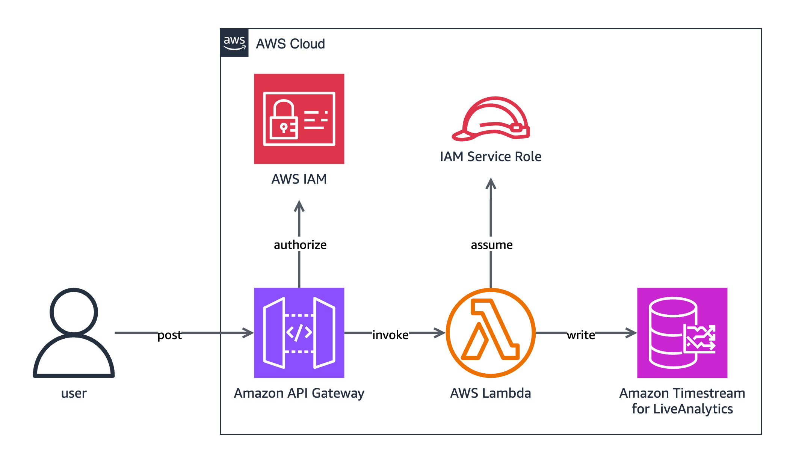

# InfluxDB Timestream Connector

## Overview

The InfluxDB Timestream connector allows [line protocol](https://docs.influxdata.com/influxdb/v2/reference/syntax/line-protocol/) to be ingested to [Amazon Timestream for LiveAnalytics](https://aws.amazon.com/timestream/). The connector parses ingested line protocol and maps the data to multi-measure records for ingestion into Timestream for LiveAnalytics using the [Timestream Write API](https://docs.aws.amazon.com/timestream/latest/developerguide/API_Operations_Amazon_Timestream_Write.html).

### Architecture

The following diagram shows a high-level overview of the connector's architecture when deployed as an [AWS Lambda](https://aws.amazon.com/lambda/) function.



## Table Mapping

### Single-Table Multi-Measure

The following table shows how the connector maps line protocol elements to Timestream for LiveAnalytics record attributes when table mapping is set to single table.

| Line Protocol Element | Timestream Record Attribute |
|-----------------------|-----------------------------|
| Timestamp             | Time                        |
| Tags                  | Dimensions                  |
| Fields                | Measures                    |
| Measurements          | Measure names               |

Single table mapping ingests all line protocol points ingested through the InfluxDB Timestream Connector to the table defined with the `single_table_name` environment variable. The `measure_name` in each Timestream record is derived from the line protocol measurement.

The following example shows the translation of two line protocol points into a Timestream for LiveAnalytics table, using Timestamps with second precision and a `single_table_name` Lambda environment variable configured to `influxdb-measures`:

#### Line Protocol Points

```
cpu_load_short,host=server01,region=us-west value=0.64,average=1.24 1725059274
weather,location=us-midwest,season=summer temperature=82.0,humidity=71.0 1706480990
```

#### Resulting influxdb-measures Timestream for LiveAnalytics Table

| host     | region  | location   | season | measure_name     | time                          | value | average | temperature | humidity |
|----------|---------|------------|--------|------------------|-------------------------------|-------|---------|-------------|----------|
| server01 | us-west |            |        | cpu_load_short   | 2024-08-30 23:07:54.000000000 | 0.64  | 1.24    |             |          |
|          |         | us-midwest | summer | weather          | 2024-01-22 26:07:33.000000000 |       |         | 82.0        | 71.0     |


### Multi-Table Multi-Measure

The following table shows how the connector maps line protocol elements to Timestream for LiveAnalytics record attributes.

| Line Protocol Element | Timestream Record Attribute |
|-----------------------|-----------------------------|
| Timestamp             | Time                        |
| Tags                  | Dimensions                  |
| Fields                | Measures                    |
| Measurements          | Table names                 |

A Timestream record's `measure_name` field is not derived from any element of ingested line protocol. Due to the multi-measure record translation, the connector sets the `measure_name` for each multi-measure record to the value of a Lambda environment variable. When [deployed as part of a CloudFormation stack](#aws-cloudformation-deployment), this can be customized by overriding the `MeasureNameForMultiMeasureRecords` parameter. When [deployed locally](#local-deployment), this can be customized by setting the `measure_name_for_multi_measure_records` environment variable.

The following example shows the translation of two line protocol points into two Timestream for LiveAnalytics tables, using Timestamps with second precision and a Lambda environment variable configured to `influxdb-measure`:

#### Line Protocol Points

```
cpu_load_short,host=server01,region=us-west value=0.64,average=1.24 1725059274
weather,location=us-midwest,season=summer temperature=82.0,humidity=71.0 1706480990
```

#### Resulting cpu_load_short Timestream for LiveAnalytics Table

| host     | region  | measure_name     | time                          | value | average |
|----------|---------|------------------|-------------------------------|-------|---------|
| server01 | us-west | influxdb-measure | 2024-08-30 23:07:54.000000000 | 0.64  | 1.24    |

#### Resulting weather Timestream for LiveAnalytics Table

| location   | season  | measure_name     | time                          | temperature | humidity |
|------------|---------|------------------|-------------------------------|-------------|----------|
| us-midwest | summer  | influxdb-measure | 2024-01-22 26:0733.000000000  | 82.0        | 71.0     |

## Deployment Options

### AWS CloudFormation Deployment

The InfluxDB Timestream connector can be deployed within an AWS CloudFormation stack as an AWS Lambda function with an accompanying Amazon REST API Gateway. The API Gateway mimics the InfluxDB v2 API and provides the `/api/v2/write` endpoint for ingestion.

#### Deploying a CloudFormation Stack Using SAM CLI

The stack can be deployed using the [AWS SAM CLI](https://docs.aws.amazon.com/serverless-application-model/latest/developerguide/using-sam-cli.html), [Cargo Lambda](https://www.cargo-lambda.info/) to package the code, and `template.yml`.

##### Stack Parameters

The following parameters are available when deploying the connector as part of a CloudFormation stack. An example of setting these parameters is included in step 4 of the [SAM deployment steps](#sam-deployment-steps).

| Parameter     | Description | Default Value |
|---------------|-------------|---------------|
| `CustomPartitionKeyDimension` |  The dimension to use as the partition key. This parameter is required if the CustomPartitionKeyType parameter is set to `dimension`. | |
| `CustomPartitionKeyType` | The type of custom partition key to use. Valid options are `dimension` or `measure`. The `dimension` option requires the CustomPartitionKeyDimension parameter to also be set. If this parameter is not provided, newly-created tables will use default partitioning and none of the parameters relating to custom partition keys will be used. | |
| `DatabaseName`  | The name of the database to use for ingestion. | `influxdb-line-protocol` |
| `EnableDatabaseCreation` | Whether to allow database creation upon ingestion of records. | `true` |
| `EnableTableCreation` | Whether to allow table creation upon ingestion of records. When using multi-table multi measure schema, each unique line protocol measurement in a request will result in the creation of a new table with the same name as the measurement. | `true` |
| `EnableMagStoreWrites` | if `EnableTableCreation` is `true`, whether to enable mag store writes. | `true` |
| `EnforceCustomPartitionKey` | Whether to only allow the ingestion of records that contain the custom partition key. Valid options are `true` or `false`. | |
| `LambdaMemorySize` | The size of the memory in MB allocated per invocation of the function. | `128` |
| `LambdaName` | The name to use for the Lambda function. | `influxdb-timestream-connector-lambda` |
| `LambdaTimeoutInSeconds` | The number of seconds to run the Lambda function before timing out. | `30` |
| `MagStoreRetentionPeriod` | If `EnableTableCreation` is `true`, the number of days in which data must be stored in the magnetic store. | `8000` |
| `MemStoreRetentionPeriod` | If `EnableTableCreation` is `true`, the number of hours in which data must be stored in the memory store. | `12` |
| `MeasureNameForMultiMeasureRecords` | The value to use in records as the `measure_name`, as shown in the [example line protocol to Timestream records translation](#resulting-cpu_load_short-timestream-for-liveanalytics-table). | `influxdb-measure` |
| `RestApiGatewayName` | The name to use for the REST API Gateway. | `InfluxDB-Timestream-Connector-REST-API-Gateway` |
| `RestApiGatewayStageName` | The name to use for the REST API Gateway stage. | `dev` |
| `RestApiGatewayTimeoutInMillis` | The maximum number of milliseconds a REST API Gateway event will wait before timing out. | `30000` |
| `RustLog` | The log level to use for the Lambda function. Typical values are error, warn, info, debug, trace, and off. Use trace in order to log the execution time of each function. | `INFO` |
| `SingleTableName` | Determines the table name for ingestion when table mapping is type single-table. | `influxdb-measures` |
| `TableMapping` | Determines whether to ingest all records to a single table or to multiple tables. | `multi-table` |
| `WriteThrottlingBurstLimit` | The number of burst requests per second that the REST API Gateway permits. | `1200` |

##### SAM Deployment Steps

1. [Download and install the AWS SAM CLI](https://docs.aws.amazon.com/serverless-application-model/latest/developerguide/install-sam-cli.html).
2. [Download and install Rust](https://www.rust-lang.org/tools/install).
3. [Download and install Cargo Lambda](https://www.cargo-lambda.info/guide/installation.html).
4. Run the following command to package the binary in `target/lambda/influxdb-timestream-connector/bootstrap.zip`, where `template.yml` expects it to be, and cross compile for Linux ARM:
    ```
    cargo lambda build --release --arm64 --output-format zip
    ```
5. Run the following command, replacing `<region>` with the AWS region you want to deploy in and providing parameter overrides as desired. Note that this example command uses the provided `samconfig.toml` file and by default sets the name of the stack to `InfluxDBTimestreamConnector`.

    ```shell
    sam deploy template.yml \
        --region <region> \
        --parameter-overrides \
            ParameterKey1=ParameterValue1 \
            ParameterKey2=ParameterValue2
    ```
6. Once the stack has finished deploying, take note of the output `Endpoint` value. This value will be used as the endpoint for all write requests and is analogous to an [InfluxDB host address](https://docs.influxdata.com/influxdb/v2/reference/urls/) and is used in the same way, for example, `<endpoint>/api/v2/write`.

#### Lambda Dead Letter Queue

If the connector was deployed with async invocation, then all client requests will be returned a response with a `202` status code, indicating that the request has been received and is being processed. If the request fails, the client will not be notified. Instead, failed requests will either be [logged by the REST API Gateway](#viewing-rest-api-gateway-logs) or be added to the Lambda's dead letter queue, where the failed request can be reviewed in full. The name of the dead letter queue is provided as the `LambdaDeadLetterQueueName` output when deploying the stack.

To access the Lambda's dead letter queue and view any possible stored messages:

1. Take note of the dead letter queue's name as provided by the `LambdaDeadLetterQueueName` output upon successful stack deployment.
2. Visit the [Amazon SQS console](https://console.aws.amazon.com/sqs/v3/home).
3. In the navigation pane, choose **Queues**.
4. Find and select the SQS queue with the same name as indicated by `LambdaDeadLetterQueueName`.
5. Choose **Send and receive messages**.
6. Choose **Poll for messages**.

#### Stack Logs

##### Viewing REST API Gateway Logs

By default, access logging is enabled for the REST API Gateway.

To view logs:

1. Visit the [AWS CloudFormation console](https://console.aws.amazon.com/cloudformation/home).
2. In the navigation pane, choose **Stacks**.
3. Choose your deployed stack from the list of stacks.
4. In the **Resources** tab choose the **Physical ID** of the `RestApiGatewayLogGroup` resource.

##### Viewing Lambda Logs

By default, logging is enabled for the deployed connector.

To view logs:

1. Visit the [AWS CloudFormation console](https://console.aws.amazon.com/cloudformation/home).
2. In the navigation pane, choose **Stacks**.
3. Choose your deployed stack from the list of stacks.
4. In the **Resources** tab choose the **Physical ID** of the Lambda function.
5. In the **Monitor** tab, choose **View CloudWatch logs**.

### Local Deployment

The connector can be run locally using [Cargo Lambda](https://www.cargo-lambda.info/guide/what-is-cargo-lambda.html).

1. [Download and install Rust](https://www.rust-lang.org/tools/install).
2. [Configure your AWS credentials for use by the AWS SDK for Rust](https://docs.aws.amazon.com/sdkref/latest/guide/creds-config-files.html).
3. [Download and install Cargo Lambda](https://www.cargo-lambda.info/guide/installation.html).
4. Configure the following environment variables:
    - `region` string: the AWS region to use. Defaults to `us-east-1`.
    - `database_name` string: the Timestream for LiveAnalytics database name to use. Defaults to `influxdb-line-protocol`.
    - `measure_name_for_multi_measure_records` string: the value to use in records as the measure name. Defaults to `influxdb-measure`.
    - `table_mapping` string: determines whether to ingest all data to a single table or multiple tables.
    - `single_table_name` string: when table mapping is set to `single-table`, this value determines the table name.
    - `enable_database_creation` bool: whether to create a database if the `database_name` database does not already exist in Timestream for LiveAnalytics. Defaults to `true`.
    - `enable_table_creation` bool: whether to create new tables if they don't already exist. Defaults to `true`.
        - `enable_mag_store_writes` bool: if `enable_table_creation` is `true`, whether to enable mag store writes. Defaults to `true`.
        - `mag_store_retention_period` int: if `enable_table_creation` is `true`, the number of days in which data must be stored in the magnetic store. Defaults to `8000`.
        - `mem_store_retention_period` int: if `enable_table_creation` is `true`, the number of hours in which data must be stored in the memory store. Defaults to `12`.
5. To run the connector on `http://localhost:9000` execute the following command:

    ```shell
    cargo lambda watch
    ```
6. Send all requests to `http://localhost:9000/api/v2/write`.

## Custom Partition Keys

When the environment variable `enable_table_creation` is `true` and records are ingested using multi-table multi measure ingestion, [custom partition keys](https://aws.amazon.com/blogs/database/introducing-customer-defined-partition-keys-for-amazon-timestream-optimizing-query-performance/) can be defined for the newly-created tables.

To define a custom partition key, set the environment variable `custom_partition_key_type` to either `dimension` or `measure`.

When `custom_partition_key_type` is set to `measure`, the measure will be used to partition the table. No additional environment variables are necessary.

When `custom_partition_key_type` is set to `dimension`, the environment variables `custom_partition_key_dimension` and `enforce_custom_partition_key` must also be defined. `custom_partition_key_dimension` specifies the dimension in which you want to use to partition your table while `enforce_custom_partition_key` determines whether all ingested records **must** contain the custom partition key.

> **NOTE**: Once a partition key has been configured for a table, it cannot be changed or removed.

### Custom Partition Key Examples

#### Local Environment

The following example shows how a custom partition key can be configured for a local environment:

```shell
# Environment variable values are case-sensitive
export custom_partition_key_type=dimension;

# One of the tag keys in the example bird migration dataset
export custom_partition_key_dimension=id;
export enforce_custom_partition_key=false;

# Run the connector locally
cargo lambda watch;
```

#### Deployed Environment

The following example shows how a custom partition key can be configured when deploying the connector as part of a CloudFormation stack:

```shell
sam deploy template.yml \
    --region <region> \
    --stack-name <stack name> \
    --resolve-s3 \
    --capabilities CAPABILITY_IAM \
    --parameter-overrides \
        CustomPartitionKeyType=dimension \
        CustomPartitionKeyDimension=id \
        EnforceCustomPartitionKey=false
```

## Security

### Encryption

When the connector is deployed as part of a CloudFormation stack, the stack's API Gateway ensures all communication is protected by TLS 1.2+.

### Authentication

The REST API Gateway ensures all requests are authenticated with SigV4. Any InfluxDB user tokens or credentials are discarded. This authentication method cannot be correlated to IAM authorization.

## IAM Permissions

The following permissions are the least-privilege permissions for deploying and executing the connector. These permissions assume the stack is named `InfluxDBTimestreamConnector` and that the REST API Gateway is named `InfluxDB-Timestream-Connector-REST-API-Gateway`.

### IAM Deployment Permissions

The following is the least-privilege IAM permissions for deploying the connector.

Replace all items listed below in the IAM policy with values from your AWS account:

- *{region}* &mdash; The AWS region where the InfluxDB Timestream Connector is deployed.
- *{account-id}* &mdash; The AWS account ID used to deploy the connector.

```json
{
    "Version": "2012-10-17",
    "Statement": [
        {
            "Effect": "Allow",
            "Action": [
                "apigateway:PATCH"
            ],
            "Resource": "arn:aws:apigateway:{region}::/account"
        },
        {
            "Effect": "Allow",
            "Action": [
                "apigateway:POST",
                "apigateway:GET"
            ],
            "Resource": [
                "arn:aws:apigateway:{region}::/usageplans",
                "arn:aws:apigateway:{region}::/usageplans/*"
            ]
        },
        {
            "Effect": "Allow",
            "Action": [
                "sqs:CreateQueue",
                "sqs:GetQueueAttributes"
            ],
            "Resource": "arn:aws:sqs:{region}:{account-id}:InfluxDBTimestreamConnector-LambdaDeadLetterQueue-*"
        },
        {
            "Effect": "Allow",
            "Action": [
                "logs:CreateLogGroup",
                "logs:PutRetentionPolicy"
            ],
            "Resource": "arn:aws:logs:{region}:{account-id}:log-group:/aws/apigateway/InfluxDBTimestreamConnector-InfluxDB-Timestream-Connector-REST-API-Gateway*:*"
        },
        {
            "Effect": "Allow",
            "Action": [
                "logs:DescribeLogGroups"
            ],
            "Resource": "arn:aws:logs:{region}:{account-id}:log-group::log-stream:"
        },
        {
            "Effect": "Allow",
            "Action": [
                "apigateway:POST",
                "apigateway:GET",
                "apigateway:PUT",
                "apigateway:PATCH"
            ],
            "Resource": [
                "arn:aws:apigateway:{region}::/restapis/*",
                "arn:aws:apigateway:{region}::/restapis",
                "arn:aws:apigateway:{region}::/tags/*"
            ]
        },
        {
            "Effect": "Allow",
            "Action": [
                "s3:GetObject",
                "s3:GetBucketPolicy",
                "s3:GetBucketLocation",
                "s3:PutObject",
                "s3:PutBucketPolicy",
                "s3:PutBucketTagging",
                "s3:PutEncryptionConfiguration",
                "s3:PutBucketVersioning",
                "s3:PutBucketPublicAccessBlock",
                "s3:CreateBucket",
                "s3:DescribeJob",
                "s3:ListAllMyBuckets"
            ],
            "Resource": [
                "arn:aws:s3:::aws-sam-cli-managed-default*"
            ]
        },
        {
            "Effect": "Allow",
            "Action": [
                "cloudformation:CreateChangeSet",
                "cloudformation:DescribeStacks",
                "cloudformation:DescribeStackEvents",
                "cloudformation:DescribeChangeSet",
                "cloudformation:ExecuteChangeSet",
                "cloudformation:CreateStack"
            ],
            "Resource": [
                "arn:aws:cloudformation:{region}:{account-id}:stack/InfluxDBTimestreamConnector/*",
                "arn:aws:cloudformation:{region}:{account-id}:stack/aws-sam-cli-managed-default/*",
                "arn:aws:cloudformation:{region}:aws:transform/Serverless-2016-10-31"
            ]
        },
        {
            "Effect": "Allow",
            "Action": [
                "iam:CreateRole",
                "iam:AttachRolePolicy",
                "iam:UpdateAssumeRolePolicy",
                "iam:PassRole",
                "iam:PutRolePolicy",
                "iam:GetRole"
            ],
            "Resource": [
                "arn:aws:iam::{account-id}:role/InfluxDBTimestreamConnector-RestApiGatewayLogsRole-*",
                "arn:aws:iam::{account-id}:role/InfluxDBTimestreamConnector-LambdaExecutionRole-*"
            ]
        },
        {
            "Effect": "Allow",
            "Action": [
                "lambda:CreateFunction",
                "lambda:UpdateFunctionCode",
                "lambda:GetFunction",
                "lambda:UpdateFunctionConfiguration",
                "lambda:GetFunctionConfiguration",
                "lambda:CreateFunctionUrlConfig",
                "lambda:TagResource",
                "lambda:AddPermission",
                "lambda:PutFunctionEventInvokeConfig"
            ],
            "Resource": "arn:aws:lambda:{region}:{account-id}:function:InfluxDBTimestreamConnector-LambdaFunction-*"
        },
    ]
}
```

### IAM Execution Permissions

The following are the least privileged IAM permissions required for invoking the deployed InfluxDB Timestream connector REST API Gateway.

Replace all items listed below in the IAM policy with values from your AWS account:

- *{region}* &mdash; The AWS region where the InfluxDB Timestream Connector is deployed.
- *{account-id}* &mdash; The AWS account ID used to deploy the connector.
- *{api-id}* &mdash; The API ID for the deployed REST API Gateway.
- *{api-stage-name}* &mdash; The stage name for the deployed REST API Gateway.


```json
{
    "Version": "2012-10-17",
    "Statement": [
        {
            "Effect": "Allow",
            "Action": "execute-api:Invoke",
            "Resource": "arn:aws:execute-api:{region}:{account-id}:{api-id}/{api-stage-name}/POST/api/v2/write"
        }
    ]
}
```

### IAM Lambda Permissions

The following are the IAM permissions required for the InfluxDB Timestream Connector Lambda function to ingest data into Timestream for LiveAnalytics. This IAM policy is attached to the Lambda function when deployed with the CloudFormation template. Additional policies are also attached for logging and DLQ functionalities. For the complete list of IAM permissions attached to the Lambda function, see the [template.yml](./template.yml).

All items listed below in the IAM policy are associated to the equivalent values from your AWS account:

- *{region}* &mdash; The AWS region where the InfluxDB Timestream Connector is deployed.
- *{account-id}* &mdash; The AWS account ID used to deploy the connector.

```json
{
    "Version": "2012-10-17",
    "Statement": [
        {
            "Effect": "Allow",
            "Action": [
                "timestream:WriteRecords",
                "timestream:Select",
                "timestream:DescribeTable",
                "timestream:CreateTable"
            ],
            "Resource": "arn:aws:timestream:{region}:{account-id}:database/influxdb-line-protocol/table/*"
        },
        {
            "Effect": "Allow",
            "Action": [
                "timestream:DescribeEndpoints"
            ],
            "Resource": "*"
        },
        {
            "Effect": "Allow",
            "Action": [
                "timestream:DescribeDatabase",
                "timestream:CreateDatabase"
            ],
            "Resource": "arn:aws:timestream:{region}:{account-id}:database/influxdb-line-protocol"
        }
    ]
}
```

## Example Application with Go Client

A demo Go client application is available under `sample-code/aws-timestream/sample-influxdb-clients/go/line-protocol-client-demo.go` that sends line protocol data to a local or deployed instance of the connector. A line protocol sample dataset is included in `sample-code/aws-timestream/sample-influxdb-clients/data/bird-migration.line`, which the demo application uses for ingestion.

To configure the sample application and ingest all line protocol data contained in `bird-migration.line` to Timestream for LiveAnalytics, perform the following steps:

1. [Download and install Go](https://go.dev/doc/install).
2. [Configure your AWS credentials for use by the AWS SDK for Rust](https://docs.aws.amazon.com/sdkref/latest/guide/creds-config-files.html).
3. [Deploy the Timestream Line Protocol connector locally](#local-deployment).
4. Navigate to `sample-code/aws-timestream/sample-influxdb-clients/go/`.
5. Run the sample Go client:
    - With the connector deployed in a CloudFormation stack, replacing `<region>` with the AWS region you deployed your stack in and `<endpoint>` with the endpoint of your deployed REST API Gateway:
        ```shell
        go run line-protocol-client-demo.go \
            --region <region> \
            --service execute-api \
            --endpoint <endpoint>
        ```
    - With the connector deployed locally:
        ```shell
        go run line-protocol-client-demo.go
        ```
6. Run the following [AWS CLI](https://aws.amazon.com/cli/) command to verify data has been ingested to Timestream for LiveAnalytics, replacing `<region>` with the region you used for ingesting data:
    ```shell
    aws timestream-query query \
        --region <region> \
        --query-string 'SELECT * FROM "influxdb-line-protocol"."migration1" LIMIT 10'
    ```

## Troubleshooting

### Amazon Timestream Write API Errors

| Error | Status Code | Description | Solution |
|-------|-------------|-------------|----------|
| `AccessDeniedException` | 400 | You are not authorized to perform this action. | Verify that your user has the [correct permissions](#iam-permissions). |
| `InternalServerException` | 500 | Timestream was unable to fully process this request because of an internal server error. | Try ingesting records at another time. |
| `RejectedRecordsException` | 400 | The records sent to Timestream were invalid. | Check the [line protocol limitations](#line-protocol-limitations) and [caveats](#caveats) and ensure your line protocol points abide by expected formatting.
| `ResourceNotFoundException` | 400 | The operation tried to access a nonexistent resource. The resource might not be specified correctly, or its status might not be ACTIVE. | Verify that your database exists in Timestream for LiveAnalytics. Consider setting `enable_database_creation` to `true` to allow the connector to create the database for you. |
| `ServiceQuotaExceededException` | 400 | The instance quota of resource exceeded for this account. | Confirm you are not exceeding Timestream for LiveAnalytics' quotas. If you are not exceeding any quotas, check the list of [line protocol limitations](#line-protocol-limitations) below, specifically the number of unique measurement names. |
| `ThrottlingException` | 400 | Too many requests were made by a user and they exceeded the service quotas. The request was throttled. | Decrease the rate of your requests. |

## Testing

### Requirements

1. [Configure your AWS credentials for use by the AWS SDK for Rust](https://docs.aws.amazon.com/sdkref/latest/guide/creds-config-files.html).
2. Ensure your IAM permissions include the permissions listed in the [IAM Execution Permissions](#iam-execution-permissions) section.

### All Tests

To run all tests, including integration tests and unit tests, use the following command:

```shell
cargo test -- --test-threads=1
```

### Integration Tests

To run all integration tests, use the following command, from the project root:

```shell
cargo test --test '*' -- --test-threads=1
```

> **NOTE**: It is important to use the flag `--test-threads=1` in order to avoid throttling errors, as the integration tests will create and delete tables.

To run a specific integration test, use the following command:

```shell
cargo test <integration test name>
```

### Unit Tests

To run all unit tests, use the following command:

```shell
cargo test --lib
```

To run a single unit test, use the following command:

```shell
cargo test <unit test name>
```

## Limitations

### Line Protocol Limitations

Due to the connector translating line protocol to Timestream records, line protocol must satisfy [Timestream for LiveAnalytics' quotas](https://docs.aws.amazon.com/timestream/latest/developerguide/ts-limits.html).

| Line Protocol Component | Limitation |
|-------------------------|------------|
| Maximum size of a line protocol point, with `measure_name` included. | 2 Kilobytes |
| Number of unique tag keys per table. | 128 |
| Maximum tag key size. | 60 bytes |
| Maximum measurement name size. | 256 bytes |
| Maximum unique measurement names per database (using multi-table multi-measure schema). | 50,000 |
| Maximum field key size. | 256 bytes |
| Maximum number of fields per point. | 256 |
| Maximum field value size. | 2048 bytes |
| Maximum unique field key values. | 1024 |
| Latest valid timestamp. | Fifteen minutes in the future from the current time. |
| Oldest valid timestamp. | `mag_store_retention_period` days before the current time. |

### Database and Table Creation Delay

There is a delay of one second added before deleting or creating a table or database. This is because of Timestream for LiveAnalytics' "Throttle rate for CRUD APIs" [quota](https://docs.aws.amazon.com/timestream/latest/developerguide/ts-limits.html#limits.default) of one table/database deletion/creation per second.

## Logging

Logging levels for the connector can be configured using the `RUST_LOG` [Rust environment variable](https://docs.rs/env_logger/latest/env_logger/#enabling-logging). By default, the logging level the connector uses is `INFO`.

The `TRACE` logging level displays execution time for each function in the connector.

### Enabling Trace Logging for Local Deployment

The following command will run the connector with its logging level set to `TRACE` and output function durations to a file:

```shell
cargo lambda watch \
    --env-var RUST_LOG=TRACE 2>&1 | \
    tee /dev/tty | \
    grep --line-buffered "TRACE.*influxdb_timestream_connector" > function_duration.log
```

### Enabling Trace Logging for CloudFormation Deployment

The parameter `RustLog` allows configuration of the `RUST_LOG` environment variable for the Lambda function.

## Troubleshooting

### Cargo Lambda Build Error "can't find crate for core"

This error can happen when running `cargo lambda build` on macOS. This error may include the message "the `aarch64-unknown-linux-gnu` target may not be installed."

#### Solution

This error can happen on macOS when Rust is installed with `brew`.

Remove `brew`'s version of Rust:

```shell
brew uninstall rust
```

Install Rust by following the installation instructions on its [official site](https://www.rust-lang.org/tools/install).

### Table Already Exists Error

Error in full: ConflictException: Timestream was unable to process this request because it contains resource that already exists.

When using multi-table multi measure schema and ingesting line protocol data in parallel with measurements that do not yet have corresponding tables in Timestream for LiveAnalytics, a ConflictException can occur. This happens when two or more concurrent Lambda function instances attempt to create a new table.

#### Solution

1. Consider creating the tables before ingestion, using each unique measurement in the line protocol data as the table names.
2. Re-ingest failed requests. Failed requests will be stored in the Lambda's dead letter queue.

### Stack Cost

The following is an overview of how the costs are calculated for each deployed resource in the CloudFormation stack, at the time of writing (Oct. 21, 2024). These calculations are based on the calculations used by the [AWS pricing calculator](https://calculator.aws/#/). Refer to the AWS pricing calculator for a more accurate estimate:

- Lambda (without free tier):
    - number of monthly requests x average request duration x 0.001 ms to sec conversion factor = total compute in seconds.
    - memory usage in GB x total compute in seconds = total compute GB-s.
    - total compute GB-s x 0.0000133334 USD = tiered price.
    - number of monthly requests x 0.0000002 USD = monthly request charges.
    - tiered price + monthly request charges = Lambda monthly cost.
- REST API Gateway:
    - number of monthly requests x 0.0000035 USD = REST API Gateway monthly cost.
- CloudWatch:
    - logs data ingested in GB per month x 0.50 USD = logs data ingested cost per month.
    - logs data ingested in GB per month x 0.15 Storage compression factor x 1 Logs retention factor x 0.03 USD = standard/vended logs data storage cost.
    - logs data ingested cost + standard/vended logs data storage cost = CloudWatch monthly cost.

#### Solution

The following are some approaches that can reduce stack costs:

- The REST API Gateway incurs the highest costs for the stack. Reduce REST API Gateway costs by including as many line protocol points in a request as possible. 5,000-20,000 line protocol points in each request is ideal. The Lambda memory size, Lambda timeout, REST API Gateway timeout, and client timeout may have to be increased in order to accommodate larger requests.
    - NOTE: if requests contain only a single line protocol point, the ratio of REST API Gateway requests to ingested records would be 1:1 and costs would be much higher than including multiple line protocol points in each request.
- If possible, create the necessary tables in advance, to reduce the time the connector will take to create tables. The connector adds a one second delay for table or database creation in order to avoid throttling.
- Reduce the amount of memory the connector uses as a Lambda function. The default, and smallest possible value, is 128 MB.
- Set the `EnableDatabaseCreation` or `EnableTableCreation` parameter to `false` to skip checks for existing databases or tables, if unnecessary.

## Caveats

### Line Protocol Tag Requirement

In order to ingest to Timestream for LiveAnalytics, every line protocol point must include at least one tag.

### Query String Parameters

The connector expects query string parameters to be included as `queryParameters` or `queryStringParameters` in requests.

### Lack of Local Gzip Support

The connector, when deployed as part of a CloudFormation stack, supports requests sent with Content-Type and Accept-Encoding headers set to `gzip`. However, when run locally with either Cargo Lambda or the SAM CLI, gzip compression is not supported.
