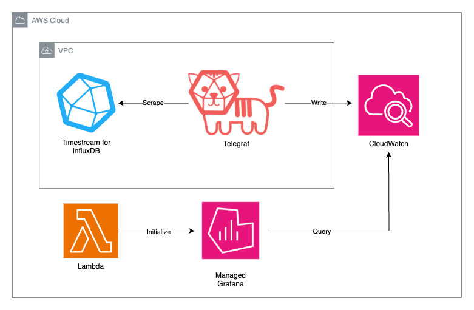
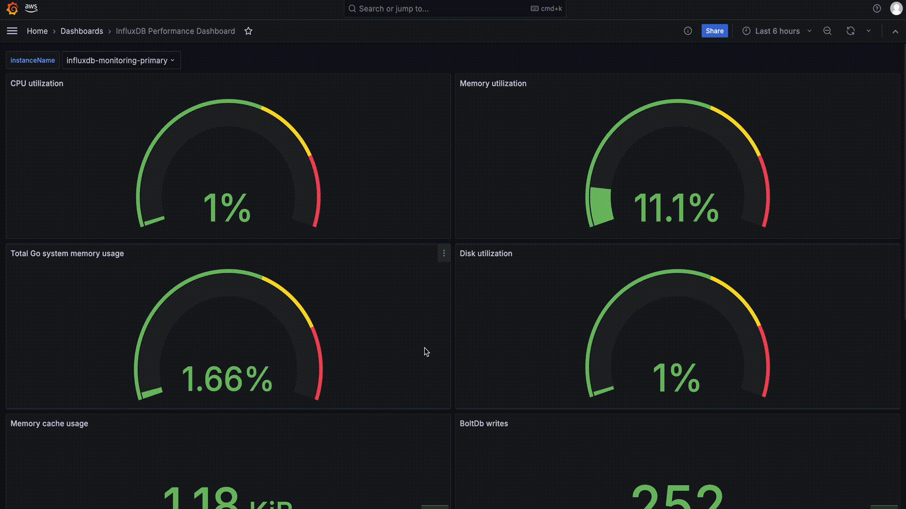

# InfluxDB Metrics Dashboard

## Overview

The InfluxDB Metrics Dashboard creates a Grafana dashboard to visualize existing Timestream for InfluxDB instance performance metrics. The application deploys an EC2 instance running Telegraf to scrape the `/metrics` endpoint of one or more Timestream for InfluxDB instances in a VPC, and ingests the scraped metrics to CloudWatch. After the CloudFormation stack has been deployed, a Lambda function creates a Grafana workspace, and uploads the performance metrics dashboard. The Lambda function is run only once during CDK app initialization and uploads the JSON configuration for your Grafana dashboard.



## Demo



## Configuration

### Prerequisites

  1. If not already installed, install the AWS CDK CLI using the [Getting started with the AWS CDK](https://docs.aws.amazon.com/cdk/v2/guide/getting_started.html) guide.
  2. If you don't already have a database instance, create a new Timestream for InfluxDB instance with the [Getting started with Timestream for InfluxDB](https://docs.aws.amazon.com/timestream/latest/developerguide/timestream-for-influx-getting-started.html) guide.

### Context options

The following context options are required when deploying the CDK application:

  1. **InfluxDBIds**: The comma separated list of Id(s) and InfluxDB 3 token(s) if applicable. If using InfluxDB 2, use the format `"instance1Id,instance2Id"`, and when using InfluxDB 3, use the format `"instance1Id:instance1Token,instance2Id:instance2Token"`
  2. **InfluxDBVersion**: The version of InfluxDB instances; supported values include `2` and `3`.

The following context options are optional when deploying the CDK application:

  1. **GrafanaWorkspaceName**: The name used for the Grafana workspace. The context defaults to `InfluxDBMetricDashboardWorkspace`.
  2. **DashboardName**: The name used for the Grafana dashboard. The context defaults to `InfluxDB Performance Dashboard`.
  3. **TelegrafSshCidr**: The CIDR IP address used in a rule to allow SSH access to the EC2 instance running Telegraf. If the context is not used when deploying the application, no SSH rule will be added to the EC2 instance security group.
  4. **EnableHighResolutionMetrics**: Set to `true` to ingest metrics to CloudWatch with an interval of every 10 seconds. The default ingestion rate is set to 1 minute when this context is not enabled.
  5. **TelegrafEc2Tags**: List of tags to apply to the EC2 instance running Telegraf in the format `"key1:val1,key2:val2"`.
  6. **GrafanaWorkspaceTags**: List of tags to apply to the Grafana workspace in the format `"key1:val1,key2:val2"`.

## Getting started

To deploy the InfluxDB Metrics Dashboard application, use the following CDK commands, and populate all required context options in the deploy command:

**note**: To deploy the stack in another region other than the default configured in your `~/.aws/credentials` file, set the environment variable `AWS_REGION` to the target deployment region.

  1. Provision AWS environment with the following command (bootstrapping only needs to be done once per account per region):
      ```shell
      cdk bootstrap --context InfluxDBIds="{influxdb_ids}"
      ```
  2. Deploy the application with the following command:
      ```shell
      cdk deploy --context InfluxDBIds="{influxdb_ids}"
      ```

## Deploy the CloudFormation stack

### Configure your AWS permissions

The following IAM policy is the least privilege policy required for deploying the InfluxDB Metrics Dashboard. Ensure your IAM user deploying the stack has the correct permissions required for deploying the InfluxDB Metrics Dashboard.

Replace the following values in the IAM policy with values from your AWS account:

- *{region}*: The AWS Region where you will deploy the CloudFormation stack.
- *{account-id}*: The AWS account ID that you're using to deploy the CloudFormation stack.
- *{stack-name}*: The CloudFormation stack name which if not changed by setting the context on deployment, defaults to "InfluxDBMetricsDashboard".

```json
{
	"Version": "2012-10-17",
	"Statement": [
		{
			"Effect": "Allow",
			"Action": "timestream-influxdb:GetDbInstance",
			"Resource": [
				"arn:aws:timestream-influxdb:{region}:{account-id}:db-instance/*"
			]
		},
		{
			"Effect": "Allow",
			"Action": "ec2:DescribeSubnets",
			"Resource": "*"
		},
		{
			"Effect": "Allow",
			"Action": [
				"cloudformation:GetTemplate",
				"cloudformation:CreateChangeSet",
				"cloudformation:DescribeChangeSet",
				"cloudformation:DeleteChangeSet",
				"cloudformation:ExecuteChangeSet",
				"cloudformation:DescribeStacks",
				"cloudformation:DescribeStackEvents",
				"cloudformation:DeleteStack"
			],
			"Resource": [
				"arn:aws:cloudformation:{region}:{account-id}:stack/CDKToolkit/*",
				"arn:aws:cloudformation:{region}:{account-id}:stack/{stack-name}/*"
			]
		},
		{
			"Effect": "Allow",
			"Action": [
				"ecr:SetRepositoryPolicy",
				"ecr:PutLifecyclePolicy",
				"ecr:PutImageTagMutability",
				"ecr:DescribeRepositories",
				"ecr:ListTagsForResource",
				"ecr:GetLifecyclePolicy",
				"ecr:CreateRepository",
				"ecr:DeleteRepository"
			],
			"Resource": [
				"arn:aws:ecr:{region}:{account-id}:repository/*"
			]
		},
		{
			"Effect": "Allow",
			"Action": [
				"iam:GetRole",
				"iam:TagRole",
				"iam:CreateRole",
				"iam:DeleteRole",
				"iam:DeleteRolePolicy",
				"iam:DetachRolePolicy",
				"iam:AttachRolePolicy",
				"iam:PutRolePolicy",
				"iam:GetRolePolicy",
				"iam:PassRole"
			],
			"Resource": [
				"arn:aws:iam::{account-id}:role/cdk*"
			]
		},
		{
			"Effect": "Allow",
			"Action": [
				"s3:CreateBucket",
				"s3:PutEncryptionConfiguration",
				"s3:PutLifecycleConfiguration",
				"s3:PutBucketVersioning",
				"s3:PutBucketPublicAccessBlock",
				"s3:DeleteBucketPolicy",
				"s3:PutBucketPolicy",
				"s3:PutObject",
				"s3:GetObject",
				"s3:GetBucketLocation",
				"s3:ListBucket"
			],
			"Resource": [
				"arn:aws:s3:::cdk-*-assets-{account-id}-{region}",
				"arn:aws:s3:::cdk-*-assets-{account-id}-{region}/*"
			]
		},
		{
			"Effect": "Allow",
			"Action": [
				"ssm:PutParameter",
				"ssm:DeleteParameter",
				"ssm:GetParameters",
				"ssm:GetParameter"
			],
			"Resource": "arn:aws:ssm:{region}:{account-id}:parameter/cdk-bootstrap/*"
		}
	]
}
```

## Viewing the dashboard

### Creating a new IAM Identity user

If you do not have an AWS IAM Identity user, complete the following steps to create a new user:

  1. Go to the [IAM Identity Center console](https://console.aws.amazon.com/singlesignon/home).
  2. In the navigation pane, choose **Users**.
  3. Choose **Add user**.
  4. Input user details.
  5. Choose **Next**.
  6. Add the user to a group if you wish.
  7. Choose **Next**.
  8. Choose **Add user**.

### Adding IAM Identity User to Workspace

Now that the dashboard has been deployed, you will need to add your AWS IAM Identity for the Grafana workspace. Complete the following steps in the AWS console to add your user:

  1. Go to the [Amazon Managed Grafana console](https://console.aws.amazon.com/grafana/home).
  2. In the navigation pane, choose **All workspaces**.
  3. From the list of workspaces, choose the workspace named `InfluxDBMetricDashboardWorkspace`. If you altered the context for the workspace name during deployment, choose the altered workspace name.
  4. in the **Authentication** tab, under **AWS IAM Identity Center (successor to AWS SSO)** choose **Assign new user or group**.
  5. From the list of users, select the user you want to give access to the dashboard, and choose **Assign users and groups**.

### Viewing the dashboard

With your AWS IAM Identify user added to the InfluxDB Metrics Dashboard workspace you can now view the dashboard.

  1. Go to the [Amazon Managed Grafana console](https://console.aws.amazon.com/grafana/home).
  2. Choose the **Grafana workspace URL**.
  3. Sign in with the **AWS IAM Identity Center** user you assigned as a viewer for the dashboard.
  4. Choose **Dashboards** in the left navigation pane.
  5. Choose the dashboard named **InfluxDB Performance Dashboard**, or alternative name if you altered the context when deploying the application.
  6. You should now be able to view a dashboard showcasing the metrics for your Timestream for InfluxDB instance.
  7. Select the instance name under **instanceName** to display the panels for the Timestream for InfluxDB instance.

### Dashboard variables

The InfluxDB Metrics Dashboard exposes variables for InfluxDB sizing specifications found on the [developer guide](https://docs.aws.amazon.com/timestream/latest/developerguide/timestream-for-influxdb.html#timestream-for-influx-dbi-classt-hw). The variable names and values used with the Infinity data source in the Grafana dashboard are as follows:

| Instance size (Not a variable) | instanceCpu | instanceMemory | instanceNetwork | instanceSeries | instanceLineWrites | instanceQueries |
|--|--|--|--|--|--|--|
| db.influx.medium    | 1   | 8589934592   | 1250000000 | 10000      | 5000      | 5  |
| db.influx.large     | 2   | 17179869184  | 1250000000 | 100000     | 50000     | 10 |
| db.influx.xlarge    | 4   | 34359738368  | 1250000000 | 1000000    | 150000    | 25 |
| db.influx.2xlarge   | 8   | 68719476736  | 1250000000 | 5000000    | 250000    | 35 |
| db.influx.4xlarge   | 16  | 137438953472 | 1500000000 | 7500000    | 500000    | 50 |
| db.influx.8xlarge   | 32  | 274877906944 | 2500000000 | 10000000   | 750000    | 55 |
| db.influx.16xlarge  | 64  | 549755813888 | 3125000000 | 10000000   | 1000000   | 60 |
| db.influx.24xlarge  | 96  | 824633720832 | 5000000000 | 12000000   | 1200000   | 65 |

Use these variables in math expressions or transformations to customize the panels with any of the metrics that are scraped from the [InfluxDB OSS metrics endpoint](https://docs.influxdata.com/influxdb/v2/reference/internals/metrics/). For an example of how to use variables in math expressions, you can view the math expressions in the "Bucket cardinality" or "Total Go system memory usage" panels.

## Limitations

The InfluxDB Metrics Dashboard only supports counter and gauge types scraped from the `/metrics` endpoint of an InfluxDB instance. This functionality is due to CloudWatch not providing support for histogram types and potentially creating large amounts of metrics if we create histograms for high cardinality datasets.

## Cleanup

To cleanup AWS resources created by the application during deployment, execute the following command:

```shell
cdk destroy --context InfluxDBIds="{influxdb_ids}"
```
