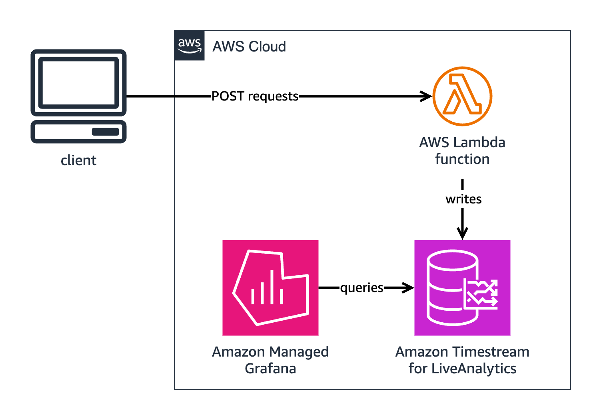

# Timestream for LiveAnalytics Lambda Sample Application

## Overview

This sample application demonstrates how [time series data](https://docs.aws.amazon.com/timestream/latest/developerguide/concepts.html) can be ingested into [Timestream for LiveAnalytics](https://docs.aws.amazon.com/timestream/latest/developerguide/what-is-timestream.html) using an [AWS Lambda function](https://aws.amazon.com/lambda/) and [`boto3`](https://boto3.amazonaws.com/v1/documentation/api/latest/index.html).

This sample application is comprised of three files:
- `demo.ipynb`: A [Jupyter notebook](https://jupyter.org/) that:
    - Generates simulated time series data from a selection of predefined scenarios or a user-defined scenario.
    - Deploys a Lambda function that receives the data and ingests the data into Timestream for LiveAnalytics.
    - Sends the generated time series data to the Lambda's URL using SigV4 authentication.
- `dashboard.json`: A Grafana dashboard, configured to view all data ingested into the Timestream for LiveAnalytics database in the last hour.
- `requirements.txt`: A file containing required packages for the Jupyter notebook, for quick environment setup.

The following diagram depicts the deployed Lambda function receiving generated data and ingesting the data to Timestream for LiveAnalytics that then is queried and displayed in [Amazon Managed Grafana](https://aws.amazon.com/grafana/).



## Prerequisites

1. [Configure AWS credentials for use with boto3](https://boto3.amazonaws.com/v1/documentation/api/latest/guide/configuration.html).
2. [Install Conda](https://docs.conda.io/projects/conda/en/latest/user-guide/install/index.html).
3. On Linux and macOS, run the following command to enable `conda`, replacing `<shell>` with your shell, whether that be `zsh`, `bash`, or `fish`:
    ```shell
    conda init <shell>
    ```
4. On Linux and macOS, restart your shell or `source` your shell configuration file (`.zshrc`, `.bashrc`, etc.).
5. Initialize a Conda environment named `sample_app_env` with the required packages by running:
    ```shell
    conda env create -f environment.yml
    ```
6. Activate the environment by running:
    ```shell
    conda activate sample_app_env
    ```
7. Install an application to run the `demo.ipynb` file. We recommend [Visual Studio Code](https://code.visualstudio.com/) with the [Jupyter extension](https://marketplace.visualstudio.com/items?itemName=ms-toolsai.jupyter).

## Using the Jupyter Notebook Locally

These steps assume you have followed the prerequisites and are using Visual Studio Code with the Jupyter extension.

To run the notebook locally:

1. After configuring the Conda environment, open `demo.ipynb` in Visual Studio Code.
2. Click the search bar and from the dropdown menu select **Show and Run Commands**.
3. Search for "Python: Select Interpreter".
4. Select the Python "sample_app_env" environment from the dropdown menu.
5. Scroll through the steps of the Jupyter notebook. Adjust values in the "Define Timestream for LiveAnalytics Settings" and "Generate Data" sections to your desire. Default values have been set for all steps.
6. Once the kernel is running, press the **Run All** button.
7. When all cells in the notebook have finished executing, records will have been ingested to the `sample_app_table` table in the `sample_app_database` database in Timestream for LiveAnalytics.

## Using the Jupyter Notebook in Amazon SageMaker

### IAM Configuration

When deployed in Amazon SageMaker, the instance hosting the Jupyter notebook must use an IAM role with the following permissions, replacing `<region>` with your desired AWS region name and `<account ID>` with your AWS account ID:

```json
{
    "Version": "2012-10-17",
    "Statement": [
        {
            "Effect": "Allow",
            "Action": [
                "lambda:GetFunction",
                "lambda:GetFunctionUrlConfig",
                "lambda:InvokeFunctionUrl",
                "lambda:UpdateFunctionUrlConfig",
                "lambda:CreateFunction",
                "lambda:CreateFunctionUrlConfig",
                "lambda:AddPermission"
            ],
            "Resource": "arn:aws:lambda:<region>:<account ID>:function:TimestreamSampleLambda"
        },
        {
            "Effect": "Allow",
            "Action": [
                "iam:CreateRole",
                "iam:GetRole",
                "iam:GetRolePolicy",
                "iam:CreatePolicy",
                "iam:CreatePolicyVersion",
                "iam:UpdateAssumeRolePolicy",
                "iam:GetPolicy",
                "iam:AttachRolePolicy",
                "iam:AttachGroupPolicy",
                "iam:PutRolePolicy",
                "iam:PutGroupPolicy",
                "iam:PassRole"
            ],
            "Resource": [
                "arn:aws:iam::<account ID>:role/TimestreamLambdaRole",
                "arn:aws:iam::<account ID>:role/GrafanaWorkspaceRole"
            ]
        },
        {
            "Effect": "Allow",
            "Action": [
                "sso:DescribeRegisteredRegions",
                "sso:CreateManagedApplicationInstance"
            ],
            "Resource": "*"
        },
        {
            "Effect": "Allow",
            "Action": [
                "grafana:DescribeWorkspace",
                "grafana:CreateWorkspace",
                "grafana:ListWorkspaces",
                "grafana:CreateWorkspaceServiceAccount",
                "grafana:CreateWorkspaceServiceAccountToken",
                "grafana:DeleteWorkspaceServiceAccountToken",
                "grafana:DescribeWorkspaceConfiguration",
                "grafana:UpdateWorkspaceConfiguration",
                "grafana:ListWorkspaceServiceAccounts",
                "grafana:ListWorkspaceServiceAccountTokens"
            ],
            "Resource": "arn:aws:grafana:<region>>:<account ID>:/workspaces*"
        }
    ]
}
```

The Lambda function name `TimestreamSampleLambda` and the role name `TimestreamLambdaRole` are the default names used in the Jupyter notebook.

### SageMaker Configuration

To host the Jupyter notebook in SageMaker and run the notebook:

1. Go to the Amazon SageMaker console.
2. In the navigation panel, choose **Notebooks**.
3. Choose **Create notebook instance**.
4. For IAM role, select the role created in the above [**IAM Configuration**](#iam-configuration) section.
5. After configuring the rest of the notebook settings to your liking, choose **Create notebook instance**.
6. Once the notebook's status is **InService**, choose the notebook's **Open Jupyter** link.
7. Choose **Upload** and select `demo.ipynb`.
8. Choose the uploaded notebook.
9. In the **Kernel not found** popup window, select `conda_python3` form the dropdown menu and choose **Set Kernel**.
10. Once the kernel has started, choose **Kernel** > **Restart & Run All**.
11. When all cells in the notebook have finished executing, records will have been ingested to the `sample_app_table` table in the `sample_app_database` database in Timestream for LiveAnalytics.

## Viewing Data in Amazon Managed Grafana

The notebook will create an Amazon Managed Grafana workspace and create a dashboard.

Before accessing the dashboard, an IAM Identity Center user must be created and added to the workspace manually. The last two steps of the notebook provide instructions for how to do this and access the dashboard. The "Generate and Upload Grafana Dashboard" cell will output the login url for the workspace.
