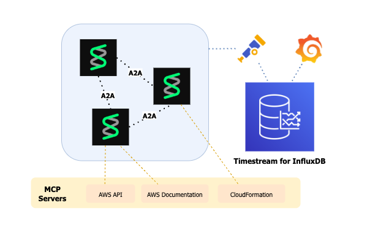
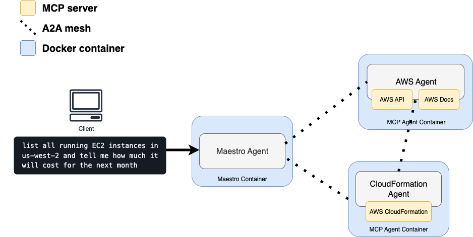
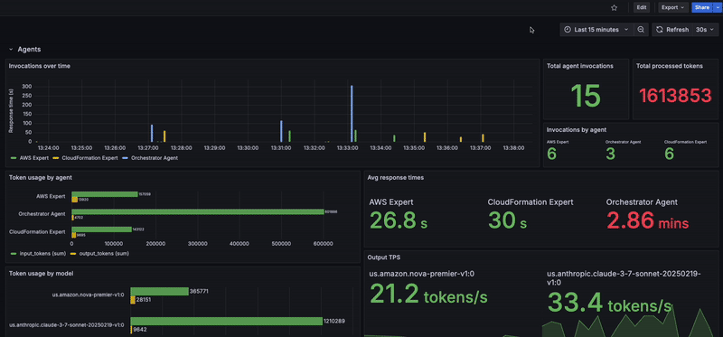

# Multi‑Agent Observability with Strands Agents and Timestream for InfluxDB

This project demonstrates how to build and observe a distributed, multi-agent system using Amazon foundation models and industry-standard telemetry tools. Purpose-built **Strands agents** can draw on official AWS documentation through the **Model-Context Protocol (MCP)** and communicate via **agent-to-agent (A2A)** protocols to solve complex tasks end-to-end.

To deliver operational excellence and measurable performance, each agent emits structured telemetry metrics via **OpenTelemetry**, which is exported to **Timestream for InfluxDB** for scalable, time-series storage. A preconfigured **Grafana** dashboard surfaces invocation metrics, tool usage, token efficiency, and latency trends in real time.

> **Why Observability Matters**  
> In distributed AI systems, **visibility into agent behavior is critical**. Time-series observability enables rapid root-cause analysis, system tuning, and continuous improvement by exposing how agents and tools interact over time—at both the orchestration and model level.

<p align="center">
  
</p>

### ✅ What's Included
- **MCP-integrated Strands agents** (CloudFormation + AWS specialists) with OTEL tracing 
- **OpenTelemetry Collector** routes emitted metrics
- **Timestream for InfluxDB + Grafana** for persistent time-series metrics

## Key Concepts

#### [MCP](https://modelcontextprotocol.io/overview)
The Model-Context Protocol enables AI agents to securely access AWS APIs and documentation through a standardized interface. It eliminates custom integrations while ensuring consistent tool behavior across agents.

#### [A2A](https://a2aprotocol.ai/)
The A2A architecture enables specialized agents (AWS general operations and CloudFormation expertise) to collaborate, delegate tasks, and share context, creating fault-tolerant workflows that scale beyond single-model limitations.

#### [Strands Agents](https://strandsagents.com/latest/)
Strands is a multi-agent framework for AWS infrastructure automation. Strands Agents equipped with MCP servers can provide secure, standardized access to AWS APIs and CloudFormation operations, eliminating custom integration complexity while ensuring consistent tool behavior across agents.

#### [Timestream for InfluxDB](https://aws.amazon.com/timestream/)
Amazon Timestream for InfluxDB is a managed time-series database that can be used to store agent telemetry data. It provides: convenient operations for scaling, data compression, and fast queries for monitoring dashboards.

#### [Grafana](https://aws.amazon.com/grafana/)
Grafana is an open-source analytics and monitoring platform that enables rich, interactive visualization of time-series data. Grafana displays telemetry emitted by Strands agents, allowing users to monitor system behavior in real time.

---

## Architecture

**Agents**  
- **`aws-agent`**: A general-purpose AWS expert agent backed by **Amazon Nova Premier**. Handles a wide range of AWS APIs and documents.
- **`cfn-agent`**: A specialized CloudFormation agent using **Amazon Nova Pro**, optimized for IaC scenarios.
- **`maestro`**: Developer entrypoint for invoking agents.

All agents are **MCP-connected** and collaborate via **A2A**, including dependency awareness and dynamic task handoffs. Agents emit telemetry data to the OTEL collector, which ships metrics to your designated Timestream for InfluxDB instance.

### Local stack

  | Service        | Port  | Description                   |
  | -------------- | ----- | ----------------------------- |
  | Grafana        | 3000  | Dashboard UI                  |
  | OTEL Collector | 4318  | OTLP receiver (HTTP)          |
  | cfn-agent      | 9002  | CloudFormation agent endpoint |
  | aws-agent      | 9001  | AWS general agent endpoint    |
  | maestro        | -     | Entrypoint for invocations    |


<p align="center">
  
</p>

---

## Grafana Dashboard (Overview)

<p align="center">
  
</p>

### Agent Performance

* **Invocations over time** — Time-series of agent invocations and response latency.
* **Total agent invocations** — Aggregate count of invocations across all agents.
* **Total processed tokens** — Sum of all token usage.
* **Invocations by agent** — Invocations per agent.
* **Token usage by agent** — Input/output tokens per agent.
* **Avg response times** — Average latency (s) per agent.
* **Output TPS** — Output tokens/second per foundation model.
* **Token usage by model** — Input/output tokens per foundation model.

### Tool Analytics

* **Tool invocations** — Usage count for each tool.
* **Tool success rate** — Execution success percentage per tool

---

## Prerequisites

* [Docker](https://docs.docker.com/) & [Docker Compose](https://docs.docker.com/compose/)
* [AWS CLI configured with credentials](https://docs.aws.amazon.com/cli/v1/userguide/cli-chap-configure.html)
* [AWS SAM CLI](https://github.com/aws/aws-sam-cli)

---

## Getting Started

### 1) Deploy InfluxDB


a) **Define the following environment variables:**

```yaml
export INFLUXDB_V2_ORG="<your org name>"
export INFLUXDB_V2_BUCKET="<your bucket name>"
```

b) Deploy the SAM template:
```bash
sam deploy \
    --stack-name multiagent-influxdb-demo \
    --region <desired AWS region name> \
    -t template.yaml \
    --parameter-overrides \
    ParameterKey=DbInstanceName,ParameterValue=<instance name> \
    ParameterKey=Username,ParameterValue=<username> \
    ParameterKey=Password,ParameterValue=<password> \
    ParameterKey=ClientIp,ParameterValue=<client IP> \
    ParameterKey=DbInstanceLogsBucketName,ParameterValue=<instance logs bucket name> \
    ParameterKey=Organization,ParameterValue=${INFLUXDB_V2_ORG} \
    ParameterKey=Bucket,ParameterValue=${INFLUXDB_V2_BUCKET}
```

Once deployment is complete, navigate to the InfluxDB UI and [retrieve an operator token](https://docs.influxdata.com/influxdb/cloud/admin/tokens/create-token/).


---

### 2) Bring up the stack

a) **Define the following environment variables:**

```yaml
export INFLUXDB_V2_URL="https://<your_influxdb_url>:8086"
export INFLUXDB_V2_TOKEN="<your_operator_token>"
```

b) **Start containers:**

```bash
chmod +x init.sh
./init.sh
```

This will pull, build, and launch containers and wait until they are healthy.

c) **Setup Grafana:**

```bash
chmod +x setup_grafana.sh
./setup_grafana.sh
```
This script automatically:

- Creates Grafana service accounts
- Generates authentication tokens
- Configures data sources
- Imports dashboards

---

### 3) Invoke the agents

Execute queries against your multi-agent cluster:
```bash
docker exec maestro bash -c "python maestro_agent.py '<your-prompt>'"
```

#### Sample Queries

##### I need to deploy a simple web app with a database. Make it secure and follow AWS best practices.

```
docker exec maestro bash -c "python maestro_agent.py 'I need to deploy a simple web app with a database. Make it secure and follow AWS best practices.'"
```

##### list all running EC2 instances in us-west-2 and tell me how much it will cost for the next month.

```
docker exec maestro bash -c "python maestro_agent.py 'list all running EC2 instances in us-west-2 and tell me how much it will cost for the next month.'"
```

##### show me a minimal example of using AWS IoT Core with Timestream for live analytics, then provide a CloudFormation template.
```
docker exec maestro bash -c "python maestro_agent.py 'show me a minimal example of using AWS IoT Core with Timestream for live analytics, then provide a CloudFormation template.'"
```

The Grafana dashboard at [http://localhost:3000](http://localhost:3000) will update in real-time as agents collaborate to process your request. On the signin page, enter `admin` for username and password.

---

## Cleanup

Remove all resources:

```bash
sam delete # deletes Timestream for InfluxDB
docker compose down --rmi all --volumes --remove-orphans # removes all local containers
```

---

## Notes & Tips

* **Prompt Formatting**: When invoking agents via the `maestro` container, ensure your prompt is properly quoted to avoid shell interpretation issues. For example:

  ```bash
  docker exec maestro bash -c "python maestro_agent.py 'Create a VPC with 3 subnets and enable flow logs.'"
  ```

  * Wrap the prompt in **single quotes** inside the double-quoted `bash -c` string.
  * Escape any inner quotes if needed, e.g.:

    ```bash
    "python maestro_agent.py 'Create an IAM policy named \"MyPolicy\"'"
    ```
* **Agent Health Checks**: The built-in health checks handle this automatically, but you can verify manually by checking their agent cards:
  ```bash
  curl http://localhost:9001/.well-known/agent.json  # AWS agent
  curl http://localhost:9002/.well-known/agent.json  # CFN agent
  ```
* **Grafana Shows No Data**:

	If your Grafana dashboards load but remain empty:

  * Confirm the OpenTelemetry Collector is **connected to InfluxDB**:

  	* Ensure that the InfluxDB environment variables are set:
      * `<INFLUXDB_V2_URL>` — must include `http(s)://` and port
      * `<INFLUXDB_V2_ORG>` — matches your InfluxDB org
      * `<INFLUXDB_V2_BUCKET>` — destination for telemetry
      * `<INFLUXDB_V2_TOKEN>` — must have **read/write** permissions for the bucket

      
  * Inspect the OTel Collector logs:

    ```bash
    docker logs collector
    ```

    Look for any errors related to the `influxdb` exporter or OTLP receiver.   


* **Check Collector Health Endpoints**

  To confirm the collector is functioning, check [http://localhost:13133](http://localhost:13133/).
  
* **Grafana Authentication & API Tokens**

  The `setup_grafana.sh` script automatically creates a **service account** and generates an **API token** used for importing dashboards. If the dashboards fail to appear:

    * Re-run `setup_grafana.sh`
    * Check for errors in the script output or in `grafana` logs:

      ```bash
      docker logs grafana
      ```

* **Restarting OTEL Collector After Changes**

  * If you make updates to `collector_config.yaml`, restart the `otel-collector` container:

    ```bash
    docker restart collector
    ```
  * For changes to agent logic or models, restart the affected agent container.

* **Persistent Storage**

  * Dashboard and Grafana configuration is persisted across restarts via mounted Docker volumes.
  * To fully reset Grafana state:
    ```bash
    docker volume rm multiagent_observability_grafana_data
    ```

* **Log Monitoring**

  * For debugging agent behavior:
    ```bash
    docker logs cfn_agent
    docker logs aws_agent
    ```
  * For tracing telemetry pipeline issues:
    ```bash
    docker logs collector
    ```
* **Security**
  * Treat your InfluxDB token like a secret. Avoid checking it into version control.
  

# Additional Resources

- [Strands Agents](https://strandsagents.com/latest/)
- [A2A](https://a2aprotocol.ai/)
- [MCP](https://modelcontextprotocol.io/overview)
- [Amazon Bedrock](https://aws.amazon.com/bedrock)
- [Amazon Managed Grafana](https://aws.amazon.com/grafana/)
- [Timestream for InfluxDB](https://aws.amazon.com/timestream/)
- [LLM Observability with OTEL](https://opentelemetry.io/blog/2024/llm-observability/)
- [OpenTelemetry Collector](https://opentelemetry.io/docs/collector/)
