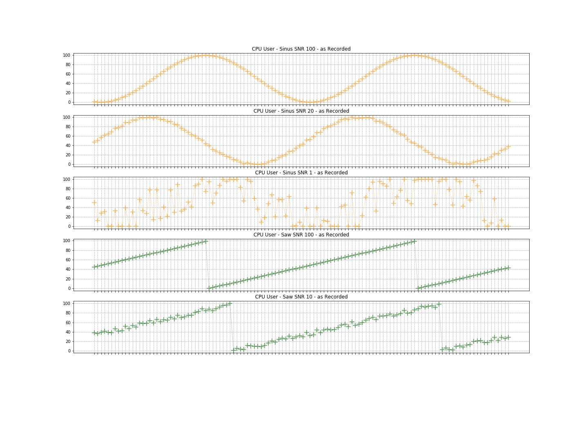

# Continuous data generator for writing DevOps metrics into Amazon Timestream

A script to generate a continuous stream of records that are ingested into Timestream. This script mimics a DevOps scenario where an application is emitting different types of events at a regular cadence. The script continuously generates data until the execution is interrupted with a SIGINT (or `CTRL + C`).

## Dependencies
- Boto3
- numpy (Tested with version 1.18.5)
- Python3 (Tested with version 3.5.2)

## How to use it

1. Requires the latest boto and numpy packages. Install requirements 
	```
	pip3 install -r requirements.txt
	```

1. Run the following command to continuously generate and ingest sample data into Timestream. 
   
    ```    
    python3 timestream_sample_continuous_data_ingestor_application.py --database-name <db_name> --table-name <table_name> --endpoint <endpoint e.g. 'us-east-1'>
    ```
    
    - The ingestion can be stopped with a SIGINT signal (typically, `Ctrl + C` on most systems).
    - If the `database-name` and `table-name` do not pre-exist in Timestream, the application will stop with an error message.
    - Use `--help` argument to see more options available in the Sample Continuous Data Ingestor Python Application.
     E.g. ```python3 timestream_sample_continuous_data_ingestor_application.py --help```

## Data Explained
The tool generates for each instances 20 common host metrics and 5 process events. The host metrics are described in the following table:

| Domain  | Metric | Value Range | Description | 
|:---     |:---    |:-------:    |:---         | 
| CPU | cpu_user | 0-100 | Random value, normal distributed around 85% for high cpu, 15% for low cpu, with a standard deviation of 10. With the additional parameters `--saw-signal-cpu` or `--sin-signal-cpu`, the load value is calculated as the appropriate signal value plus white noise with the defined signal to noise ratio. |
| | cpu_system, cpu_iowait, cpu_steal, cpu_nice, cpu_si, cpu_hi | 0-1 | Uniform random value between 0 and 1, to represent a small cpu load < 1%|
| | cpu_idle | 0-100 | Value is the remainder of ```100 - cpu_user - cpu_[other]``` to ensure that cpu load adds up to 100.|
| Memory | memory_used | 0-8k | A uniform distributed value between 0 and 8000 representing the use of memory in e.g. MB. |
| | memory_free | 0-8k | `8000 - memory_used` the remainder of available memory |
| | memory_cached | 0-4k | A value between zero and 4000 representing the disk cache in e.g. MB |
| Disk | disk_io_read | 0-25k | A uniform random value between 0-25k.|
| | disk_io_write | 0-25k | A uniform random value between 0-25k.|
| | disk_used | N +/-  | A host specific value moving normal distributed up/down by 5 GB.|
| | disk_free | 15 +/-  | 15GB +/- the inverse of disk_used |
| | file_descriptors_in_use | 2200 +/- | 2200 open files (mean) with a standard deviation of 500 |
| Network | latency_per_read | 8 +/- | A normal distributed value of mean 8 and standard deviation 4 | 
| | latency_per_write | 12 +/- | A normal distributed value of mean 12 and standard deviation 8 | 
| | network_bytes_in | 0-1000 | A uniform distributed value between 0 and 1000 bytes | 
| | network_bytes_out | 0-5000 | A uniform distributed value between 0 and 5000 bytes | 

The generated process (event) metrics are described in the following table:

| Domain  | Metric | Value Range | Description | 
|:---     |:---    |:-------:    |:---         | 
| JVM     | gc_reclaimed | 0-100 | The uniform distributed value between 0-100 % |
|         | gc_pause | 0-100 | The uniform distributed value between 0-100 % |
|         | memory_free | 0-100 | The uniform distributed value between 0-100 % |
| Task    | task_completed | 0-500 | The uniform distributed value of finished tasks |
|         | task_end_state | SUCCESS_WITH_NO_RESULT, SUCCESS_WITH_RESULT, INTERNAL_ERROR, USER_ERROR, UNKNOWN, THROTTLED | One of the previous text values with likelihood `[0.2, 0.7, 0.01, 0.07, 0.01, 0.01]`

The generator now creates as many measures as possible for each dimension set. The dimension set for each of the metric measurements is defined as shown in this example. The dimension names are `[region, cell, silo, availability_zone, microservice_name, instance_name, instance_type, os_version]`
```
[
  [
    "eu-central-1",                          # region
    "eu-central-1-cell-1",                   # cell
    "eu-central-1-cell-1-silo-1",            # silo
    "eu-central-1-1",                        # availability_zone
    "apollo",                                # microservice_name
    "i-AUa00Zt2-apollo-0000.amazonaws.com",  # instance_name
    "r5.4xlarge",                            # instance_type
    "AL2"                                    # os_version
  ]
]
```
while the dimensions for events overlap with the metrics, they also define process and JDK dimension key value pairs. The dimension names are `[region, cell, silo, availability_zone, microservice_name, instance_name, process, jdk_version]`

```
[
  [
    "eu-central-1",                          # region
    "eu-central-1-cell-1",                   # cell
    "eu-central-1-cell-1-silo-1",            # silo
    "eu-central-1-1",                        # availability_zone
    "apollo",                                # microservice_name
    "i-AUa00Zt2-apollo-0000.amazonaws.com",  # instance_name
    "host_manager",                          # process
    "JDK_11"                                 # jdk_version
  ]
]
```

Depending on the parameterization one can enable data generation for instances across 1-7 regions, each region will have between 1 and 15 predefined cells, within each cell having 1 to 3 silos. In total we can have up to 101 silos. In each silo between 1-3 instances per microservice are then simulated. The configuration spreads thereby 10 instances across the 5 microservices `[apollo, athena, demeter, hercules, zeus]`. 

Depending on the parameterization one can therefore define up to 1010 server instances spread across the globe in 101 silos. For each of the instances the tool generates the 25 host metrics and additionally 5 process events as fast as possible. The generator loops over all dimension permutations and creates and inserts the metrics with the current time stamp, while not creating more than one measurement per second per time series. In turn this means that the tool is not ensuring equidistant measurements.

## Command Line Parameters
```
python3 timestream_sample_continuous_data_ingestor_application.py -h
--
  -h, --help              show this help message and exit
  --region REGION, -r REGION
                        Specify the service region. E.g. 'us-east-1'
  --endpoint-url ENDPOINT_URL, -url ENDPOINT_URL
                        Specify the service endpoint url that you have been mapped to. E.g. 'https://ingest-cell1.timestream.us-east-1.amazonaws.com'
  --profile PROFILE     The AWS Config profile to use.
  --database-name DATABASENAME, -d DATABASENAME
                        The database name in Amazon Timestream - must be already created.
  --table-name TABLENAME, -t TABLENAME
                        The table name in Amazon Timestream - must be already created.
  --concurrency CONCURRENCY, -c CONCURRENCY
                        Number of concurrent ingestion threads (default: 10)
  --host-scale HOSTSCALE, -s HOSTSCALE
                        The scale factor that determines the number of hosts emitting events and metrics (default: 10).
  --include-region LIST
                        Comma separated include of regions (default: EMPTY, all)
  --include-ms LIST
                        Comma separated include of microservice (default: EMPTY, all).
  --missing-cpu MISSINGCPU
                        The percentage of missing values [0-100], (default: 0).
  --sin-signal-cpu SINSIGNALCPU
                        The SIN signal to noise ratio, [0-100] no signal to 100 times noise, (default: 0).
  --sin-frq-cpu SINFRQCPU
                        The SIN signal frequency (m | h | d | we | mo | qu | ye) (default:m)
  --saw-signal-cpu SAWSIGNALCPU
                        The SAW signal to noise ratio, [0-100] no signal to 100 times noise, (default: 0).
  --saw-frq-cpu SAWFRQCPU
                        The SIN signal frequency (m | h | d | we | mo | qu | ye) (default:m)
  --seed SEED           The seed with which to initialize random, (default: now()).
  --autostop AUTOSTOP   Add autostop to stop each individual ingestor thread after N iterates records. (default:0, unlimited)
  --dry-run             Add dry run to preview the dimensions of metrics and events.

```

## Examples
### Single-threaded ingest
The following command starts a single-threaded ingest process that continues until SIGINT signal (CTRL + C) is received.
```
python3 timestream_sample_continuous_data_ingestor_application.py -c 1 -d testDb -t testTable -r 'us-east-1'
```

In cases, where fewer time series are needed one can limit the regions to one and also focus on only one microservice. The region ```eu-central-1``` is configured with 1 cell and 1 silo. As the ```athena``` microservice is configured with exactly one instance this simulates the metrics and events of one host.

```
python3 timestream_sample_continuous_data_ingestor_application.py -c 1 -d testDb -t testTable -r 'us-east-1' --include-region "eu-central-1" --include-ms "athena"
```

### Multi threaded ingest
As a single thread is limited with the number of records which can be generated, we allow for parallelism. A concurrency parameter greater than 1 starts a  multi-threaded ingest process which will continous until SIGINT signal (CTRL + C) is received. The number of threads is controlled by the option `-c`.

```
python3 timestream_sample_continuous_data_ingestor_application.py -c 30 -d testDb -t testTable -r 'us-east-1'
```

### Higher number of hosts and time series
Starts a multi-threaded ingest process the continues until SIGINT signal (CTRL + C) is received. The time series count is controlled by the option --host-scale. The host scale acts thereby as a scale factor for the number of instances per microservice. 

```
python3 timestream_sample_continuous_data_ingestor_application.py -c 30 -s 3 -d testDb -t testTable -r 'us-east-1'
```

### Single-threaded ingest to specified endpoint
Starts a single-threaded ingest process the continues until SIGINT signal (CTRL + C) is received.
```
python3 timestream_sample_continuous_data_ingestor_application.py -c 1 -d testDb -t testTable -r 'us-east-1' -url 'https://ingest-cell1.timestream.eu-west-1.amazonaws.com'
```

## CPU Signal Overlay
The CPU signal can have an SIN or SAW signal overlay. For the signal overlay 2 parameters are necessary. First ```--sin-signal-cpu``` which represents the signal to noise ratio - a value of 100 is defined without noise - otherwise a value of 20 means that the sinus signal (0..100) is 20 times stronger than the white noise (-2.5 ... +2.5).

To generate an ideal sinus signal with the frequency of 1 period per minute (equals 0.01667 Hz) the second parameter ```--sin-frq-cpu``` should be set to ```m``` representing minute. Other frequencies are ```[h for hour, d for day, we for week, mo for month, qu for quarter and ye for year]```

```
python3 timestream_sample_continuous_data_ingestor_application.py \
  --database-name testDb --table-name testTable --region 'us-east-1' \
  --sin-signal-cpu 100 --sin-frq-cpu m 
```

Similarly one can create a saw signal overlay with the parameters ```--saw-signal-cpu``` and ```--saw-frq-cpu```. Some examples are shown below in the picture. 

```
python3 timestream_sample_continuous_data_ingestor_application.py \
  --database-name testDb --table-name testTable --region 'us-east-1' \
  --sin-signal-cpu 100 --sin-frq-cpu m 
```

