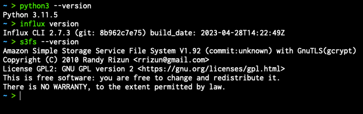
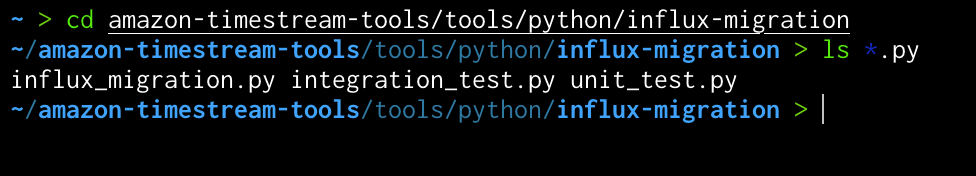
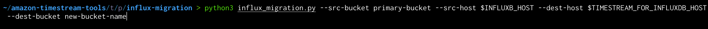
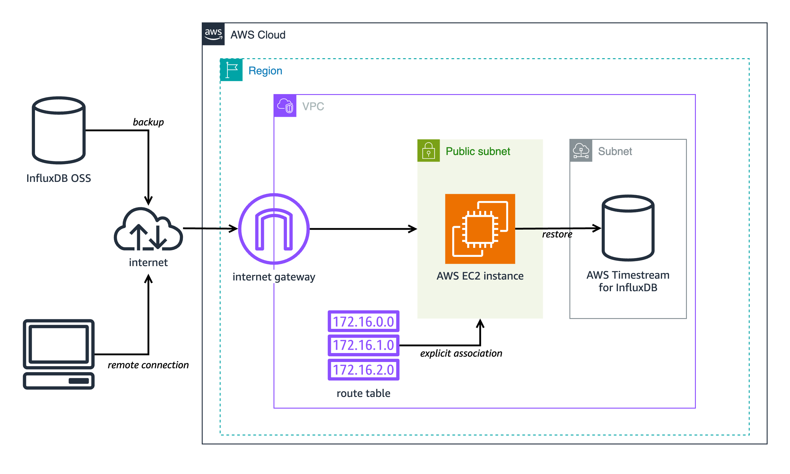

# InfluxDB Data Migration Script Guide

## Introduction

The Amazon Timestream for InfluxDB migration script is a Python script that migrates data between InfluxDB OSS instances, whether those instances are managed by AWS or not.

InfluxDB is a time series database. InfluxDB contains "points," which contain a number of key-value pairs and a timestamp. When points are grouped by key-value pairs they form a series. Series are grouped by a string identifier called a "measurement." InfluxDB is often used for operations monitoring, IOT data, and analytics. A bucket is a kind of container within InfluxDB to store data. AWS-managed InfluxDB is InfluxDB but within the AWS ecosystem. InfluxDB provides the InfluxDB v2 API for accessing data and making changes to the database. The InfluxDB v2 API is what the Amazon Timestream for InfluxDB migration script uses to migrate data.

The Amazon Timestream for InfluxDB migration script can migrate buckets and their metadata, migrate all buckets from all organizations, or do a full migration, which replaces all data on the destination instance.

The script backups data from the source instance locally, on whatever system executes the script, then restores the data to the destination instance. The data is kept in `influxdb-backup-<timestamp>` directories, one for each migration. Users are responsible for setting up and managing the system running the script.

The script provides a number of options and configurations including mounting S3 buckets to limit local storage usage during migration and choosing which organizations to use during migration.

## Preparation

Data migration for InfluxDB is accomplished with a Python script that utilizes InfluxDB CLI features and the InfluxDB v2 API. Execution of the migration script requires the following environment configuration:

- **Supported Versions**:

  A minimum version of 2.3 of InfluxDB and Influx CLI is supported.

- **Token Environment Variables:**
  - Create the environment variable `INFLUX_SRC_TOKEN` containing the token for your source InfluxDB instance.
  - Create the environment variable `INFLUX_DEST_TOKEN` containing the token for your destination InfluxDB instance.

- **Python 3:**
  - Check installation: `python3 --version`
  - If not installed:
    - Install from the [Python website](https://www.python.org/downloads/). Minimum version 3.7 required.
    > On Windows the default Python 3 alias is simply `python`.
  - For performing a migration, the Python modules `boto3` and `influxdb_client` are required. All Python requirements, including those for testing, can be installed using `requirements.txt`. The following example creates a virtual environment and installs all dependencies:
    ```shell
    # Create and activate a virtual environment
    python3 -m venv env
    source env/bin/activate
    
    # Install only migration dependencies
    python3 -m pip boto3 influxdb_client

    # Install all dependencies, including test dependencies
    python3 -m pip install -r requirements.txt
    ```

- **InfluxDB CLI:**
  - Confirm installation: `influx version`
  - If not installed:
    - Follow the installation guide in the [InfluxDB documentation](https://docs.influxdata.com/influxdb/cloud/tools/influx-cli/#install-the-influx-cli).
    - Add `influx` to your $PATH.

- **S3 Mounting Tools (Optional):**

    When S3 mounting is used, all backup files are stored in a user-defined S3 bucket. S3 mounting can be useful to save space on the executing machine or when backup files need to be shared. If S3 mounting isn't used, by omitting the `--s3-bucket` option, then a local `influxdb-backup-<millisecond timestamp>` directory will be created to store backup files in the same directory that the script was run.
  - For Linux: [mountpoint-s3](https://github.com/awslabs/mountpoint-s3).
  - For Windows and macOS: [`rclone`](https://rclone.org/) (Note: Prior rclone configuration is needed. See `rclone`'s documentation for configuring a "remote" for access to S3 buckets [here](https://rclone.org/s3/#configuration)).

- **Disk Space:**
  - The migration process automatically creates unique directories to store sets of backup files and retains these backup directories in either S3 or on the local filesystem, depending on the program arguments provided.

  - Ensure there is enough disk space for database backup, ideally double the size of the existing InfluxDB database if you choose to omit the `--s3-bucket` option and use local storage for backup and restoration.

  - Check space with `df -h` (UNIX/Linux) or by checking drive properties on Windows.

- **Direct Connection:**
  - Ensure a direct network connection exists between the system running the migration script and the source and destination systems. `influx ping --host <host>` is one way to verify a direct connection.

## Tokens

For migrations without `--csv`, operator tokens are needed for both source and destination instances. Operator tokens have all possible permissions for a database granted to it, this is required as migrations require the `read:/authorizations` permission, which only operator tokens have. If setup for InfluxDB is done through the UI, an operator token will be displayed and cannot be retrieved afterwards. If setup for InfluxDB is done through the CLI, operator tokens will be located in the InfluxDB configs file (default location `~/.influxdbv2/configs`).

For `--csv`, the least privilege for source and destination tokens can be found in "[Permissions](#permissions)."

These tokens can be created by using the Influx CLI and an operator token:

```shell
# Source token
influx auth create --read-orgs --read-buckets -u <source user> --host <source host> -t <source operator token> --org <source org>

# Destination token
influx auth create --read-orgs --read-buckets --write-buckets -u <destination user> --host <destination host> -t <destination operator token> --org <destination org>
```

## How to Use the Script

A simple example of running the script is the command

```shell
python3 influx_migration.py --src-host <source host> --src-bucket <source bucket> --dest-host <destination host>
```
Which migrates a single bucket.

All options can be viewed by running:

```shell
python3 influx_migration.py -h
```

The following is a formatted version of the output:

### Usage:
  ```shell
  influx_migration.py [-h] [--src-bucket SRC_BUCKET] [--dest-bucket DEST_BUCKET] [--src-host SRC_HOST] --dest-host DEST_HOST [--full] [--confirm-full] [--src-org SRC_ORG] [--dest-org DEST_ORG] [--csv] [--retry-restore-dir RETRY_RESTORE_DIR] [--dir-name DIR_NAME] [--log-level LOG_LEVEL] [--skip-verify] [--s3-bucket S3_BUCKET]
  ```

### Options

**`--allow-unowned-s3-bucket`**: Optional. Whether to automatically allow the use of an unowned S3 bucket, skipping prompt verification. Using an S3 bucket you own is recommended. If you choose to continue the migration with an S3 bucket you do not own, proceed with caution.

**`--confirm-full`**: Optional. Using `--full` without `--csv` will replace all tokens, users, buckets, dashboards, and any other key-value data in the destination database with the tokens, users, buckets, dashboards, and any other key-value data in the source database. `--full` with `--csv` only migrates all bucket and bucket metadata, including bucket organizations. This option (`--confirm-full`) will confirm a full migration and proceed without user input. If this option is not provided, and `--full` has been provided and `--csv` not provided, then the script will pause for execution and wait for user confirmation. This is a critical action, proceed with caution. Defaults to false.

**`--csv`**: Optional. Whether to use csv files for backing up and restoring. If `--full` is passed as well then all user-defined buckets in all organizations will be migrated, not system buckets, users, tokens, or dashboards. If a singular organization is desired for all buckets in the destination server instead of their already-existing source organizations, use `--dest-org`.

> **NOTE:** Upon successful migration the number of migrated records will be reported. In the event of any failed write, failed records will be reported and, due to records being written in batches, the number of successfully written records will not be able to be determined. Users will be urged to verify the number of ingested records themselves.</br></br>A limitation of `--csv` is that the number of reported records migrated reflects the number of records in the bucket being migrated at the time the script is run. Records ingested into the source after the script is running will not be counted when the number of total records migrated is reported.

**`--dest-bucket DEST_BUCKET`**: Optional. The name of the InfluxDB bucket in the destination server, must not be an already existing bucket. Defaults to value of `--src-bucket` or `None` if `--src-bucket` not provided.

**`--dest-host DEST_HOST`**: The host for the destination server. Must have a scheme, domain or IP address, and port, e.g., `http://127.0.0.1:8086` or `https://<domain>:<port>`.

**`--dest-org DEST_ORG`**: Optional. The name of the organization to restore buckets to in the destination server. If this is omitted, then all migrated buckets from the source server will retain their original organization and migrated buckets may not be visible in the destination server without creating and switching organizations. This value will be used in all forms of restoration whether a single bucket, a full migration, or any migration using csv files for backup and restoration.

**`--dir-name DIR_NAME`**: Optional. The name of the backup directory to create. Defaults to `influxdb-backup-<timestamp>`. Must not already exist.

**`--full`**: Optional. Whether to perform a full restore, replacing all data on destination server with all data from source server from all organizations, including all key-value data such as tokens, dashboards, users, etc. Overrides `--src-bucket` and `--dest-bucket`. If used with `--csv`, only migrates data and metadata of buckets. Defaults to false.

**`-h, --help`**: Shows help message and exits.

**`--log-level LOG_LEVEL`**: Optional. The log level to be used during execution. Options are debug, error, and info. Defaults to info.

**`--retry-restore-dir RETRY_RESTORE_DIR`**: Optional. Directory to use for restoration when a previous restore failed, will skip backup and directory creation, will fail if the directory doesn't exist, can be a directory within an S3 bucket. If a restoration fails, the backup directory path that can be used for restoration will be indicated relative to the current directory. S3 buckets will be in the form `influxdb-backups/<s3 bucket>/<backup directory>`. The default backup directory name is `influxdb-backup-<timestamp>`.

**`--s3-bucket S3_BUCKET`**: Optional. The name of the S3 bucket to use to store backup files. On Linux this is simply the name of the S3 bucket, such as `my-bucket`, given `AWS_ACCESS_KEY_ID` and `AWS_SECRET_ACCESS_KEY` environment variables have been set or `${HOME}/.aws/credentials` exists. On Windows, this is the `rclone` configured remote and bucket name, such as `my-remote:my-bucket`. All backup files will be left in the S3 bucket after migration in a created `influxdb-backups-<timestamp>` directory. A temporary mount directory named `influx-backups` will be created in the directory from where this script is ran. If not provided, then all backup files will be stored locally in a created `influxdb-backups-<timestamp>` directory from where this script is ran.

**`--skip-verify`**: Optional. Skip TLS certificate verification.

**`--src-bucket SRC_BUCKET`**: Optional. The name of the InfluxDB bucket in the source server. If not provided, then `--full` must be provided.

**`--src-host SRC_HOST`**: Optional. The host for the source server. Must have a scheme, domain or IP address, and port, e.g., `http://127.0.0.1:8086` or `https://<domain>:<port>`. Defaults to http://localhost:8086 if no value is specified.

> As mentioned previously, `mountpoint-s3` and `rclone` are needed if `--s3-bucket` is to be used, but can be ignored if the user doesn't provide a value for `--s3-bucket`, in which case backup files will be stored in a unique directory locally.

## Migration Overview

After meeting the prerequisites:

1. **Run Migration Script**: Using a terminal app of your choice, run the Python script to transfer data from the source InfluxDB instance to the destination InfluxDB instance.

2. **Provide Credentials**: Provide host addresses and ports as CLI options.

3. **Verify Data**: Ensure the data is correctly transferred by:

    a. Using the InfluxDB UI and inspecting buckets.

    b. Listing buckets with `influx bucket list -t <destination token> --host <destination host address> --skip-verify`.

    c. Using `influx v1 shell -t <destination token> --host <destination host address> --skip-verify` and running `SELECT * FROM <migrated bucket>.<retention period>.<measurement name> LIMIT 100` to view contents of a bucket or `SELECT COUNT(*) FROM <migrated bucket>.<retention period>.<measurement name>` to verify the correct number of records have been migrated.

    d. By running a query using `influx query -t <destination token> --host <destination host address> --skip-verify 'from(bucket: "<migrated bucket>") |> range(start: <desired start>, stop: <desired stop>)'`. Adding `|> count()` to the query is also a way to verify the correct number of records have been migrated.

## Example Run

1. Open up a terminal app of choice and make sure the required pre-requisites are properly installed.

    

2. Navigate to where the migration script is located.

    

3. Prepare the following information:

    - name of the source bucket (to be migrated).

    - (optional) new bucket name for the migrated bucket, in destination server.

    - root token for source & destination influx instances.

    - host address of source & destination influx instances.

    - (optional) S3 bucket name and credentials, AWS CLI credentials should be set in the OS environment variables.
      ```
      # AWS credentials
      export AWS_ACCESS_KEY_ID="xxx"
      export AWS_SECRET_ACCESS_KEY="xxx"
      ```

4. Construct the command as:
    
    ```
    python3 influx_migration.py --src-bucket [source-bucket-name] 
    --dest-bucket [dest-bucket-name]
    --src-host [source host] --dest-host [dest host]
    --s3-bucket [s3 bucket name](optional)
    --log-level debug
    ```

5. Execute the script:

    

6. Wait for the script to finish executing.

7. Check the newly migrated bucket for data integrity, performance.txt under the same directory where the script was run from contains some basic information on how long each step took.

## Example Scenarios

### Simple Migration Using Local Storage

**Scenario**: You want to migrate a single bucket, `primary-bucket`, from the source server (`http://localhost:8086`) to a destination server (`http://dest-server-address:8086`).

After ensuring you have TCP access (for HTTP access) to both machines hosting the InfluxDB instances on port 8086 and you have both source and destination tokens and have stored them as the environment variables `INFLUX_SRC_TOKEN` and `INFLUX_DEST_TOKEN`, respectively, for added security:

```shell
python3 influx_migration.py --src-bucket primary-bucket --src-host http://localhost:8086 --dest-host http://dest-server-address:8086
```
Output:

```
INFO: influx_migration.py: Backing up bucket data and metadata using the InfluxDB CLI
2023/10/26 10:47:15 INFO: Downloading metadata snapshot
2023/10/26 10:47:15 INFO: Backing up TSM for shard 1
2023/10/26 10:47:15 INFO: Backing up TSM for shard 8245
2023/10/26 10:47:15 INFO: Backing up TSM for shard 8263
[More shard backups . . .]
2023/10/26 10:47:20 INFO: Backing up TSM for shard 8240
2023/10/26 10:47:20 INFO: Backing up TSM for shard 8268
2023/10/26 10:47:20 INFO: Backing up TSM for shard 2
INFO: influx_migration.py: Restoring bucket data and metadata using the InfluxDB CLI
2023/10/26 10:47:20 INFO: Restoring bucket "96c11c8876b3c016" as "primary-bucket"
2023/10/26 10:47:21 INFO: Restoring TSM snapshot for shard 12772
2023/10/26 10:47:22 INFO: Restoring TSM snapshot for shard 12773
[More shard restores . . .]
2023/10/26 10:47:28 INFO: Restoring TSM snapshot for shard 12825
2023/10/26 10:47:28 INFO: Restoring TSM snapshot for shard 12826
INFO: influx_migration.py: Migration complete
```
The directory `influxdb-backup-<timestamp>` will be created and stored in the directory from where the script was ran, containing backup files.

### Full Migration Using Local Storage and Debug Logging

**Scenario**: Same as above except you want to migrate all buckets, tokens, users, and dashboards, deleting the buckets in the destination server, proceeding without user confirmation of a complete database migration by using the `--confirm-full option`. You also want to see what the performance measurements are so you enable debug logging.

```shell
python3 influx_migration.py --full --confirm-full --src-host http://localhost:8086 --dest-host http://dest-server-address:8086 --log-level debug
```

Output

```
INFO: influx_migration.py: Backing up bucket data and metadata using the InfluxDB CLI
2023/10/26 10:55:27 INFO: Downloading metadata snapshot
2023/10/26 10:55:27 INFO: Backing up TSM for shard 6952
2023/10/26 10:55:27 INFO: Backing up TSM for shard 6953
[More shard backups . . .]
2023/10/26 10:55:36 INFO: Backing up TSM for shard 8268
2023/10/26 10:55:36 INFO: Backing up TSM for shard 2
DEBUG: influx_migration.py: backup started at 2023-10-26 10:55:27 and took 9.41 seconds to run.
INFO: influx_migration.py: Restoring bucket data and metadata using the InfluxDB CLI
2023/10/26 10:55:36 INFO: Restoring KV snapshot
2023/10/26 10:55:38 WARN: Restoring KV snapshot overwrote the operator token, ensure following commands use the correct token
2023/10/26 10:55:38 INFO: Restoring SQL snapshot
2023/10/26 10:55:39 INFO: Restoring TSM snapshot for shard 6952
2023/10/26 10:55:39 INFO: Restoring TSM snapshot for shard 6953
[More shard restores . . .]
2023/10/26 10:55:49 INFO: Restoring TSM snapshot for shard 8268
2023/10/26 10:55:49 INFO: Restoring TSM snapshot for shard 2
DEBUG: influx_migration.py: restore started at 2023-10-26 10:55:36 and took 13.51 seconds to run.
INFO: influx_migration.py: Migration complete
```

### Full Migration Using CSV and Destination Organization

**Scenario**: You want to do a full migration but only want to migrate bucket data and metadata, keep your original destination buckets, and you would also like to store bucket data as csv files, in case you want to migrate data yourself later or want to import the data into something like excel or Tableau. Also, you don't have any organizations in your destination server with the same name as your source server. If you were to not specify an organization to use for restoring then you wouldn't be able to see the migrated buckets. You decide to migrate all buckets from the source server and associate them with an organization that exists in your destination server, MyOrg.

```shell
python3 influx_migration.py --full --src-host http://localhost:8086 --dest-host http://dest-server-address:8086 --csv --dest-org MyOrg

```

Output

```
INFO: influx_migration.py: Backing up bucket data and metadata using the InfluxDB v2 API
INFO: influx_migration.py: Restoring bucket data and metadata from csv
INFO: influx_migration.py: Restoring bucket some-bucket
INFO: influx_migration.py: Restoring bucket another-bucket
INFO: influx_migration.py: Restoring bucket primary-bucket
INFO: influx_migration.py: Migration complete
```

### Full Migration Using CSV, Destination Organization, and S3 Bucket

**Scenario**: Same as the previous example but using Linux or Mac and storing the files in the S3 bucket, my-s3-bucket. This avoids backup files overloading the local storage capacity.

```shell
python3 influx_migration.py --full --src-host http://localhost:8086 --dest-host http://dest-server-address:8086 --csv --dest-org MyOrg --s3-bucket my-s3-bucket
```

Output

```
INFO: influx_migration.py: Creating directory influxdb-backups
INFO: influx_migration.py: Mounting influxdb-migration-bucket
INFO: influx_migration.py: Creating directory influxdb-backups/my-s3-bucket/influxdb-backup-1698352128323
INFO: influx_migration.py: Backing up bucket data and metadata using the InfluxDB v2 API
INFO: influx_migration.py: Restoring bucket data and metadata from csv
INFO: influx_migration.py: Restoring bucket some-bucket
INFO: influx_migration.py: Restoring bucket another-bucket
INFO: influx_migration.py: Restoring bucket primary-bucket
INFO: influx_migration.py: Migration complete
INFO: influx_migration.py: Unmounting influxdb-backups
INFO: influx_migration.py: Removing temporary mount directory
```

## Security

### Sensitive Data

All data migrated by the Amazon Timestream for InfluxDB migration script, including sensitive data, is the responsibility of the user. Users are encouraged to be mindful about what data they choose to migrate and where that data will be migrated.

### Permissions

For a migration that doesn't use the `--csv` flag, operator tokens should be used since backing up and restoring data in this case requires read permissions for all authorizations in an instance.

An operator token can be created using `influx auth create --operator`.

With `--csv`, the required least permissions for source tokens should have:
- Read access for buckets within a chosen organization used for migration.
- Read access for the source organization used for migration.

The required least permissions for destination tokens should have:
- Read and write access for buckets within a chosen organization used for migration.
- Read access for the destination organization used for migration.

The following is an example of the bodies of two POST requests made to the `/api/v2/authorizations` endpoint to create tokens with these permissions:

```json
# Source token
{
  "status": "active",
  "description": "source-migration-token",
  "orgID": "'"<source org ID>"'",
  "userID": "<user ID of user existing in source>",
  "permissions": [
    {
      "action": "read",
      "resource": {
        "orgID": "'"<source org ID>"'",
        "type": "orgs"
      }
    },
    {
      "action": "read",
      "resource": {
        "orgID": "'"<source org ID>"'",
        "type": "buckets"
      }
    }
  ]
}

# Destination token
{
  "status": "active",
  "description": "destination-migration-token",
  "orgID": "'"<destination org ID>"'",
  "userID": "<user ID of user existing in destination>",
  "permissions": [
    {
      "action": "read",
      "resource": {
        "orgID": "'"<destination org ID>"'",
        "type": "orgs"
      }
    },
    {
      "action": "read",
      "resource": {
        "orgID": "'"<destination org ID>"'",
        "type": "buckets"
      }
    },
    {
      "action": "write",
      "resource": {
        "orgID": "'"<destination org ID>"'",
        "type": "buckets"
      }
    }
  ]
}
```

### Secrets

InfluxDB operator tokens are generated on instance setup; other kinds of tokens, such as all-access and read/write tokens, can be created using the Influx CLI or Influx v2 API. See "[Manage API tokens](https://docs.influxdata.com/influxdb/v2/admin/tokens/)" for how to generate, view, assign, and delete tokens.

It is recommended that users rotate tokens often using a secret manager and keep tokens hidden via environment variables, i.e., the `INFLUX_SRC_TOKEN` and `INFLUX_DEST_TOKEN` environment variables required for migration.

### Network Access

The Amazon Timestream for InfluxDB migration script can function locally, migrating data between two InfluxDB instances on the same system, but it is assumed that the primary use case for migrations will be migrating data across the network, either a local or public network. With this comes security considerations. The Amazon Timestream for InfluxDB migration script will, by default, verify TLS certificates for instances with TLS enabled: it is recommended that users enable TLS in their InfluxDB instances and do not use the `--skip-verify` option for the script.

Additionally, network traffic to the InfluxDB instances should be limited to known IPs.

### Dependencies

The latest major versions of all dependencies should be used, including Influx CLI, InfluxDB, Python, the Influx Python client, and optional dependencies such as `mountpoint-s3` and `rclone`.

### S3 Buckets

If users wish to use S3 buckets for migration they should secure their S3 buckets by enabling TLS, versioning, and disabling public access.

Steps:
  
  1. Navigate to Amazon S3 > Buckets.
  2. Click on your bucket from the list of buckets.
  3. Click the "Permissions" tab.
  4. Under "Block public access (bucket settings)" click "Edit."
  5. Check "Block _all_ public access."
  6. Click "Save changes."
  7. Under "Bucket policy" click "Edit."
  8. Paste the following, replacing `<example bucket>` with your bucket name, to enforce the use of TLS version 1.2 or later for connections:
      ```json
      {
        "Version": "2012-10-17",
        "Statement": [
          {
            "Sid": "EnforceTLSv12orHigher",
            "Principal": {
              "AWS": "*"
            },
            "Action": [
              "s3:*"
            ],
            "Effect": "Deny",
            "Resource": [
              "arn:aws:s3:::<example bucket>/*",
              "arn:aws:s3:::<example bucket>"
            ],
            "Condition": {
              "NumericLessThan": {
                "s3:TlsVersion": 1.2
              }
            }
          }
        ]
      }
      ```
  9. Click "Save changes."
  10. Click the "Properties" tag.
  11. Under "Bucket Versioning" click "Edit."
  12. Check "Enable."
  13. Click "Save changes." 

Read more about S3 bucket best security practices at "[Security best practices for Amazon S3](https://docs.aws.amazon.com/AmazonS3/latest/userguide/security-best-practices.html)."

## Deploying in a VPC

AWS Timestream for InfluxDB can be deployed without a public endpoint, restricting access to within its VPC, this makes migrations trickier. In this situation, the Amazon Timestream for InfluxDB migration script must be run from an EC2 machine within the same VPC as the AWS Timestream for InfluxDB instance.

What is needed:

- A subnet for the EC2 instance.
- A route table associated with a subnet that the migration script EC2 Instance uses.
- An internet gateway.
- An EC2 instance in the same VPC as the AWS Timestream for InfluxDB instance.

### Creating a Subnet

If the AWS Timestream for InfluxDB instance already has a subnet and you wish to make this subnet public, skip to the next step.

1. Ensure you are in the same region as your AWS Timestream for InfluxDB instance.
2. Go to `VPC` > `Subnets` and select "Create subnet."
3. Under "VPC ID" select the VPC associated with your AWS Timestream for InfluxDB instance from the dropdown menu.
4. Under "Subnet settings" give the subnet a name.
5. Select "Create subnet."

### Creating a Route Table

If a route table has already been configured for your subnet, skip to the next step.

1. Go to `VPC` > `Route tables` and select "Create route table."
2. Under "VPC" select the VPC associated with your AWS Timestream for InfluxDB instance.
3. Select "Create route table."
4. Select your newly-created route table from `VPC` > `Route tables` and on the "Explicit subnet associations" pane select "Edit subnet associations."
5. Select the subnet you created above from the list and select "Save associations."

### Creating an Internet Gateway

If an internet gateway has already been configured and is associated with the above route table, skip to the next step.

1. Go to `VPC` > `Internet gateways` and select "Create internet gateway."
2. Give the internet gateway a name tag and select "Create internet gateway."
3. Select "Actions" and in the dropdown menu select "Attach to VPC."
4. Under "Available VPCs" select your VPC and then select "Attach internet gateway."

### Creating an EC2 Instance for Migration Within a VPC

1. Ensure you are in the same region as your AWS Timestream for InfluxDB instance.
2. Go to `EC2` > `Instances` and select "Launch instances."
3. In the "Network settings" pane select "Edit."
4. Under "VPC" select the VPC associated with your AWS Timestream for InfluxDB instance.
5. Select the subnet that has an attached internet gateway.
6. Ensure "Auto-assign public IP" is enabled in "Network settings" pane for your EC2 instance.
7. Select "Launch instance."

### Migrating with your Private EC2 Instance

You should now be ready, after completing setting up the [prerequisites](#preparation), to perform a migration.

Perform the migration using the Amazon Timestream for InfluxDB migration script; the Amazon Timestream for InfluxDB migration script will perform health checks, ensure both source and destination instances are reachable, that buckets exists, that the required dependencies are installed, and will clearly indicate what kind of configuration errors are encountered, if any.

The following diagram outlines the structure of the above configuration:



**NOTE**: The EC2 and AWS Timestream for InfluxDB instances are depicted as being in separate subnets, with the AWS Timestream for InfluxDB instance being in a generic subnet (public or private). This will be different if you decide to use the same subnet for both instances; the crucial element is that the EC2 instance is within a public subnet.

## Migrating from InfluxDB 1.x to AWS Timestream for InfluxDB

To migrate from InfluxDB 1.x to AWS Timestream for InfluxDB:

1. Upgrade from InfluxDB 1.x to InfluxDB 2.7.
2. Use the migration script to migrate from InfluxDB 2.7 to AWS Timestream for InfluxDB, as usual.

### Considerations Before Upgrading

All following considerations are included in the linked documentation; these considerations are listed here so that users are fully informed before starting an upgrade.

- If InfluxDB 1.x or InfluxDB 2.7 is installed using a package manager, `sudo -u influxdb influxd upgrade` must be used instead of simply `influxd upgrade`.

- InfluxDB 2.7 is only available on Linux, Windows, and macOS.

- InfluxDB 2.7 doesn't support alternative write protocols such as CollectD, use Telegraf to translate these protocols into line protocol.

- Kapacitor can be used with InfluxDB 2.7 under certain circumstances. Kapacitor batch-style TICKscripts work via the 1.x read compatible API. Kapacitor stream tasks are not supported in InfluxDB 2.7, use Telegraf to write to Kapacitor and InfluxDB at the same time.

- Admin users and users that have no permissions are not migrated during the upgrade. If you are using an admin user for visualization or Chronograf administrative purposes, create a new read-only InfluxDB 1.x user before doing the upgrade.

- Existing InfluxDB 1.x visualizations and dashboards are supported in InfluxDB 2.7 via the 1.x read compatibility API.

- Authentication must be enabled in the InfluxDB 1.x instance before upgrading, as InfluxDB 2.7 must have authentication. Enable authentication in InfluxDB 1.x by following [this guide](https://docs.influxdata.com/influxdb/v1/administration/authentication_and_authorization/#set-up-authentication).

- InfluxDB 2.7 doesn't support in-memory indexing.

- The [Influx CLI](https://docs.influxdata.com/influxdb/v2/tools/influx-cli/) provides the `influx v1 shell` command, which allows the execution of InfluxQL queries.

- For the Docker method of upgrading, a number of environment variables need to be set in your Docker container: 
  
  - `DOCKER_INFLUXDB_INIT_USERNAME`: Username to set for the admin user.
  - `DOCKER_INFLUXDB_INIT_PASSWORD`: Password to set for the admin user.
  - `DOCKER_INFLUXDB_INIT_ORG`: Name to set for the initial organization.
  - `DOCKER_INFLUXDB_INIT_BUCKET`: Name to set for the initial bucket.
  - `DOCKER_INFLUXDB_INIT_RETENTION`: Duration for the initial bucket’s retention period. If not set, the initial bucket will retain data forever.
  - `DOCKER_INFLUXDB_INIT_ADMIN_TOKEN`: API token to associate with the admin user. If not set, InfluxDB automatically generates a token.

- For the Docker method of upgrading, the upgrade will fail if a boltdb file already exists in the 2.x configuration path, `/etc/influxdb2`.

- For the Docker method of upgrading, extra volume mounts are required for the 2.x container. Environment variables and mounts are required:

  - 1.x data on disk.
  - Custom 1.x configuration file.
  - 2.x data on disk.
  - 2.x configuration directory.
  
  For more information regarding these mounts and environment variables see InfluxData's documentation [here](https://docs.influxdata.com/influxdb/v2/install/upgrade/v1-to-v2/docker/#file-system-mounts).

- For the Docker method of upgrading, set the environment variable `DOCKER_INFLUXDB_INIT_MODE` to `upgrade`.

### Upgrading InfluxDB 1.x to InfluxDB 2.7

There are three possible ways to upgrade from 1.x to 2.7 that are documented by InfluxData. All methods involve creating a new InfluxDB 2.7 instance and copying over InfluxDB 1.x data and metadata, translating 1.x structures like databases to 2.7 equivalents, leaving the InfluxDB 1.x instance intact.

The guides provided by InfluxData are comprehensive and provide step-by-step instructions, caveats, and important information for upgrading; use the provided documentation as primary resources for upgrading. For each upgrade method linked below, high-level summaries and notes are provided.

#### Automatically upgrade from InfluxDB 1.x to 2.7

InfluxData documentation: https://docs.influxdata.com/influxdb/v2/install/upgrade/v1-to-v2/automatic-upgrade/.

This method uses the `influxd upgrade` command and will migrate all data apart from the `_internal` database and all users apart from admin users and users with no permissions. To migrate the `_internal` database, an [InfluxDB 2.7 scraper](https://docs.influxdata.com/influxdb/v2/write-data/no-code/scrape-data/manage-scrapers/create-a-scraper/) is needed. The InfluxDB 1.x instance must be stopped, the InfluxDB 2.7 instance must be installed and started, then `influxd upgrade` (an InfluxDB 2.7 command) must be executed.

InfluxDB 1.x continuous tasks are written to `~/continuous_queries.txt` by default during the upgrade; to migrate continuous queries, transforming them into InfluxDB 2.7 tasks, a more involved process is required. See InfluxData's documentation for migrating continuous queries to tasks [here](https://docs.influxdata.com/influxdb/v2/install/upgrade/v1-to-v2/migrate-cqs/).

The `influxd upgrade` command has a number of options that allow some customization of the upgrade; see its documentation [here](https://docs.influxdata.com/influxdb/v2/reference/cli/influxd/upgrade/).

#### Upgrade from InfluxDB 1.x to 2.7 with Docker

InfluxData documentation: https://docs.influxdata.com/influxdb/v2/install/upgrade/v1-to-v2/docker/.

This method uses the InfluxDB 2.7 Docker container to perform an upgrade. The steps involved are similar to the automatic upgrade, but instead of using `influxd upgrade`, this method uses built-in options in the InfluxDB 2.7 Docker image for upgrading.

#### Manually upgrade from InfluxDB 1.x to 2.7

InfluxData documentation: https://docs.influxdata.com/influxdb/v2/install/upgrade/v1-to-v2/manual-upgrade/.

This method is the most involved, in which users perform each step that would be done by `influxd upgrade` themselves.

## Testing

### Requirements

In addition to the requirements listed in "[Preparation](#preparation)," `wget` is required:
- On macOS with homebrew: `brew install wget`.
- On Ubuntu and Debian with apt: `sudo apt install wget`.
- On CentOS and Fedora with yum: `sudo yum install wget`.

The Python modules `pandas` and `parameterized` are required. These dependencies are included in `requirements.txt` and can be installed in the same manner as covered in the "Python 3" section under "[Preparation](#preparation)":
```shell
# Create and activate a virtual environment, if not already done
python3 -m venv env
source env/bin/activate

# Install all dependencies, including test dependencies
python3 -m pip install -r requirements.txt
```

And Docker is required:
- On macOS with homebrew: `brew install --cask docker`.
- On Linux: https://docs.docker.com/desktop/install/linux-install/.

### Starting InfluxDB and Running Tests

Testing uses an InfluxDB instance in a Docker container on localhost:8086. First, ensure the Docker daemon is running, then to start, or restart, the InfluxDB instance, load it with sample data, and run the integration and unit tests, execute:
```shell
# Start and load InfluxDB Docker container
bash scripts/influxdb-restart.sh
python3 integration_test.py
python3 unit_test.py
```
To run a single test, after the InfluxDB is running:
```shell
python3 <integration_test.py or unit_test.py> <test case>.<test name>
# For example, to run an integration test that succeeds in migrating a single bucket
# python3 integration_test.py ValidAuthTestCase.test_valid_auth
```
The tests will use the InfluxDB instance for all operations, migrating data to itself.

Testing is currently only supported on Linux and macOS.

## Troubleshooting

### Warning of "dev" Version Not Recognized

The warning 'WARN: Couldn't parse version "dev" reported by server, assuming latest backup/restore APIs are supported' may be displayed during migration. This warning can be ignored.

### Migration Failed During Restoration Stage

In the event of a failed migration during the restoration stage, users can use the `--retry-restore-dir` flag to re-attempt the restoration. Use the `--retry-restore-dir` flag with a path to a previously backed up directory to skip the backup stage and retry the restoration stage. The created backup directory used for a migration will be indicated if a migration fails during restoration.

Possible reasons for a restore failing include:
- Invalid InfluxDB destination token.
- A bucket existing in the destination instance with the same name as in the source instance. For individual bucket migrations use the `--dest-bucket` option to set a unique name for the migrated bucket.
- Connectivity failure, either with the source or destination hosts or with an optional S3 bucket.
