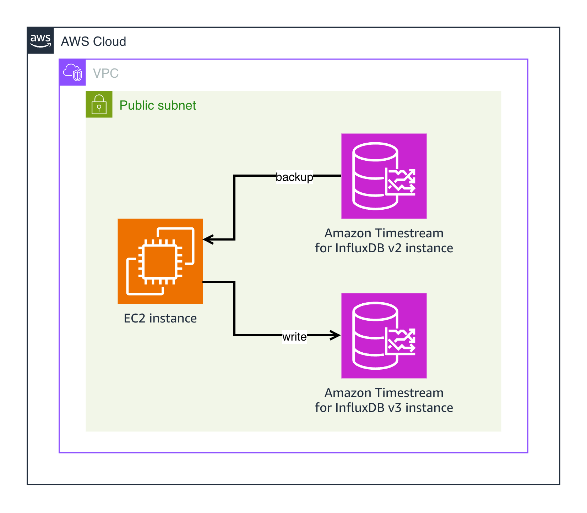

# Amazon Timestream for InfluxDB v2 to v3 Migration Script

## Overview

The [Amazon Timestream for InfluxDB](https://docs.aws.amazon.com/timestream/latest/developerguide/timestream-for-influxdb.html) [v2](https://docs.influxdata.com/influxdb/v2/) to [v3](https://docs.influxdata.com/influxdb3/enterprise/) migration script allows you to migrate your data from managed InfluxDB v2 to v2 or v3.

The script is available standalone or as part of an automated solution that deploys an EC2 instance with the script and all prerequisites installed. To use the automated solution, see the [`README` in the `automated_deployment/` directory](./automated_deployment/README.md).

If you already have your backed-up data, a separate script that ingests to InfluxDB v3 is provided, `influxdb_v3_ingestion.py`. See the [**InfluxDB v3 Ingestion**](#influxdb-v3-ingestion) section below for more information.

### Migration Process

The following diagram depicts the migration process.



In this diagram, data is being migrated from Timestream for InfluxDB v2 to Timestream for InfluxDB v3. An [Amazon Elastic Compute Cloud (Amazon EC2)](https://aws.amazon.com/ec2/) instance, utilizing the migration script, facilitates the migration. The steps of the migration are as follows:
1. Using the [InfluxDB v2 CLI](https://docs.influxdata.com/influxdb/v2/reference/cli/influx/), the migration script runs [`influx backup`](https://docs.influxdata.com/influxdb/v2/reference/cli/influx/backup/), and data from InfluxDB v2 is backed up to the EC2 instance's local storage.
2. On the EC2 instance, the data is [translated to line protocol using the InfluxDB v2 daemon](https://docs.influxdata.com/influxdb/v2/reference/cli/influxd/inspect/export-lp/).
3. Finally, the line protocol data is written to InfluxDB v3 using the [InfluxDB v3 HTTP API](https://docs.influxdata.com/influxdb3/enterprise/api/v3/).

## Standalone Usage

### Steps

1. [Install minimum Python version 3.13](https://www.python.org/downloads/).
2. Create a [Python virtual environment](https://docs.python.org/3/library/venv.html):
   ```shell
   python3.13 -m venv .env
   source .env/bin/activate
   ```
3. Install all Python dependencies:
   ```shell
   python3.13 -m pip install .
   ```
4. [Retrieve an operator token from your InfluxDB v2 instance](https://docs.aws.amazon.com/timestream/latest/developerguide/timestream-for-influx-getting-started-operator-token.html). An operator token is necessary for the migration.
   - This can also be done by logging in to the InfluxDB v2 UI and cloning an existing operator token.
5. Retrieve a token from your InfluxDB v3 instance. In Timestream for InfluxDB v3, they are placed in a secret in AWS Secrets Manager that is associated with the instance. In the AWS console, the secret ARN is included in the instance's summary.
6. Create a secret in [AWS Secrets Manager](https://aws.amazon.com/secrets-manager/) containing your InfluxDB v2 and v3 tokens. For example, using the AWS CLI:
   ```shell
   aws secretsmanager create-secret \
       --region us-west-2 \
       --name influxdb_secret_name_example \
       --secret-string \
       '{"INFLUXDB_V2_TOKEN": "replace me", "INFLUXDB_V3_TOKEN": "replace me"}'
   ```
7. [Download and Install the InfluxDB v2 CLI](https://docs.influxdata.com/influxdb/v2/tools/influx-cli/).
8. [Download InfluxDB v2](https://docs.influxdata.com/influxdb/v2/install/). Once you have downloaded InfluxDB v2, make sure the [InfluxDB v2 daemon (`influxd`)](https://docs.influxdata.com/influxdb/v2/reference/cli/influxd/) has been added to your PATH. InfluxDB v2 does not need to be running, the daemon will be used in isolation.
9. Make sure you have network connectivity to your Timestream for InfluxDB v2 and v3 instances.

    a. InfluxDB v2 connectivity can be checked with the [Influx CLI](https://docs.influxdata.com/influxdb/v2/tools/influx-cli/):
       ```shell
       influx ping --host <InfluxDB v2 host>
       ```

    b. InfluxDB v3 connectivity can be checked with [cURL](https://curl.se/):
       ```shell
       curl -X GET "<InfluxDB v3 host>/health" --header "Authorization: Bearer <InfluxDB v3 token>"
       ```

10. Make sure you have enough disk space to hold all of the data that you want to migrate, uncompressed. Data will be backed up to an `engine` directory, by default in `~`. Within this directory, backed up data is organized into `data/<bucket_id>/` directories. Each bucket's [line protocol](https://docs.influxdata.com/influxdb/v2/reference/syntax/line-protocol/) data file will be `<bucket name>.lp`, and will be in their respective bucket directories.

11. Run the script, providing:
    - Your InfluxDB v2 URL.
    - Your InfluxDB v3 URL.
    - Either:
      - The InfluxDB v2 buckets that you want to migrate and their organizations, with `--source-buckets-and-orgs`.
      - Or, the names of the organizations to migrate all buckets from, with `--source-orgs`.
    - The name of the secret you created in AWS Secrets Manager that contains your InfluxDB v2 and v3 tokens.
    ```shell
    python3.13 influxdb_v2_to_v3_migration.py \
        --source-url "https://example.com:8086" \
        --destination-url "https://example.com:8181" \
        --source-buckets-and-orgs "bucket-one:organization-one,bucket-two:organization-two" \
        --tokens-secret-name "influxdb_v2_to_v3_migration"
    ```

### Clean Up

Remove the backed-up data. By default, data is placed in `~/engine`:
```
rm -rf ~/engine
```

## Migrating to InfluxDB v2

`influxdb_v2_to_v3_migration.py` can be used to migrate data from an InfluxDB v2 instance to InfluxDB v2. This can be useful, if, for example, you have a source InfluxDB v2 instance and want to migrate all of your data to an InfluxDB cluster. InfluxDB clusters don't support the `backup` or `restore` InfluxDB v2 CLI commands, so using `influxdb_v2_to_v3_migration.py`, which ingests using write APIs, is an alternate migration path.

To migrate to InfluxDB v2, follow the same steps as above, but provide the argument `--destination-org` to `influxdb_v2_to_v3_migration.py` or `influxdb_v3_ingestion.py` with the name of an existing organization in your destination.

**All** data will be migrated to the organization you specify.

## Manual Verification

After completing a migration, you may want to verify that all points were migrated.

For verification it is important to note that during the migration process, buckets are mapped to databases, measurements are mapped to tables, and each bucket's data is output to a single line protocol file.

### Verifying InfluxDB v2 Count

You can query InfluxDB v2, returning all points in bucket:

```flux
from(bucket: "<bucket name>")
   |> range(start: 0)
   |> filter(fn: (r) => r["_measurement"] == "your measurement name")
   |> group()
   |> count()
```

If you are confident that line protocol data was exported correctly, you can get the number of points in a bucket by calculating the number of lines in each file:
```shell
wc -l ~/engine/data/0b6d5261bb527ac5/bucket_name.lp
```

### Verifying InfluxDB v3 Count

To check the number of records in a table within a database, use SQL:
```sql
SELECT COUNT(*) FROM my_table_name
```

To compare the total number of records in an InfluxDB v3 database to the known number of records in an InfluxDB v2 bucket, this query must be executed for all tables in a database, since databases correspond to buckets.

## InfluxDB v3 Ingestion

A script, `./app/influxdb_v3_ingestion.py`, is provided that ingests data to Timestream for InfluxDB v2 or v3. This script is useful if you have already backed up your InfluxDB v2 data. The ingestion script is tailored to be used by the end-to-end migration script, and expects data to be organized in a specific way. To organize data the way that the ingestion script expects, you can backup, extract InfluxDB v2 data, and convert InfluxDB v2 data to line protocol using the following commands:
```shell
# Required input values.
INFLUXDB_V2_HOST=<InfluxDB v2 host>
INFLUXDB_V2_ORG=<organization name>
INFLUXDB_V2_TOKEN=<InfluxDB v2 operator token>

# Create backup directory. Naming is important.
mkdir -p ~/engine/data

# Backup all buckets from an InfluxDB v2 instance to a local directory
# using the InfluxDB v2 CLI.
influx backup \
    --host $INFLUXDB_V2_HOST \
    --org $INFLUXDB_V2_ORG \
    --token $INFLUXDB_V2_TOKEN \
    --compression none \
    ~/engine/data

# Extract all .tar files.
for f in ~/engine/data/*.tar; do tar -xzf "$f" -C ~/engine/data; done

# Extract all data to line protocol using the InfluxDB v2 CLI, the InfluxDB v2 daemon,
# and jq.
for bucket_id in $(ls -1d ~/engine/data/*/ | xargs -n 1 basename); do
    BUCKET_NAME=$(influx bucket list \
        --host $INFLUXDB_V2_HOST \
        --token $INFLUXDB_V2_TOKEN \
        --org $INFLUXDB_V2_ORG \
        --json \
        -i $bucket_id | jq -r ".[0].name")

    influxd inspect export-lp \
        --bucket-id $bucket_id \
        --engine-path ~/engine \
        --output-path "$(cd ~/engine/data/${bucket_id} && pwd)/${BUCKET_NAME}.lp"
done
```

Once your data is available in a `engine/data/` directory, `influxdb_v3_ingestion.py` can be used to ingest your data to InfluxDB v2 or v3:
```shell
# The AWS Secrets Manager secret holding InfluxDB v2 and v3 tokens.
TOKENS_SECRET_NAME=<tokens secret name>
INFLUXDB_V3_HOST=<InfluxDB v3 host>

# Create list of bucket names and bucket IDs.
BUCKET_NAMES_AND_IDS=""
for bucket_id in $(ls -1d ~/engine/data/*/ | xargs -n 1 basename); do
    BUCKET_LP_FILE=$(ls -1d ~/engine/data/${bucket_id}/*.lp | xargs -n 1 basename)
    BUCKET_NAME="${BUCKET_LP_FILE::${#BUCKET_LP_FILE}-3}"
    BUCKET_NAMES_AND_IDS="${BUCKET_NAME}:${BUCKET_ID},${BUCKET_NAMES_AND_IDS}"
done
# Remove trailing comma.
BUCKET_NAMES_AND_IDS="${BUCKET_NAMES_AND_IDS%?}"

# Ingest data.
python3 influxdb_v3_ingestion.py \
    --url $INFLUXDB_V3_HOST \
    --source-buckets-and-ids $BUCKET_NAMES_AND_IDS \
    --tokens-secret-name $TOKENS_SECRET_NAME \
    --backup-path ~/engine/data
```

Run the following command to view the ingestion script's full options:
```shell
python3 influxdb_v3_ingestion.py --help
```

## Testing

1. Before running tests, make sure the Docker daemon is running. On macOS, this means having Podman desktop or Docker desktop running.

2. Install the optional test dependencies:
   ```shell
   python3.13 -m pip install -e '.[test]'
   ```

3. Navigate to [`tests/integration/`](./tests/integration/) and run all tests:
   ```shell
   python3.13 -m pytest .
   ```
   These tests will create a secret in AWS Secrets Manager, create Docker containers for InfluxDB v2 OSS and v3 Core, create a temporary directory for migrations, and perform a number of migrations. Tests should clean up all resources after they have finished. Errors during teardown, if any occur, may leave residual resources.

## FAQ

### Can you migrate to InfluxDB v2?

Yes, simply supply the name of an existing org with `--destination-org` as an argument to `influxdb_v2_to_v3_migration.py` or `influxdb_v3_ingestion.py`. All data will be migrated to this organization. See the above [Migrating to InfluxDB v2](#migrating-to-influxdb-v2) section.

### What is the cutoff time for migrated points?
All points before the migration begins will be migrated. Points ingested after or during the migration will not. This is due to the behaviour of the InfluxDB v2 CLI.

### Do I need the InfluxDB v2 daemon to be running?
No, the daemon (`influxd`) simply needs to be in your PATH, available for the script to use.

### Will Python `3.12` work?
No, you must use Python minimum version `3.13`.

### Why do I need to install the InfluxDB v2 CLI?
The InfluxDB v2 CLI is capable of doing backups efficiently. This could be done instead entirely with InfluxDB v2's HTTP API, but doing a backup is not as simple as a few HTTP requests.

### Why do I need to have the InfluxDB v2 daemon in my PATH?
InfluxDB v2 and InfluxDB v3 share a common file format, line protocol. Unfortunately, the only way to extract line protocol data from InfluxDB v2 is to use the InfluxDB v2 daemon. This cannot be done across a network. The InfluxDB v2 CLI is used to back up bucket data across a network, that bucket data is extracted, and the InfluxDB v2 daemon is used to transform data to line protocol. This is possible due to the fact that a backup is basically a file copy of an InfluxDB v2's `engine/data/` directory.
