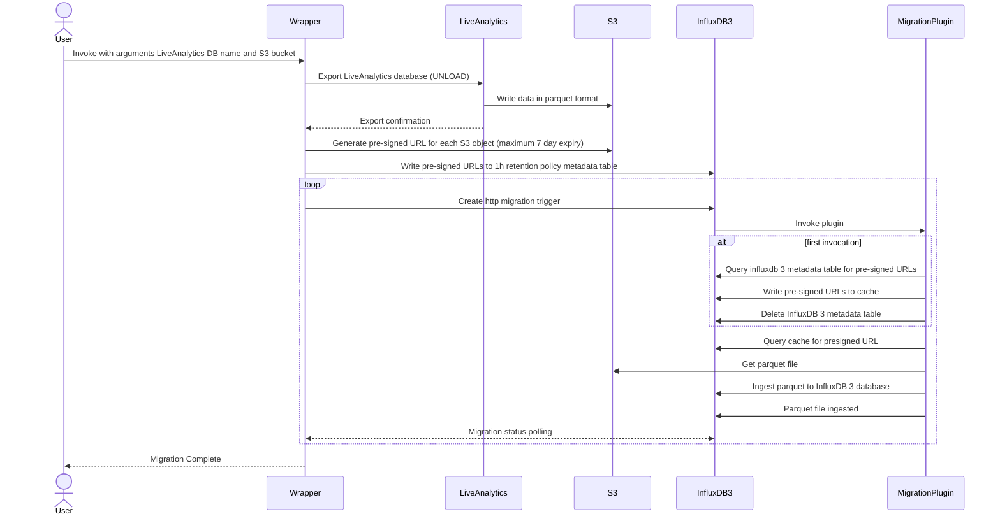

# Timestream for LiveAnalytics to InfluxDB v3 Migration Plugin and Client

## Overview

The Timestream for LiveAnalytics to InfluxDB v3 migration [plugin](./migration_plugin/liveanalytics_influxdb3_migration.py) and [client](./migration_client/liveanalytics_influxdb3_migration_client.py) help you migrate your [Timestream for LiveAnalytics](https://docs.aws.amazon.com/timestream/latest/developerguide/what-is-timestream.html) data to [Timestream for InfluxDB v3](https://docs.aws.amazon.com/timestream/latest/developerguide/influxdb3.html). The plugin and client accomplish a migration by taking advantage of the [`UNLOAD` feature](https://docs.aws.amazon.com/timestream/latest/developerguide/supported-sql-constructs.UNLOAD.html) of Timestream for LiveAnalytics and InfluxDB v3's [processing engine](https://docs.influxdata.com/influxdb3/core/reference/processing-engine/).

### Migration Process

The following sequence diagram depicts the entire migration process:


The overall migration process is as follows:

1. InfluxDB v3 is started with a plugin directory containing the migration plugin. Timestream for InfluxDB v3 by default has access to the migration plugin.
2. After meeting the pre-requisites, the client is run and provided with a Timestream for LiveAnalytics database to migrate; the InfluxDB v3 host, token, and database name as environment variables; and the name of an [Amazon S3](https://aws.amazon.com/s3/) bucket.
3. The client sends a query to Timestream for LiveAnalytics, unloading all data in the database into the S3 bucket in the form of Parquet files. Parquet files are organized into `s3://<bucket name>/<database name>/<table name>` object keys.
4. The client creates a metadata table in InfluxDB v3. This metadata table is used as a work queue by the plugin.
5. The client generates [presigned URLs](https://docs.aws.amazon.com/AmazonS3/latest/userguide/ShareObjectPreSignedURL.html) for all Parquet files in the S3 bucket. Additionally, presigned PUT URLs are generated so that the plugin can mark a file as having been migrated. This is done by putting an empty `done.ack` file, using a Parquet file's name as an object key. For example, `s3://<bucket name>/<database name>/<table name>/example.parquet/done.ack`. Presigned URLs are given a maximum expiration date of 7 days.
6. The client places all presigned URLs in the metadata table so that the plugin can use them.
7. The client creates an HTTP trigger with arguments specifying the S3 bucket name, database name, and a unique migration ID.
8. The client, using the HTTP trigger, sends a request for each Parquet file. Since the plugin writes to a buffer and does not persist writes, each invocation of the trigger verifies the previous migration. When an invocation verifies a previous migration, it places an empty `done.ack` file in the S3 bucket, marking that Parquet file as completed, preventing it from being migrated if `--resume` is used in the future.
9. A final request is made using the HTTP trigger with an empty body to verify that all data has been migrated and all record counts are as expected.


## Performing a Migration

### Considerations

Before attempting a migration, consider the following:
1. The plugin is best suited for migrations with less than 1 billion records. This is due to the limitation of the 7 day maximum duration of presigned URLs. Migrations with more than 1 billion records may requiring multiple `--resume` invocations.
2. The migration plugin uses presigned URLs for S3 bucket access. By default, these presigned URLs expire after 7 days. But their expiry may vary depending on the authentication method used to create them:
   - Using an EC2 instance profile, presigned URLs expire after approximately 6 hours or when the temporary EC2 instance credentials expire.
   - Using AssumeRole with custom session, URL validity can be extended up to 12 hours by explicitly assuming a role with a custom DurationSeconds parameter and role maximum duration set to 12 hours.
   - Using long-term IAM user credentials, the maximum 7-day expiration period for presigned URLs can be used.
     - We recommend using [Timestream for LiveAnalytics Migration Tooling](https://github.com/awslabs/amazon-timestream-tools/tree/mainline/tools/python/liveanalytics_migration_scripts) instead of relying on long-term IAM user credentials.

### Prerequisites

Before starting a migration, the following prerequisites must be met:
1. [Download and install Python](https://www.python.org/downloads/).
2. Start InfluxDB v3 with [`--plugin-dir`](https://docs.influxdata.com/influxdb3/core/reference/config-options/#plugin-dir) set to a directory containing the migration plugin.
3. If you are running InfluxDB v3 yourself, and not using Timestream for InfluxDB, use [`influxdb3`](https://docs.influxdata.com/influxdb3/core/reference/cli/influxdb3/) to install the packages needed by the plugin:
   ```shell
   influxdb3 install package --token <InfluxDB v3 token> --host <InfluxDB v3 host> numpy requests pandas pyarrow
   ```
4. Obtain your InfluxDB v3 token. In Timestream for InfluxDB, the token is placed in a secret in [AWS Secrets Manager](https://aws.amazon.com/secrets-manager/) that shares its name with the ID if your instance. If you are running InfluxDB v3 yourself, you can generate a token with:
   ```shell
   influxdb3 create token --admin
   ```
5. Set the following environment variables:
   - `INFLUXDB3_HOST_URL`: The host of your InfluxDB v3 instance. For example, `https://example.com:8181`.
   - `INFLUXDB3_AUTH_TOKEN`: Your InfluxDB v3 token.
   - `INFLUXDB3_DATABASE_NAME`: The name of the InfluxDB v3 database that you want to migrate data to. This database does not have to already exist.

   These environment variables are the same ones used by the InfluxDB v3 CLI.
6. Navigate to the client directory, `./migration_client/`.
7. Create a Python virtual environment:
   ```shell
   python3 -m venv .env
   source .env/bin/activate
   ```
8. Download all Python dependencies:
   ```
   python3 -m pip install .
   ```

9. Create an S3 bucket with object lock with the following command:
`aws s3api create-bucket --bucket <your bucket name> --object-lock-enabled-for-bucket --region <your-region> --create-bucket-configuration LocationConstraint=<your region>`

10. Ensure the AWS credentials used when invoking the client have the following permissions:

    ```json
    {
        "Sid": "QueryLiveAnalytics",
        "Effect": "Allow",
        "Action": [
           "timestream:Select",
           "timestream:DescribeEndpoints",
           "timestream:ListDatabases",
           "timestream:ListTables",
           "timestream:DescribeDatabase",
           "timestream:DescribeTable",
           "timestream:SelectValues"
        ],
        "Resource": "*"
    },
    {
       "Sid": "MigrationDataBucketMetadata",
       "Effect": "Allow",
       "Action": [
          "s3:ListBucket",
          "s3:GetBucketLocation",
          "s3:GetBucketVersioning"
       ],
       "Resource": "arn:aws:s3:::LAtoV3MigrationDataBucket-*"
    },
    {
       "Sid": "AccessDataBucket",
       "Effect": "Allow",
       "Action": [
          "s3:GetObject",
          "s3:PutObject",
          "s3:DeleteObject",
          "s3:PutObjectLegalHold",
          "s3:DeleteObject",
          "s3:DeleteObjectVersion",
          "s3:BypassGovernanceRetention"
       ],
       "Resource": "arn:aws:s3:::LAtoV3MigrationDataBucket-*/*"
    }
    ```

11. Ensure that your S3 bucket has the following policy, denying all non-TLS traffic:
    ```json
    {
       "Version": "2012-10-17",
       "Statement": [
          {
             "Sid": "DenyInsecureTransport",
             "Effect": "Deny",
             "Principal": "*",
             "Action": "s3:*",
             "Resource": [
                "arn:aws:s3:::<bucket name>",
                "arn:aws:s3:::<bucket name>/*"
             ],
             "Condition": {
                "Bool": {
                   "aws:SecureTransport": "false"
                }
             }
          }
       ]
    }
    ```

12. [Ensure that your S3 bucket uses SSE-S3 encryption](https://docs.aws.amazon.com/AmazonS3/latest/userguide/specifying-s3-encryption.html).


### Running the Client

After the above prerequisites have been met, navigate to `./migration_client/` and run the client:
```shell
python3 liveanalytics_influxdb3_migration_client.py \
    --live-analytics-database-name example-database-name \
    --s3-bucket-name example-s3-bucket
```

If you wish to resume a migration, use the `--resume` flag. The resume flag skips the `UNLOAD` step:
```shell
python3 liveanalytics_influxdb3_migration_client.py \
    --live-analytics-database-name example-database-name \
    --s3-bucket-name example-s3-bucket-name \
    --resume
```

**NOTE**: If you are re-running a migration using the same S3 bucket and the same Timestream for LiveAnalytics database without using `--resume`, make sure `s3://<S3 bucket name>/<LiveAnalytics database name>/<LiveAnalytics table name>/` is empty.

By default, the client will wait 2 minutes (120 seconds) for each Parquet file to be migrated. Since the maximum unloaded Parquet size is 16 MB, this shouldn't need to be changed. This can be changed with the `--timeout-seconds` argument:
```shell
python3 liveanalytics_influxdb3_migration_client.py \
    --live-analytics-database-name example-database-name \
    --s3-bucket-name example-s3-bucket \
    --timeout-seconds 1800 # Half an hour
```

## Tests

### Integration Tests

Integration tests will perform end-to-end tests, creating an S3 bucket, creating a Timestream for LiveAnalytics database and table, starting an InfluxDB v3 core container to migrate to, and will clean up all of these resources at the end of testing.

Before running tests, make sure the Docker daemon is running. On macOS, this means having either Docker desktop or Podman desktop running.

In `./migration_client/` Install the testing dependencies:
```shell
python3 -m pip install -e '.[test]'
```

Navigate to `./tests/integration/`:
```shell
cd tests/integration/
```

Run most tests with:
```shell
python3 -m pytest .
```

Run all tests, including long-running tests, with:
```shell
python3 -m pytest --run-slow .
```

Run all tests and show print statements and logs with:
```shell
python3 -m pytest -s --log-cli-level=INFO .
```

#### Troubleshooting Tests

##### Tests Failing with "TimeoutError: container did not become running"

If you are using Podman on macOS, set the environment variables:
```shell
export TESTCONTAINERS_DOCKER_SOCKET_OVERRIDE=/var/run/docker.sock
export TESTCONTAINERS_RYUK_DISABLED=true
```
