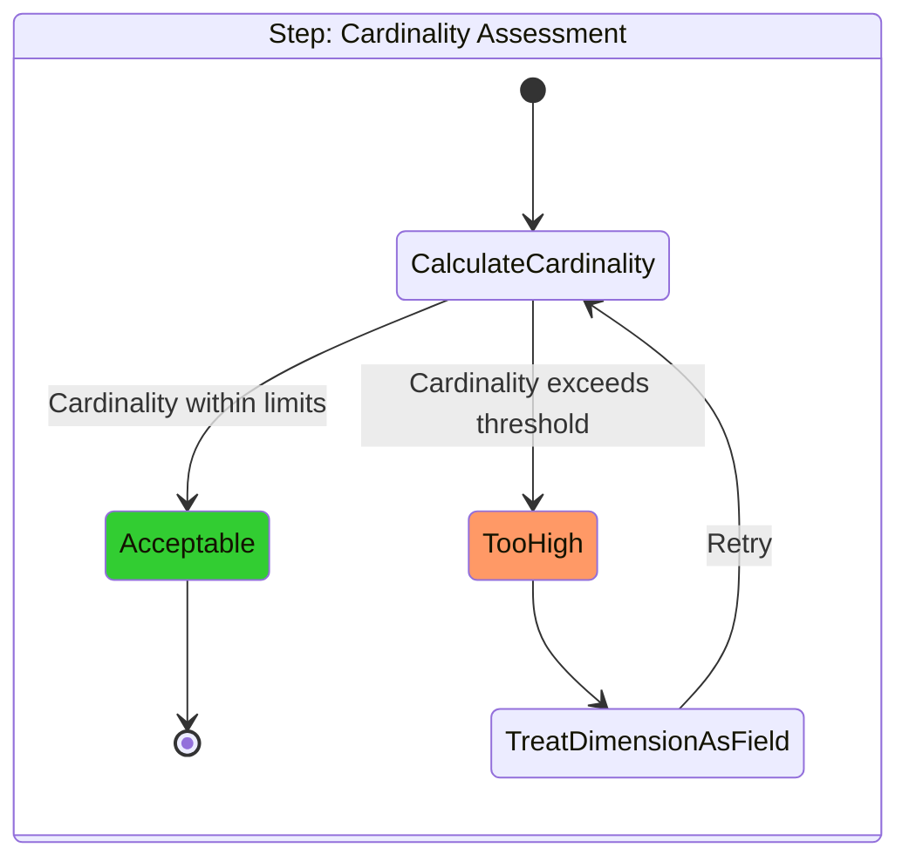

# Timestream for LiveAnalytics Migration Tooling

The Timestream for LiveAnalytics migration tooling is a collection of scripts to perform a migration of your Timestream for LiveAnalytics data to a supported target database. The Timestream for LiveAnalytics data is first unloaded from Timestream to S3 to be prepared and migrated to a new database target.

## Migration Targets

### Timestream for InfluxDB

Timestream for InfluxDB is ideal for workloads with moderate cardinality that benefit from InfluxDB's time series capabilities while leveraging AWS managed service features.

#### Cardinality Assessment



Before migrating to Timestream for InfluxDB, you must assess your schema for cardinality to ensure it's within acceptable limits. The cardinality assessment tool helps you:
- Calculate the cardinality of your dataset when mapping a Timestream for LiveAnalytics table to a Timestream for InfluxDB schema
- Identify if your cardinality exceeds Timestream for InfluxDB's recommended limits
- Suggest schema alterations (treating dimensions as as fields rather than tags) to reduce cardinality

For detailed migration steps to Timestream for InfluxDB, including data transformation with Athena, data ingestion, and validation, see the [Timestream for InfluxDB Migration Guide](./targets/timestream_for_influxdb/README.md).

### Amazon RDS for PostgreSQL

Amazon RDS for PostgreSQL is recommended when:
- Your data has high cardinality that exceeds Timestream for InfluxDB's capabilities
- Your query patterns require a Timestream for InfluxDB schema with excessive cardinality
- You need compatibility with existing PostgreSQL-based applications

For detailed migration steps to Amazon RDS for PostgreSQL, see the [RDS for PostgreSQL Migration Guide](./targets/rds_for_postgresql/README.md).

## Unload Process

The unload process extracts data from your source database and prepares it for migration. The tool supports:

- Single table export
- All tables in a database export
- All databases export

For detailed instructions on using the unload tool for your preferred migration target, see the [Unload README](./unload/README.md).

## Prerequisites

- AWS CLI configured with appropriate permissions
- Python 3.12+
- Required Python packages (see [requirements.txt](requirements.txt))

## Installation

Create a virtual environment using `venv` and install required dependencies.
   ```shell
   python3 -m venv .env && \
   source .env/bin/activate && \
   python3 -m pip install -r requirements.txt
   ```

## Getting Started

1. Clone this repository
2. Determine migration target
    - If migrating to Timestream for InfluxDB, assess [schema cardinality](./cardinality/README.md)
3. Install required dependencies
4. [Unload your data](./unload/README.md) with the format required for the target migration
5. Follow the target-specific migration guide:
    - [Timestream for InfluxDB](./targets/timestream_for_influxdb/README.md)
    - [RDS for PostgreSQL](./targets/rds_for_postgresql/README.md)

## Testing

Tests are contained within the [`tests`](./tests/README.md) directory.
