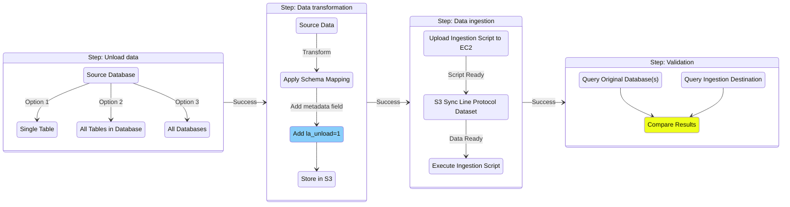

# Ingest to Timestream for InfluxDB

## Overview

Migration tooling for Timestream for InfluxDB allows you to easily transform your Timestream for LiveAnalytics data and ingest it to a Timestream for InfluxDB instance. Prior to performing the migration, ensure you have completed a cardinality assessment of the transformed schema to ensure Timestream for InfluxDB is a suitable migration target. See [../../cardinality/README.md](../../cardinality/README.md) for how to perform the cardinality assessment, and any potential schema alterations before starting the transformation process.

See the Influx documentation for [getting started](https://docs.influxdata.com/influxdb/v2/get-started/) with InfluxDB V2 for an overview of the database key concepts, as the data models differ from Timestream for LiveAnalytics in how the data model is represented.

For best practices when designing your Timestream for InfluxDB deployment, see [Applying the AWS Well-Architected Framework for Amazon Timestream for InfluxDB](https://docs.aws.amazon.com/prescriptive-guidance/latest/timestream-for-influxdb-well-architected-framework/introduction.html).

Migration is composed of four stages:
- [**Unload**](../../unload/README.md): Exports your Timestream for LiveAnalytics dataset to S3
- [**Data transformation**](./transform/README.md): Converts your Timestream for LiveAnalytics data to line protocol format (Based on the schema defined after the cardinality assessment)
- [**Data ingestion**](./ingestion/README.md): Ingests the line protocol dataset to your Timestream for InfluxDB instance
- [**Validation**](./validation/README.md): Validates that line protocol has been ingested



#### Prerequisites

Ensure you have run the steps in [README.md#Installation](../../README.md#installation).

- Migrating to <b>InfluxDB V2</b>

    Define the following environment variables:
    ```
    export INFLUXDB_V2_URL="https://influxdb_v2_url:8086"
    export INFLUXDB_V2_ORG="org"
    export INFLUXDB_V2_TOKEN="xxx"
    ```

- Migrating to <b>InfluxDB V3</b>

    InfluxDB V3 supports the [V2 write API](https://docs.influxdata.com/influxdb3/enterprise/write-data/compatibility-apis/).

    1. Set `influxdb_version` in the [config](example.migration-config.yaml) to `v3`. Note that *buckets* from V2 are called *databases* in V3.

    2. Define the following environment variables, omitting `INFLUXDB_V2_ORG` (concept of organizations do not apply in V3):
    ```
    export INFLUXDB_V2_URL="https://influxdb_v3_url:8181"
    export INFLUXDB_V2_TOKEN="xxx"
    ```

### Usage

Run `main.py` with the path to your config file which will handle all 4 stages of the migration:

```
python main.py --config <path_to_config>
```

Refer to [the example config](example.migration-config.yaml) for the full set of configurable options.

#### Example Scenarios

The migration script supports 2 modes:

1. `batch`: Migrates all specified source databases and tables between `start_time` and `end_time`

2. `live_replication`: Runs the migration as a continuous process with optional hard stop at `cutoff_time`.
    - `batch_sleep_min`: Number of minutes to sleep between batches.
    - `backfill_start_time`: The start datetime of the first batch.
    - `backfill_min_overlap`: Minutes to subtract from each batch's start time to capture late-arriving data.
    - `cutoff_time`: End datetime of the final batch.

- Migrate all records from all databases between `2020-01-01 00:00:00` and `2021-01-01 00:00:00`
    ```
    mode: batch
    batch:
      start_time: "2020-01-01 00:00:00"
      end_time:   "2021-01-01 00:00:00"
    source:
      all_databases: true
    ```

- Live replication every ~30 minutes with 1 minute backfill overlap
    ```
    mode: live_replication
    live_replication:
      batch_sleep_min: 30
      backfill_start_time: "2020-01-01 00:00:00"
      backfill_min_overlap: 1
    ```

- Migrate tables `cpu`, `memory` from database `database1` and all tables from `database2`:

    ```
    mode: batch
    batch:
      start_time: "2000-01-01 00:00:00"
      end_time: "2026-07-01 00:00:00"
    source:
      all_databases: false
      databases:
        database1:
          - cpu
          - memory
        database2:
    ```

- Transform dimension `hostname` to field from `database1`.`cpu`:

    ```
    stage:
      transform:
        dimensions_to_fields:
          database1:
            cpu:
              - hostname
    ```

## Live Migrations

For performing live migrations, see the [Live Migration Guide](./live_migration_guide.md).

## Troubleshooting

- If you are experiencing unexpected Python errors, ensure your Python virtual environment is properly activated:

    1. Activate the virtual environment:
    ```bash
    source venv/bin/activate
    ```

    You should see (venv)
    appear at the beginning of your command prompt.

    2. If you're experiencing command path issues, refresh your shell's command hash table:
    ```bash
    hash -r
    ```

    3. Verify Python path points to the virtual environment directory:

    ```bash
    which python
    ```

- Ensure required environment variables (for ingestion) are defined:
    - `INFLUXDB_V2_URL`
    - `INFLUXDB_V2_ORG`
    - `INFLUXDB_V2_TOKEN`

    Note that you can omit `INFLUXDB_V2_ORG` for migrations to InfluxDB V3.
