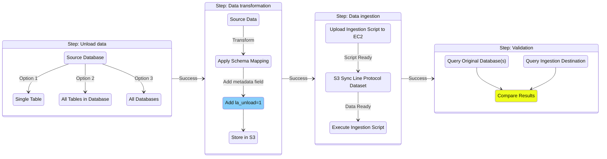

# Ingest to Timestream for InfluxDB

## Overview

Migration tooling for Timestream for InfluxDB allows you to easily transform your Timestream for LiveAnalytics data and ingest it to a Timestream for InfluxDB instance. Prior to performing the migration, ensure you have completed a cardinality assessment of the transformed schema to ensure Timestream for InfluxDB is a suitable migration target. See [../../cardinality/README.md](../../cardinality/README.md) for how to perform the cardinality assessment, and any potential schema alterations before starting the transformation process.

See the Influx documentation for [getting started](https://docs.influxdata.com/influxdb/v2/get-started/) with InfluxDB V2 for an overview of the database key concepts, as the data models differ from Timestream for LiveAnalytics in how the data model is represented.

For best practices when designing your Timestream for InfluxDB deployment, see [Applying the AWS Well-Architected Framework for Amazon Timestream for InfluxDB](https://docs.aws.amazon.com/prescriptive-guidance/latest/timestream-for-influxdb-well-architected-framework/introduction.html).

Migration is composed of four stages:
- [**Unload**](../../unload/README.md): Exports your Timestream for LiveAnalytics dataset to S3
- [**Data transformation**](./transform/README.md): Converts your Timestream for LiveAnalytics data to line protocol format (Based on the schema defined after the cardinality assessment)
- [**Data ingestion**](./ingestion/README.md): Ingests the line protocol dataset to your Timestream for InfluxDB instance
- [**Validation**](./validation/README.md): Validates that line protocol has been ingested




## End-to-end Migration

#### Prerequisites

Ensure you have run the steps in [README.md#Installation](../../README.md#installation).

- Migrating to <b>InfluxDB V2</b>

    Define the following environment variables:
    ```
    export INFLUXDB_V2_URL="https://influxdb_v2_url:8086"
    export INFLUXDB_V2_ORG="org"
    export INFLUXDB_V2_TOKEN="xxx"
    ```

- Migrating to <b>InfluxDB V3</b>

    InfluxDB V3 supports [backwards compatibility with prior versions (ie. the V2 write API)](https://docs.influxdata.com/influxdb3/enterprise/write-data/compatibility-apis/).

    1. Define the following environment variables, omitting `INFLUXDB_V2_ORG` (concept of organizations do not apply in V3):
    ```
    export INFLUXDB_V2_URL="https://influxdb_v3_url:8181"
    export INFLUXDB_V2_TOKEN="xxx"
    ```

    2. Set `influxdb_version` in your config to `v3`. Note that *buckets* from V2 are called *databases* in V3.

#### Usage

Run `main.py` with the path to your config file which will handle all 4 stages of the migration:

```
python main.py --config <path_to_config>
```

Refer to [the example config](example.migration-config.yaml) for the full set of configurable options.

##### Example Scenarios

- Migrate all databases and tables (in given region):

    ```
    source:
      all_databases: true
    ```

- Migrate tables `cpu`, `memory` from database `database1` and all tables from `database2`:

    ```
    source:
      all_databases: false
      databases:
        database1:
          - cpu
          - memory
        database2:
    ```

- Transform dimension `hostname` to field from `database1`.`cpu`:

    ```
      transform:
        dimensions_to_fields:
          database1:
            cpu:
              - hostname
    ```

## Sample Workflow for Manual Migrations

The following is a step-by-step workflow for performing a manual migration from a Timestream for LiveAnalytics database `benchmark` and table `cpu` to bucket `benchmark-bucket` in Timestream for InfluxDB V2.

###  1. Transform data from Timestream

Transform the unloaded data from Timestream for LiveAnalytics to line protocol (LP) using Athena.

```
cd transform
python3 transform.py --database-name benchmark --tables cpu --s3-bucket-path <s3_bucket_path> --add-validation-field true
```

- To transform all tables, use the `--all-tables` flag.
- If validation (comparing logical row counts between source and destination) is not required, set `--add-validation-field` flag to `false`.
- To convert dimensions to fields during transformation, use the `--dimensions-to-fields` flag.

See [transform/README.md](./transform/README.md) for more details.

### 2. Ingest line protocol to Timestream for InfluxDB

Download transformed LP dataset from S3:
```
aws s3 sync s3://<s3_bucket_name>/benchmark/cpu/unload-<%Y-%m-%d-%H-%M-%S>/line-protocol-output ./line-protocol-output
```

Define required environment variables:
```
export INFLUXDB_V2_URL="https://influxdb_v2_url:8086"
export INFLUXDB_V2_ORG="org"
export INFLUXDB_V2_TOKEN="xxx"
```

Run the ingestion script with the target Timestream for InfluxDB bucket and path to your downloaded LP dataset:
```
python3 ingestion/influxdb_ingestion.py benchmark-bucket ./line-protocol-output
```

- Optionally configure the number of workers (`-w`), batch size (`-l`), and I/O multiplier (`-m`) 
- Run ingestion with the `--continue-on-error` flag to continue ingesting remaining files even if one fails.
- On failure or disruption to ingestion, you can resume from a previous run by using the `--resume-from` flag. Specify the path to the tracking directory from a previous run to skip already ingested files.
    ```
    python3 ingestion/influxdb_ingestion.py benchmark-bucket ./line-protocol-output --resume-from  ./influxdb-ingestion-logs/tracking_<run_id>
    ```

See [ingestion/README.md](./ingestion/README.md) for more details.

### 3. Validation

Validate that all records have been ingested to InfluxDB:
```
python3 validation/validator.py
```

- Optionally configure `--start-time` and `--end-time` to validate row counts in time ranges.

- If any dimensions were converted to fields during transformation to LP, provide the full list of tags from the new schema. Refer to the output of the [transformation](transform/README.md#using-dimensions-as-fields) to retrieve tags from the transformed schema.

- To check current ingestion progress without impacting the migration, run the validator with `--influx-only` and `--skip-wal-check` flags. This provides a real-time count of points in Timestream for InfluxDB without querying the source database (Athena/Timestream for LiveAnalytics) and excludes records still in post-processing.

    ```
    python3 validation/validator.py --skip-wal-check --influx-only
    ```

See [validation/README.md](./validation/README.md) for more details.

## Troubleshooting

- If you are experiencing unexpected Python errors, ensure your Python virtual environment is properly activated:

    1. Activate the virtual environment:
    ```bash
    source venv/bin/activate
    ```

    You should see (venv)
    appear at the beginning of your command prompt.

    2. If you're experiencing command path issues, refresh your shell's command hash table:
    ```bash
    hash -r
    ```

    3. Verify Python path points to the virtual environment directory:

    ```bash
    which python
    ```

- Ensure required environment variables (for ingestion) are defined:
    - `INFLUXDB_V2_URL`
    - `INFLUXDB_V2_ORG`
    - `INFLUXDB_V2_TOKEN`

    Note that you can omit `INFLUXDB_V2_ORG` for migrations to InfluxDB V3.
