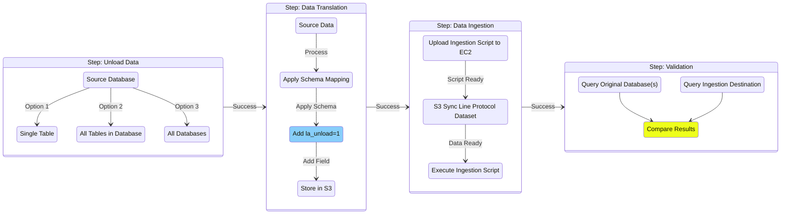

# Ingest to Timestream for InfluxDB

TODO: Intro

## Overview



TODO: Overview

### End-to-end Migration

TODO: 

####  1. Unload and transform data from Timestream

Run `unload_and_transform.py` to export data from Timestream to S3 and transform it to line protocol (LP) using Athena.

```
python main.py --database-name benchmark12 --athena-database-name mig3  --tables cpu --s3-bucket-name migration-002-tmp --add-validation-field
```

- If end-to-end validation is not required (comparing row counts between source and destination databases), remove the `--add-validation-field` flag. 
- To convert dimensions to fields during transformation, use the `--dimensions-to-fields` flag.

The output LP dataset can be found in `s3://<bucket_name>/<database_name>/<table_name>/line_protocol_output`


#### 2. Ingest LP to InfluxDB

Define the following environment variables:
```
INFLUXDB_V2_URL
INFLUXDB_V2_TOKEN
INFLUXDB_V2_ORG
```

Download transformed LP dataset from S3:
```
aws s3 sync s3://migration-002-tmp/benchmark12/cpu/line-protocol-output/ ./line-protocol-output
```

Run the ingestion script with the target InfluxDB bucket and path to your downloaded LP dataset:
```
python3 unload_influxdb_ingestion.py smol ./line-protocol-output
```

You can optionally run ingestion with the `--continue-on-error` flag to continue ingesting remaining files even if one fails.

On failure or disruption to ingestion, you can resume from a previous run by using the `--resume-from` flag. Specify the path to the tracking directory from a previous run to skip already ingested files.

```
python3 unload_influxdb_ingestion.py smol ./line-protocol-output --resume-from  ./influxdb-ingestion-logs/tracking_<run_id>
```


#### 3. Validation

Using the validation script, you can verify that all records have been ingested to InfluxDB.
```
python validator.py
```

If any dimensions were converted to fields during transformation to LP, provide the full list of tags from the new schema. Refer to the output of `unload_and_transform.py` (Step 1) to retrieve tags from the transformed schema.

To check current ingestion progress without impacting the migration, use the validator with `--influx-only` and `--skip-wal-check` flags. This provides a real-time count of points in InfluxDB without querying the source database (Athena/Timestream) but excludes records still in post-processing.

```
python validator.py --skip-wal-check --influx-only
```

## FAQ

TODO
