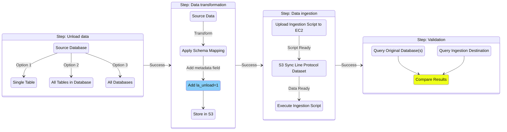

# Ingest to Timestream for InfluxDB

## Overview

Migration tooling for Timestream for InfluxDB allows you to easily transform your Timestream for LiveAnalytics data and ingest it to a Timestream for InfluxDB instance. Prior to performing the migration, ensure you have completed a cardinality assessment of the transformed schema to ensure Timestream for InfluxDB is a suitable migration target. See [../../cardinality/README.md](../../cardinality/README.md) for how to perform the cardinality assessment, and any potential schema alterations before starting the transformation process.

Migrating to Timestream for InfluxDB takes multiple steps as the data models differ in how the data model is represented. See the Influx documentation for [getting started](https://docs.influxdata.com/influxdb/v2/get-started/) with InfluxDB V2 for an overview of the database key concepts.

The workflow for completing a migration is separated into four stages:
- **Unload**: Export your Timestream for LiveAnalytics dataset to S3
- **Data transformation**: Convert your Timestream for LiveAnalytics data to line protocol format (Based on the schema defined after the cardinality assessment)
- **Data ingestion**: Ingest the line protocol dataset to your Timestream for InfluxDB instance
- **Validation**: Optionally you can validate that every line protocol point has been ingested (Requires hard-coded field during transformation)

See [End to end migration](#end-to-end-migration) for additional details on each step, and the migration diagram below for a visual workflow.




## End-to-end Migration

###  1. Unload and transform data from Timestream

Run `unload_and_transform.py` to export data from Timestream to S3 and transform it to line protocol (LP) using Athena.

```
python transorm/transform.py --database-name benchmark12 --athena-database-name mig3  --tables cpu --s3-bucket-name migration-002-tmp --add-validation-field true
```

- If end-to-end validation is not required (comparing row counts between source and destination databases), set `--add-validation-field` flag to `false`.
- To convert dimensions to fields during transformation, use the `--dimensions-to-fields` flag.

The output LP dataset can be found in `s3://<bucket_name>/<database_name>/<table_name>/line_protocol_output`

### 2. Ingest line protocol to Timestream for InfluxDB

Define the following environment variables:
```
INFLUXDB_V2_URL
INFLUXDB_V2_TOKEN
INFLUXDB_V2_ORG
```

Download transformed LP dataset from S3:
```
aws s3 sync s3://migration-002-tmp/benchmark12/cpu/line-protocol-output/ ./line-protocol-output
```

Run the ingestion script with the target Timestream for InfluxDB bucket and path to your downloaded LP dataset:
```
python3 ingestion/influxdb_ingestion.py smol ./line-protocol-output
```

You can optionally run ingestion with the `--continue-on-error` flag to continue ingesting remaining files even if one fails.

On failure or disruption to ingestion, you can resume from a previous run by using the `--resume-from` flag. Specify the path to the tracking directory from a previous run to skip already ingested files.

```
python3 ingestion/influxdb_ingestion.py smol ./line-protocol-output --resume-from  ./influxdb-ingestion-logs/tracking_<run_id>
```


#### 3. Validation

Using the validation script, you can verify that all records have been ingested to InfluxDB.
```
python3 validation/validator.py
```

If any dimensions were converted to fields during transformation to LP, provide the full list of tags from the new schema. Refer to the output of `unload_and_transform.py` (Step 1) to retrieve tags from the transformed schema.

To check current ingestion progress without impacting the migration, use the validator with `--influx-only` and `--skip-wal-check` flags. This provides a real-time count of points in Timestream for InfluxDB without querying the source database (Athena/Timestream for LiveAnalytics) but excludes records still in post-processing.

```
python3 validation/validator.py --skip-wal-check --influx-only
```

## Troubleshooting

If you are experiencing unexpected Python errors, ensure your Python virtual environment is properly activated:

1. Activate the virtual environment:
```bash
source venv/bin/activate
```

You should see (venv)
appear at the beginning of your command prompt.

2. If you're experiencing command path issues, refresh your shell's command hash table:
```bash
hash -r
```

3. Verify Python path points to the virtual environment directory:

```bash
which python
```

