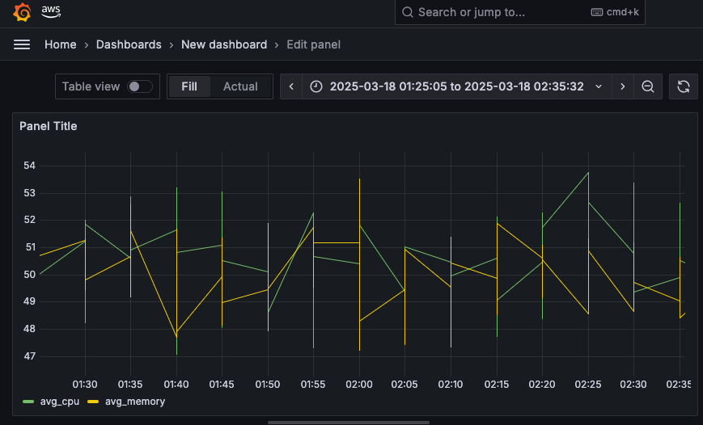
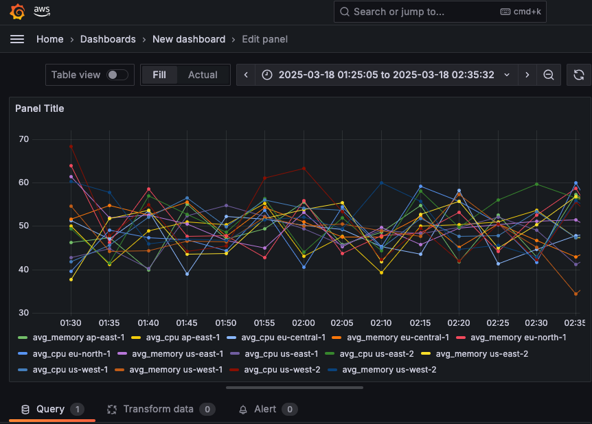

# Migrating from Amazon Timestream for LiveAnalytics to InfluxDB V2

This guide provides a comprehensive comparison between Amazon Timestream for LiveAnalytics and InfluxDB V2, focusing on how to migrate an existing LiveAnalytics ingestion workflow implementation to InfluxDB V2.

Along with the guide are two sample applications which can be used to ingest the same sample dataset to Timestream for LiveAnalytics and Timestream for InfluxDB.

## Table of Contents

1. [InfluxDB V2 vs InfluxDB V3](#influxdb-v2-vs-influxdb-v3)
2. [Running Example Apps](#running-example-apps)
   - [InfluxDB App](#influxdb-app)
   - [Timestream for LiveAnalytics App](#timestream-for-liveanalytics-app)
3. [Concept Mapping](#concept-mapping)
4. [Function Comparison](#function-comparison)
   - [Client Creation and Configuration](#client-creation-and-configuration)
   - [Database/Bucket Creation](#databasebucket-creation)
   - [Table/Measurement Creation](#tablemeasurement-creation)
   - [Record/Point Creation](#recordpoint-creation)
   - [Setting Dimensions/Tags](#setting-dimensionstags)
   - [Setting Measures/Fields](#setting-measuresfields)
   - [Setting Timestamp](#setting-timestamp)
   - [Setting Time Unit](#setting-time-unit)
   - [Writing Data](#writing-data)
5. [Batch Size Differences](#batch-size-differences)
6. [Retention Policy Differences](#retention-policy-differences)
7. [Dependencies](#dependencies)
8. [Authentication and Authorization](#authentication-and-authorization)
9. [Data Conversion Process](#data-conversion-process)
10. [Summary of Key Migration Considerations](#summary-of-key-migration-considerations)
11. [Querying Data in Grafana](#querying-data-in-grafana)
    - [Query example: Average CPU and Memory Utilization by Region](#query-example-average-cpu-and-memory-utilization-by-region)
12. [Query Language Differences and Limitations](#query-language-differences-and-limitations)
    - [SQL vs. Flux](#sql-vs-flux)
    - [Key Limitations and Differences](#key-limitations-and-differences)

## InfluxDB V2 vs InfluxDB V3

Many of the concepts used for InfluxDB V2 are compatible with InfluxDB V3, and the sample application will successfully ingest data to InfluxDB V3 core's [V2 compatibility API](https://docs.influxdata.com/influxdb3/core/write-data/http-api/compatibility-apis/). While InfluxDB V3 supports ingestion through the V2 compatibility API, InfluxDB V2 Flux queries are not supported.

### InfluxDB version differences

| InfluxDB V2 | InfluxDB V3 | Notes |
|-------------|-------------|-------|
| Bucket      | Database    | The top-level container for time series data |
| Table       | Measurement | Defines the data structure |
| Flux / InfluxQL | SQL / InfluxQL | Supported query languages |


## Running example apps

Complete the following steps to ingest the sample datasets to Timestream for LiveAnalytics and Timestream for InfluxDB.

### InfluxDB app

Have an InfluxDB instance accessible and define the following environment variables:

```
export INFLUXDB_V2_URL="https://<InfluxDB V2 endpoint>:8086"
export INFLUXDB_V2_ORG="org"
export INFLUXDB_V2_TOKEN="xxx"
```

Create a virtual environment using venv and install required dependencies.

```bash
python3 -m venv .env && \
source .env/bin/activate && \
python3 -m pip install influxdb_client boto3
```

Run the InfluxDB sample application.

```bash
python3 influxdb_iot.py
```

### Timestream for LiveAnalytics app

Ensure you have your local environment setup with AWS credentials configured with permissions to create Timestream for LiveAnalytics databases and tables.

```bash
python3 liveanalytics_iot.py
```

Continue reading the remainder of the guide in order to understand how the data is stored, accessed, and interpreted in the different time series solutions. The guide is not exhaustive of all options for ingestion and querying but provides a high level overview of the important topics and research required for a successful workflow migration from LiveAnalytics to InfluxDB.

## Concept Mapping

| Timestream for LiveAnalytics Concept  | InfluxDB V2 Concept | Notes |
|---------------------------------------|---------------------|-------|
| Database                              | Bucket              |The top-level container for time series data |
| Table                                 | Measurement         |Defines the data structure |
| Dimensions                            | Tags                |Used for metadata and filtering |
| Measure name                          | Tag                 |In InfluxDB, the measurement name serves a similar purpose |
| Measures                              | Fields              |The actual data values being stored |
| Time                                  | Timestamp           |Both use timestamps for time series data |
| Time unit                             | Precision           |InfluxDB handles precision differently |

## Function Comparison

In this section we delve into the differences in implementation of the basic examples used to ingest to [LiveAnalytics](https://boto3.amazonaws.com/v1/documentation/api/latest/reference/services/timestream-write.html) versus [InfluxDB](https://influxdb-client.readthedocs.io/en/latest/).

### Client Creation and Configuration

#### Timestream for LiveAnalytics

```python
def create_timestream_client():
    config = Config(
        read_timeout=20,
        max_pool_connections=5000,
        retries={"max_attempts": 10}
    )
    return boto3.client('timestream-write', config=config)
```

#### InfluxDB V2

```python
def create_influxdb_client():
    return InfluxDBClient().from_env_properties()
```

**Key Differences:**
- Timestream uses AWS SDK (boto3) while InfluxDB uses its own client library
- Timestream configuration focuses on AWS-specific parameters
- InfluxDB uses environment variables for org name, token, and URL

### Database/Bucket Creation

#### Timestream for LiveAnalytics

```python
def create_database_if_nonexistent(client, database_name):
    try:
        client.create_database(DatabaseName=database_name)
        print(f"Created database: {database_name}")
    except client.exceptions.ConflictException:
        print(f"Database {database_name} already exists")
    except Exception as e:
        print(f"Error creating database: {e}")
        raise
```

#### InfluxDB V2

```python
def create_bucket_if_nonexistent(client: InfluxDBClient, bucket_name: str, retention_hours: int) -> None:
    from influxdb_client.domain.bucket_retention_rules import BucketRetentionRules

    buckets_api = client.buckets_api()
    bucket = buckets_api.find_bucket_by_name(bucket_name)

    if bucket is None:
        print(f"Creating bucket: {bucket_name}")

        retention_rules = None
        if retention_hours > 0:
            retention_rules = BucketRetentionRules(type="expire", every_seconds=retention_hours * 3600)
            print(f"Setting retention policy: {retention_hours} hours")

        buckets_api.create_bucket(
            bucket_name=bucket_name, 
            org=client.org,
            retention_rules=retention_rules
        )
    else:
        print(f"Bucket {bucket_name} already exists")
```

**Key Differences:**
- InfluxDB V2 requires organization specification
- InfluxDB V2 Buckets can define retention rule

### Table/Measurement Creation

#### Timestream for LiveAnalytics

```python
def create_table_if_nonexistent(client, database_name, table_name):
    try:
        client.create_table(
            DatabaseName=database_name,
            TableName=table_name,
            RetentionProperties={
                'MemoryStoreRetentionPeriodInHours': 24,
                'MagneticStoreRetentionPeriodInDays': 7
            }
        )
        print(f"Created table: {table_name}")
    except client.exceptions.ConflictException:
        print(f"Table {table_name} already exists")
    except Exception as e:
        print(f"Error creating table: {e}")
        raise
```

#### InfluxDB V2

In InfluxDB, measurements are created implicitly when data is written. There's no need to explicitly create a measurement before writing data.

**Key Differences:**
- Timestream requires explicit table creation with retention properties
- InfluxDB creates measurements automatically when writing data
- Retention policies in InfluxDB V2 are set at the bucket level, not the measurement level

### Record/Point Creation

#### Timestream for LiveAnalytics

```python
def create_record():
    return {
        'Dimensions': [],
        'MeasureName': '',
        'MeasureValues': [],
        'MeasureValueType': 'MULTI',
        'Time': '',
        'TimeUnit': ''
    }
```

#### InfluxDB V2

```python
def create_point(measurement=MEASUREMENT_NAME):
    return Point(measurement)
```

**Key Differences:**
- Timestream records are dictionaries with specific keys
- InfluxDB uses Points to define line protocol
- Timestream requires explicit specification of all components
- InfluxDB V2 has a more fluent API for building points

### Setting Dimensions/Tags

#### Timestream for LiveAnalytics

```python
def set_record_dimensions(record, dimensions):
    record['Dimensions'] = [
        {'Name': name, 'Value': value}
        for name, value in dimensions.items()
    ]
    return record
```

#### InfluxDB V2

```python
def set_point_tags(point, tags):
    for name, value in tags.items():
        point = point.tag(name, value)

    return point
```

**Key Differences:**
- InfluxDB tags increase the cardinality and directly affect DB performance, see [Cardinality Caldulation Script](../../../cardinality/README.md) for an in-depth look into cardinality

### Setting Measures/Fields

#### Timestream for LiveAnalytics

```python
def set_record_measures(record, measures):
    record['MeasureValues'] = [
        {
            'Name': name,
            'Value': str(details['value']),
            'Type': details['type']
        }
        for name, details in measures.items()
    ]
    return record
```

#### InfluxDB V2

```python
def set_point_fields(point, fields):
    for name, value in fields.items():
        if isinstance(value, dict) and 'value' in value:
            # Extract the value from the nested structure
            field_value = value['value']
            point = point.field(name, field_value)
        else:
            point = point.field(name, value)
    
    return point
```

**Key Differences:**
- Timestream requires explicit type specification for each measure
- InfluxDB V2 infers types
- Timestream uses a more complex structure for multi-measure records
- InfluxDB V2 has a simpler field model

### Setting Timestamp

#### Timestream for LiveAnalytics

```python
def set_record_timestamp(record, timestamp):
    if isinstance(timestamp, str):
        # Parse the timestamp string with nanosecond precision
        # First, split the string into datetime part and nanosecond part
        datetime_part = timestamp[:26]  # Up to microseconds
        nanosecond_part = timestamp[26:] if len(timestamp) > 26 else "000"

        # Parse the datetime part
        dt = datetime.strptime(datetime_part, "%Y-%m-%d %H:%M:%S.%f")

        # Convert to nanosecond precision timestamp
        # First convert to seconds since epoch
        epoch_seconds = dt.timestamp()
        # Convert to nanoseconds and add the nanosecond part
        epoch_nanoseconds = int(epoch_seconds * 1_000_000_000) + int(nanosecond_part)

        record['Time'] = str(epoch_nanoseconds)
    else:
        record['Time'] = str(timestamp)

    return record
```

#### InfluxDB V2

```python
def set_point_timestamp(point: Point, timestamp: str) -> Point:
    if isinstance(timestamp, str):
        # Parse the timestamp string with nanosecond precision
        # First, split the string into datetime part and nanosecond part
        datetime_part = timestamp[:26]  # Up to microseconds
        nanosecond_part = timestamp[26:] if len(timestamp) > 26 else "000"

        # Parse the datetime part
        dt = datetime.strptime(datetime_part, "%Y-%m-%d %H:%M:%S.%f")

        # Convert to nanosecond precision timestamp
        # First convert to seconds since epoch
        epoch_seconds = dt.timestamp()
        # Convert to nanoseconds and add the nanosecond part
        epoch_nanoseconds = int(epoch_seconds * 1_000_000_000) + int(nanosecond_part)

        point = point.time(epoch_nanoseconds, write_precision='ns')
    else:
        point = point.time(timestamp)

    return point
```

**Key Differences:**
- Timestream requires explicit time unit specification (separate function)
- InfluxDB V2 handles precision at the write API level

### Setting Time Unit

#### Timestream for LiveAnalytics

```python
def set_record_time_unit(record, time_unit):
    record['TimeUnit'] = time_unit
    return record
```

#### InfluxDB V2

InfluxDB V2 specifies the precision when writing data.

**Key Differences:**
- Timestream requires explicit time unit specification per record
- InfluxDB V2 handles precision at the write API level

### Writing Data

#### Timestream for LiveAnalytics

```python
def write_records(client, database_name, table_name, records):
    total_records = len(records)
    records_written = 0

    # Process records in batches of MAX_BATCH_SIZE (100 records is Timestream maximum)
    for i in range(0, total_records, MAX_BATCH_SIZE):
        batch = records[i:i + MAX_BATCH_SIZE]
        try:
            result = client.write_records(
                DatabaseName=database_name,
                TableName=table_name,
                Records=batch
            )
            records_written += len(batch)
            print(f"Successfully wrote {len(batch)} records. Total: {records_written}/{total_records}")
        except client.exceptions.RejectedRecordsException as e:
            print(f"Some records were rejected: {e}")
            for rejected in e.response["RejectedRecords"]:
                print(f"Rejected record at index {rejected['RecordIndex']}: {rejected['Reason']}")
        except Exception as e:
            print(f"Error writing records: {e}")

    return records_written
```

#### InfluxDB V2

```python
def write_line_protocol(client: InfluxDBClient, bucket: str, points: List[Point]) -> int:
    total_points = len(points)
    points_written = 0

    write_api = client.write_api(write_options=SYNCHRONOUS)

    # Process points in batches of MAX_BATCH_SIZE
    for i in range(0, total_points, MAX_BATCH_SIZE):
        batch = points[i:i + MAX_BATCH_SIZE]
        try:
            write_api.write(bucket=bucket, org=client.org, record=batch)
            points_written += len(batch)
            print(f"Successfully wrote {len(batch)} points. Total: {points_written}/{total_points}")
        except Exception as e:
            print(f"Error writing points: {e}")

    return points_written
```

**Key Differences:**
- Timestream has a maximum batch size of 100 records
- InfluxDB V2 has an optimal batch size of 5000 points
- Timestream requires database and table names
- InfluxDB V2 requires bucket and organization

## Batch Size Differences

- **Timestream for LiveAnalytics**: Maximum batch size of 100 records, see [Batch load best practices](https://docs.aws.amazon.com/timestream/latest/developerguide/batch-load-best-practices.html) for more information
- **InfluxDB V2**: Optimal batch size of 5000 points, see [Optimize writes to InfluxDB](https://docs.influxdata.com/influxdb/v2/write-data/best-practices/optimize-writes/) for additional information

This significant difference in batch sizes can lead to performance improvements when migrating to InfluxDB V2, as fewer API calls are needed to write the same amount of data.

## Retention Policy Differences

### Timestream for LiveAnalytics

In Timestream, [retention policies](https://docs.aws.amazon.com/timestream/latest/developerguide/storage.html) are defined at the table level with two distinct storage tiers:

1. **Memory Store**: High-performance, in-memory storage for recent data
   - Configured in hours (e.g., 24 hours)
   - Higher cost but faster query performance
   - Specified using `MemoryStoreRetentionPeriodInHours`

2. **Magnetic Store**: Lower-cost storage for historical data
   - Configured in days (e.g., 7 days, 365 days)
   - Lower cost but slower query performance
   - Specified using `MagneticStoreRetentionPeriodInDays`

Example:
```python
client.create_table(
    DatabaseName=database_name,
    TableName=table_name,
    RetentionProperties={
        'MemoryStoreRetentionPeriodInHours': 24,
        'MagneticStoreRetentionPeriodInDays': 7
    }
)
```

Data automatically moves from Memory Store to Magnetic Store after the Memory Store retention period expires.

### InfluxDB V2

In InfluxDB V2, [retention policies](https://docs.influxdata.com/influxdb/v2/reference/internals/data-retention/) are defined at the bucket level:

1. **Single-tier storage**: InfluxDB V2 uses a single storage tier with a unified retention policy
   - Configured in seconds (typically specified in hours or days)
   - Set using `BucketRetentionRules` with an expiration type
   - Can set to infinite retention by not specifying retention rules or setting to 0

Example:
```python
from influxdb_client.domain.bucket_retention_rules import BucketRetentionRules

retention_rules = BucketRetentionRules(type="expire", every_seconds=24 * 3600)  # 24 hours

buckets_api.create_bucket(
    bucket_name=bucket_name, 
    org=client.org,
    retention_rules=retention_rules
)
```

**Key Differences:**
- Timestream uses a two-tiered storage model (Memory Store and Magnetic Store)
- InfluxDB V2 uses a single-tier storage model
- Timestream automatically moves data between tiers
- In Timestream, retention is set at the table level, while in InfluxDB V2 it's set at the bucket level

When migrating from Timestream to InfluxDB V2, you'll need to decide on a single retention period that meets your needs, typically based on your Magnetic Store retention period if you need long-term storage, or a combination of both retention periods depending on your use case.

## Dependencies

### Timestream for LiveAnalytics

```python
import boto3
from botocore.config import Config
```

### InfluxDB V2

```python
from influxdb_client import InfluxDBClient, Point
from influxdb_client.client.write_api import SYNCHRONOUS
```

**Key Differences:**
- Timestream requires [AWS SDK (boto3)](https://boto3.amazonaws.com/v1/documentation/api/latest/reference/services/timestream-write.html)
- InfluxDB V2 requires the [influxdb_client package](https://influxdb-client.readthedocs.io/en/latest/)

## Authentication and Authorization

### Timestream for LiveAnalytics

Authentication and authorization in Timestream are handled through AWS Identity and Access Management (IAM):

- Uses [AWS credentials](https://docs.aws.amazon.com/cli/v1/userguide/cli-configure-files.html) (access key ID and secret access key)
- Permissions are managed through IAM policies
- Credentials are typically loaded from environment variables, AWS configuration files, or instance metadata

Example:
```python
# Credentials are loaded automatically from environment variables or configuration files
client = boto3.client('timestream-write')
```

### InfluxDB V2

Authentication in InfluxDB V2 is handled through [API tokens](https://docs.influxdata.com/influxdb/v2/admin/tokens/):

- Requires a token for authentication
- Organization membership for authorization
- Tokens can have specific permissions (read, write, etc.)
- Tokens are configured by environment variables (recommended), or passed in directly

Example:
```python
client = InfluxDBClient.from_env_properties()
```

**Key Differences:**
- Timestream uses AWS IAM for authentication and authorization
- InfluxDB V2 uses API tokens and organizations

## Data Conversion Process

When migrating from Timestream to InfluxDB, you'll need to convert your data structures:

### Timestream Record to InfluxDB Point

```python
# Timestream record
timestream_record = {
    'Dimensions': [
        {'Name': 'region', 'Value': 'us-east-1'},
        {'Name': 'az', 'Value': 'us-east-1a'},
        {'Name': 'hostname', 'Value': 'host1'}
    ],
    'MeasureName': 'system_metrics',
    'MeasureValues': [
        {'Name': 'cpu_utilization', 'Value': '70.0', 'Type': 'DOUBLE'},
        {'Name': 'memory_utilization', 'Value': '85.0', 'Type': 'DOUBLE'}
    ],
    'Time': '1596339600000',
    'TimeUnit': 'NANOSECONDS'
}

# Equivalent InfluxDB point
influxdb_point = Point("system_metrics") \
    .tag("region", "us-east-1") \
    .tag("az", "us-east-1a") \
    .tag("hostname", "host1") \
    .field("cpu_utilization", 70.0) \
    .field("memory_utilization", 85.0) \
    .time(datetime.fromtimestamp(1596339600000))
```

## Summary of Key Migration Considerations

1. **Conceptual Mapping**: Understand how Timestream concepts map to InfluxDB V2 concepts
2. **Client Configuration**: Switch from boto3 to influxdb_client
3. **Authentication**: Move from AWS IAM to InfluxDB tokens
4. **Data Structure**: Convert from Timestream records to InfluxDB line protocol
5. **Batch Sizes**: Adjust batch sizes from 100 to 5000
7. **Time Handling**: Adapt timestamp handling to use InfluxDB's approach

By following this guide, you should be able to successfully migrate your Amazon Timestream for LiveAnalytics implementation to InfluxDB V2 while maintaining the same ingestion functionality.

## Querying Data in Grafana

After migrating your data from Amazon Timestream for LiveAnalytics to InfluxDB V2, you'll need to adapt your [Timestream SQL queries](https://docs.aws.amazon.com/timestream/latest/developerguide/reference.html) to work with InfluxDB V2 [Flux](https://docs.influxdata.com/influxdb/v2/query-data/flux/) or [InfluxQL](https://docs.influxdata.com/influxdb/v2/query-data/influxql/). Below is an example of a similar query which also highlights how data model differences need to be accounted for when adapting queries. There are fundamental difference in database data models, query languages, and how visualizations function.

See [Get started with Grafana and InfluxDB](https://grafana.com/docs/grafana/latest/getting-started/get-started-grafana-influxdb/) and [Amazon Timestream plugin for Grafana](https://grafana.com/grafana/plugins/grafana-timestream-datasource/) for an overview of working with Grafana and InfluxDB or LiveAnalytics.

### Query example: Average CPU and Memory Utilization by Region

#### LiveAnalytics SQL Query



```sql
SELECT region, 
       AVG(cpu_utilization) AS avg_cpu, 
       AVG(memory_utilization) AS avg_memory,
       BIN(time, 5m) AS time_bin
FROM "timestream_iot_sample"."iot_data"
WHERE time BETWEEN '2025-03-18 08:28:29' AND '2025-03-18 10:42:09'
  AND measure_name = 'system_metrics'
GROUP BY region, BIN(time, 5m)
ORDER BY time_bin ASC
```

#### InfluxDB V2 Flux Query



```
from(bucket: "iot_sample")
  |> range(start: 2025-03-18T08:28:29Z, stop: 2025-03-18T10:42:09Z)
  |> filter(fn: (r) => r._measurement == "system_metrics")
  |> filter(fn: (r) => r._field == "cpu_utilization" or r._field == "memory_utilization")
  |> aggregateWindow(every: 5m, fn: mean, createEmpty: false)
  |> pivot(rowKey: ["_time"], columnKey: ["_field"], valueColumn: "_value")
  |> map(fn: (r) => ({
      region: r.region,
      avg_cpu: r.cpu_utilization,
      avg_memory: r.memory_utilization,
      _time: r._time
    }))
  |> group(columns: ["region"])
  |> sort(columns: ["_time"], desc: false)
  |> yield(name: "mean")
```

The key differences in how these queries compare are listed as follows:

1. __Data Model Differences__:

   - In LiveAnalytics, the data is stored with a measure_name of "system_metrics" and multiple measure values (cpu_utilization, memory_utilization) within each record. See [Data modeling](https://docs.aws.amazon.com/timestream/latest/developerguide/data-modeling.html) for more information on how LiveAnalytics models the time series data.
   - In InfluxDB V2, the data is stored with a measurement name of "system_metrics" and fields for cpu_utilization and memory_utilization. See [Key concepts](https://docs.influxdata.com/influxdb/v2/get-started/#key-concepts-before-you-get-started) for more information on InfluxDB data modelling.

2. __Query Structure__:

   - The LiveAnalytics query groups by region and time bin, which would result in one series per region with both avg_cpu and avg_memory as fields.
   - The InfluxDB V2 query uses `group(columns: ["region"])` which creates separate series for each region.

3. __Series Generation in Grafana__:

   - For the LiveAnalytics query, Grafana would create 2 series (one for avg_cpu and one for avg_memory) because the query returns a single result set with these two metrics.
   - For the InfluxDB V2 query, Grafana would create a series for each region's avg_cpu and avg_memory, resulting in more series if there are multiple regions.

4. __Visualization in Grafana__:

   - The LiveAnalytics query would show 2 lines in a time series chart (one for avg_cpu and one for avg_memory).
   - The InfluxDB V2 query would show a line for each region's avg_cpu and avg_memory, resulting in more lines if there are multiple regions.

These differences in visualizations and queries highlight the importance of understanding the use-case for querying the data being in LiveAnalytics vs InfluxDB V2. While migrating ingestion workflows may be fairly simple, there may be limitations in the data model and supported feature of the database.

## Query Language Differences and Limitations

When migrating from Amazon Timestream for LiveAnalytics to InfluxDB V2, it's important to understand the key differences between SQL and Flux query languages:

***(note)*** &rarr; InfluxDB V3 supports SQL with minor differences to the time specific functions from LiveAnalytics. See [SQL reference documentation](https://docs.influxdata.com/influxdb3/core/reference/sql/) for more info on SQL with InfluxDB V3.

### SQL vs. Flux

| Feature | LiveAnalytics (SQL) | InfluxDB V2 (Flux) | Notes |
|---------|---------------------|-----------------|-------|
| Query Language | Standard SQL with time series extensions | Functional data scripting language | Flux has a steeper learning curve |
| Time Functions | `ago()`, `now()`, `BIN()` | `range()`, `aggregateWindow()` | Different time handling paradigms |
| Aggregations | `AVG()`, `SUM()`, `MIN()`, `MAX()`, etc. | `mean()`, `sum()`, `min()`, `max()`, etc. | Similar functionality, different syntax |
| Grouping | `GROUP BY` clause | `group()` function | Flux uses functional approach |
| Filtering | `WHERE` clause | `filter()` function | Flux uses predicates in functions |
| Joins | SQL joins | `join()` function | Flux joins require explicit column mapping |
| Sorting | `ORDER BY` clause | `sort()` function | Similar functionality |
| Limiting | `LIMIT` clause | `limit()` function | Similar functionality |

### Key Limitations and Differences

1. **Data Model Differences**:
   - LiveAnalytics uses a record-based model with dimensions and measures
   - InfluxDB uses a series-based model with tags and fields
   - This affects how you structure queries and join data

2. **Missing Functions**:
   - LiveAnalytics has specialized time series functions not available in Flux
   - Flux has functional programming capabilities not available in SQL
   - Some complex SQL queries may require multiple Flux operations

3. **Query Complexity**:
   - Simple queries are often more verbose in Flux
   - Complex data transformations can be more elegant in Flux
   - SQL's declarative nature vs. Flux's functional pipeline approach

4. **Performance Considerations**:
   - LiveAnalytics optimizes for large-scale time series analytics
   - InfluxDB V2 optimizes for high write throughput and real-time queries
   - Query patterns may need adjustment for optimal performance

5. **Visualization Integration**:
   - Grafana supports both query languages
   - SQL queries may be easier to build in Grafana's query editor
   - Flux offers more flexibility for complex visualizations

Understanding these differences is important for a successful workflow migration. You can effectively translate your LiveAnalytics SQL queries to InfluxDB V2 Flux queries while maintaining similar visualization capabilities in Grafana with some limitations. A thorough investigation into workflows and queries on the underlying data should be done to remove as much uncertainty of compatibility between the two time series solutions.

