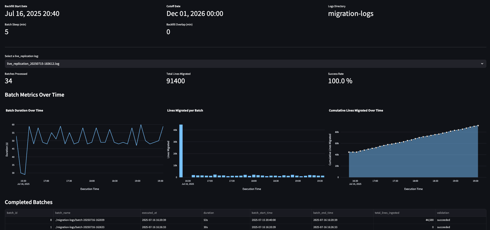

# Live Migration Guide

This guide explains how to perform **live migrations** when moving your applications from **Amazon Timestream for LiveAnalytics** to [**Timestream for InfluxDB**](https://docs.aws.amazon.com/timestream/latest/developerguide/timestream-for-influxdb.html).

The migration has three high‑level phases:

1. **[Data Migration](#step-1--data-migration)** – continuously back‑fill and replicate historical + live records from Timestream for LiveAnalytics into Timestream for InfluxDB using batched [Line Protocol](https://docs.influxdata.com/influxdb3/cloud-dedicated/reference/syntax/line-protocol/) ingestion.
2. **[Application Migration](#step-2--application-migration)** – refactor your application code, queries, dashboards and alerting rules so clients read from and write to Timestream for InfluxDB.
3. **[Clean Up](#step-3--clean-up)** – de‑commission your legacy Timestream for LiveAnalytics resources once data and traffic have been fully cut over.

---
## Table of Contents

0. [Prerequisites](#prerequisites)
1. [Step 1 · Data Migration](#step-1--data-migration)
   - [Quick start](#quick-start)
   - [Tracking Migration Progress](#tracking-migration-progress)
   - [Batch Directory Structure](#batch-directory-structure)
2. [Step 2 · Application Migration](#step-2--application-migration)
   - [Migration Strategy](#migration-strategy)
   - [Coordination and Planning](#coordination-and-planning)
   - [Implementation Guide](#implementation-guide)
3. [Step 3 · Clean Up](#step-3--clean-up)
   - [Checklist](#checklist)
---

## Prerequisites

Before starting the migration, ensure you have the necessary tools and dependencies installed. Follow the installation steps at **[README.md#Installation](../../../README.md#installation)**.

- Migrating to <b>InfluxDB V2</b>

    Define the following environment variables:
    ```
    export INFLUXDB_V2_URL="https://influxdb_v2_url:8086"
    export INFLUXDB_V2_ORG="org"
    export INFLUXDB_V2_TOKEN="xxx"
    ```

- Migrating to <b>InfluxDB V3</b>

    InfluxDB V3 supports ingestion through the [V2 write API](https://docs.influxdata.com/influxdb3/enterprise/write-data/compatibility-apis/).

    Define the following environment variables, omitting `INFLUXDB_V2_ORG` (concept of organizations do not apply in V3):
    ```
    export INFLUXDB_V2_URL="https://influxdb_v3_url:8181"
    export INFLUXDB_V2_TOKEN="xxx"
    ```

    > **Large datasets (≥1 TB)** – LP ingestion can be slow. The InfluxDB team is working on a Parquet‑based migration solution for InfluxDB V3; consider waiting if you are dealing with terabytes (or more) of data.


---

## Step 1 · Data Migration

> **Goal:** keep data in the two clusters in near‑real‑time sync while you re‑point your app.

Run the migration pipeline in **`live_replication`** mode. It continuously:

* [Unloads](https://github.com/awslabs/amazon-timestream-tools/blob/mainline/tools/python/liveanalytics_migration_scripts/unload/README.md) batches of records from Timestream for LiveAnalytics
* [Transforms](https://github.com/awslabs/amazon-timestream-tools/blob/mainline/tools/python/liveanalytics_migration_scripts/targets/timestream_for_influxdb/transform/README.md) to Line Protocol
* [Ingests](https://github.com/awslabs/amazon-timestream-tools/blob/mainline/tools/python/liveanalytics_migration_scripts/targets/timestream_for_influxdb/ingestion/README.md) to Timestream for InfluxDB (V2 or V3 via its V2‑compatible API)
* [Validates](https://github.com/awslabs/amazon-timestream-tools/blob/mainline/tools/python/liveanalytics_migration_scripts/targets/timestream_for_influxdb/validation/README.md) that logical row counts match

> The migration script can also be run in `batch` mode, which migrates all data within a specified time range as a single batch. Use `batch` mode if you only need to migrate data within a specific time range and/or do not expect new writes to Timestream for LiveAnalytics.

### Quick start

1. Copy `example.migration-config.yaml` ➜ `config.yaml` and adjust:

   * `batch_sleep_min` – pause between batches (default `30`).
   * `backfill_start_time` – first timestamp to migrate (default `2000‑01‑01 00:00:00`).
   * `backfill_min_overlap` – minutes to rewind each batch to capture late-arriving rows (default `0`)
   * `cutoff_time` – **optional** hard stop for the final batch.
   * `influxdb_version` – target InfluxDB version. Supports both `v2` and `v3` (default `v2`).

2. Select source databases & tables:

```yaml
source:
  all_databases: false
  databases:
    database1:              # migrate only these tables
      - cpu
      - memory
    database2:              # migrate everything in this DB
```

3. Optionally, to lower cardinality for any Timestream table, you can convert a Timestream **dimension** to an InfluxDB **field**:

```yaml
stage:
  transform:
    dimensions_to_fields:
      database1:
        cpu:
          - hostname
```

Migrations to V2 should be [mindful of cardinality](https://github.com/awslabs/amazon-timestream-tools/tree/mainline/tools/python/liveanalytics_migration_scripts#cardinality-assessment). Use the [Cardinality Calculation script](../../cardinality) to ensure you are within recommended limits.

See the [README on transform](./transform/README.md) for more details on advanced options.

4. Run the pipeline:

   ```bash
   python main.py --config config.yaml
   ```

### Tracking Migration Progress

#### Docker Container Dashboard

To monitor your migration progress in real-time, you can spin up a provided Docker container that displays a comprehensive dashboard.

The dashboard includes:
- Real-time batch processing status
- Migration throughput metrics
- Granular batch logs and validation results

Screenshot:



#### Build Image

```bash
docker build -t migration-dashboard:local ./live_migration_dashboard
```

#### Run Container

```bash
docker run -d \
  --name migration-dashboard \
  -p 8501:8501 \
  -v $(pwd)/migration-logs:/app/migration-logs:ro \
  -v $(pwd)/config.yaml:/app/config.yaml:ro \
  migration-dashboard:local
```

##### With Docker Compose

Run the following command to build and run with `docker compose`:

```bash
docker compose up -d
```

Access the dashboard at `http://localhost:8501`.

#### Live Replication Log Format

A `live_replication_<timestamp>.log` file will be created on execution under the specified log directory (default `./migration-logs`).

Example log:
```
batch_id,batch_name,executed_at,duration,batch_start_time,batch_end_time,total_lines_ingested,validation
0,./migration-logs/batch-20250714-172608,2025-07-14 17:26:08,56s,2025-07-13 12:10:00,2025-07-14 17:26:08,2000,succeeded
```

| Column                 | Description                                                                          |
| ---------------------- | ------------------------------------------------------------------------------------ |
| `batch_id`             | A sequential identifier for each batch.                              |
| `batch_name`           | Name of batch directory                              |
| `executed_at`          | Timestamp when the batch started execution. Format: `YYYY-MM-DD HH:MM:SS`.  |
| `duration`             | Time taken to execute the batch in seconds (e.g., `67s`).                 |
| `batch_start_time`     | Logical start time of the data included in this batch.                               |
| `batch_end_time`       | Logical end time of the data included in this batch (usually matches `executed_at`). |
| `total_lines_ingested` | Number of Line Protocol points ingested in this batch.                            |
| `validation`           | Status of validation checks for the batch (`failed` or `succeeded`).                       |

### Batch Directory Structure

Logs for each stage of a given batch can be found within the `batch-<timestamp>` directory. Each batch directory contains organized subdirectories for different stages:

#### Directory Layout

```
batch-<timestamp>/
├── migration_<timestamp>.log          # Main batch execution log
├── ingestion-logs/                    # Stage: Ingestion
│   ├── ingestion_<timestamp>.log      # Ingestion logs
│   ├── tracking_<timestamp>/          # Tracking subdirectory
│   │   └── ingested_files.txt         # List of files processed
│   └── worker-<id>.log                # Worker process logs
├── transform-logs/                    # Stage: Transform
│   └── transform_<timestamp>.log
├── unload-logs/                       # Stage: Unload
│   └── timestream_export_<timestamp>.log
└── validation-logs/                   # Stage: Validation
    └── validation_<timestamp>.log
```

#### Stage-Specific Logs

**Unload Logs (`unload-logs/`)**
- `timestream_export_<timestamp>.log`: Captures data export operations (UNLOAD) from Timestream for LiveAnalytics

**Transform Logs (`transform-logs/`)**
- `transform_<timestamp>.log`: Logs data transformation operations (conversion to Line Protocol) and results

**Ingestion Logs (`ingestion-logs/`)**
- `ingestion_<timestamp>.log`: Records data ingestion activities and status
- `tracking_<timestamp>/`: Directory containing file tracking information
- `worker-<id>.log`: Logs from individual worker processes handling ingestion

**Validation Logs (`validation-logs/`)**
- `validation_<timestamp>.log`: Records validation checks.

> Note that validation failures can occur because post-ingestion processing is incomplete at time of validation, particularly when ingesting very large datasets. If you need to verify and retry validations for failed batches, check the logs located in `<failed-batch>/validation-logs` to retrieve and copy the query for resubmission.

---

## Step 2 · Application Migration

> **Goal:** cut application traffic over to your new InfluxDB backend with minimal downtime.

Now that your data is available in Timestream for InfluxDB, you can begin migrating your application with minimal service disruption. The [data migration pipeline from Step 1](#step-1--data-migration) will continue running in the background, keeping your InfluxDB instance synchronized with Timestream for LiveAnalytics with only a minor lag (determined by your configured `batch_sleep_min` setting).

### Migration Strategy

To achieve minimal downtime, follow this phased approach:

1. **Development and Testing Phase**
   - Develop your new application code against the InfluxDB instance while the data migration pipeline runs
   - Test all functionality thoroughly using the replicated data
   - Validate that queries against historical time ranges return consistent results between both systems

2. **Validation Phase**
   - Compare query results between Timestream for LiveAnalytics and InfluxDB across various time ranges
   - Verify both historical data (already migrated) and recent data (actively being replicated) produce identical results
   - Test edge cases and complex queries to ensure data integrity

3. **Gradual Cutover**
   - **Read Traffic First:** Begin by redirecting read operations (queries, dashboards, alerts) to InfluxDB
   - **Write Traffic Second:** Once read operations are stable, migrate write operations to InfluxDB
   - Monitor both systems during the transition period to ensure consistency

### Coordination and Planning

Before beginning application migration, coordinate with stakeholders to:

- Identify acceptable maintenance windows for any required downtime
- Plan rollback procedures in case issues arise
- Establish monitoring to track the health of both systems during migration
- Schedule the cutover during low-traffic periods when possible

### Implementation Guide

For a **drop‑in, line‑by‑line walkthrough** of porting an ingestion pipeline, database objects, and queries, follow the companion guide:

➡️ **[Migrating Applications from Amazon Timestream for LiveAnalytics to InfluxDB](./example-application-migration/liveanalytics_influxdb_application_migration.md)**

This document covers:

* End‑to‑end sample apps that ingest the same IoT dataset into both systems
* Concept‑by‑concept mapping (LiveAnalytics vs. InfluxDB)
* Code snippets for client creation, record/point construction, and write batching
* Batch‑size and retention‑policy tuning tips
* Side‑by‑side query examples (Timestream SQL vs. InfluxDB Flux) and Grafana visualization gotchas

---

## Step 3 · Clean Up

> **Goal:** remove migration infrastructure and de-commission Timestream for LiveAnalytics resources

Once you have successfully migrated your data and traffic to InfluxDB, you are ready to de-commission Timestream for LiveAnalytics.

### Checklist

- If data migration was performed with a specified `cutoff_time`, there is no action required as the script will safely terminate after processing the last batch. Otherwise, you can stop the data migration pipeline.

- Stop and remove the dashboard container, image and logs directory.

```
# Stop and delete the container
docker stop  DASHBOARD_CONTAINER_ID
docker rm    DASHBOARD_CONTAINER_ID

# Delete the dashboard image
docker images | grep migration-dashboard
docker rmi    IMAGE_ID

# Bring down containers if ran with docker compose
docker compose down

# Remove log directory
rm -rf ./migration-logs
```

- All migrated data from Timestream for LiveAnalytics has been <b>backed up to an S3 bucket</b> (in a bucket specified in your config or by default, in `s3://influxdb-migration-<timestamp>`). When this data is no longer needed, delete it to free up space on your AWS account.

```
# Dry‑run
aws s3 rm s3://influxdb-migration-<timestamp> --recursive --dryrun

# Then actually delete
aws s3 rb s3://influxdb-migration-<timestamp> --recursive 
```

Find more details on Amazon's [documentation for deleting buckets](https://docs.aws.amazon.com/AmazonS3/latest/userguide/delete-bucket.html).

- Delete all Timestream for LiveAnalytics tables and databases. Please note that deleting your Timestream database/table is an <b>irreversible operation</b> - ensure that there are no remaining clients configured to use Timestream for LiveAnalytics.

```
# List databases (handy sanity check)
aws timestream-write list-databases

# List all tables in each database
aws timestream-write list-tables --database-name MY_TS_DB

# Repeat for each table
aws timestream-write delete-table \
  --database-name MY_TS_DB \
  --table-name    MY_TS_TABLE

# When all tables are removed, delete the database itself
aws timestream-write delete-database --database-name MY_TS_DB
```

Repeat as necessary for every Timestream database you created for LiveAnalytics.
