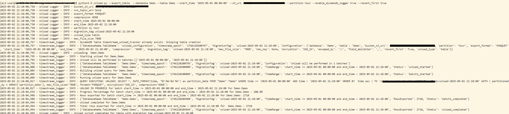
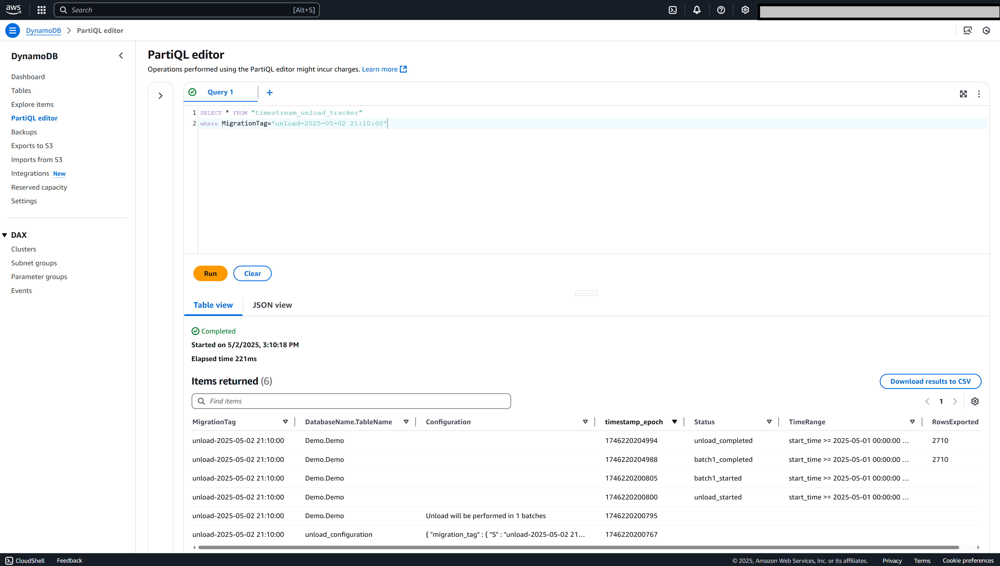

 

<h3>Export Amazon Timestream data to S3 with configurable options</h3>

<h2>Core Features</h2>

<h3>Export Capabilities</h3>
<ul>
<li>📊 Data Scope Options
<ul>
<li>Table export</li>
<li>Database export</li>
<li>All databases export</li>
</ul>
</li>
</ul>

<h3>Data Management</h3>
<ul>
<li>📁 File Organization
<ul>
<li>Flexible data partitioning (hour/day/month/year)</li>
<li>Customizable file size limits</li>
</ul>
</li>
<li>📦 Format Options 
<ul>
<li>Parquet support</li>
<li>CSV support</li>
<li>GZIP compression</li>
</ul>
</li>
</ul>

<h3>Optional Features</h3>
<ul>
<li>🔔 Monitoring
<ul>
<li>SNS notifications for migration completion</li>
<li>DynamoDB-based operation logging</li>
</ul>
</li>
<li>🔐 Security
<ul>
<li>Flexible encryption options</li>
<li>KMS integration</li>
</ul>
</li>
</ul>

<h2>Installation</h2>

See <a href="../README.md#installation">../README.md#Installation</a>.

<h2>Recommendations and Best Practices</h2>
<ol>
<li> If your target is <strong>Timestream for InfluxDB</strong> export in <strong>Parquet format</strong> and <strong>no compression</strong> to meet the ingestion scripts requirements </li>
<li>Enable DynamoDB logging for tracking and validation</li>
<li>Configure SNS notifications to receive failure or completion of export</li>
<li>If your target is <strong>Postgres</strong> choose <strong>CSV</strong>, <strong>GZIP compression</strong>, set <strong>`--append-timestamps` to false</strong>, and <strong>`--max-file-size` to 3GB</strong> to meet the ingestion script requirements. We recommend using AWS Database Migration Service (DMS) with source as S3 (both CSV and Parquet are supported) with PostgreSQL as the target. For scenarios where AWS DMS may not be suitable for your specific requirements, you can use our <a href="../targets/rds_for_postgresql/README.md">PostgreSQL ingestion tool</a> which provides a customizable solution for loading CSV data into PostgreSQL databases.</li>
<li>Tool uses <a href="https://docs.aws.amazon.com/timestream/latest/developerguide/export-unload.html" target="_blank" rel="noopener noreferrer" title="Learn more about unload functionality" aria-label="Read about AWS Timestream unload feature">Timestream unload Feature</a>. Unload has limitation on number of partitions, tool will overcome this by running unload in batches if required based and start time and end time provided</li>
<li>Tool supports partitioning by hour, day, month, or year (default is <strong>day</strong>). To avoid error "The query computation exceeds maximum available memory," make sure each partition under approximately 350GB. For example, if your yearly data in Timestream table exceeds 350GB, consider switching to monthly partitions, and if needed, go even more granular (e.g., daily or hourly) </li>
<li>  If you choose hourly and still get a “The query computation exceeds maximum available memory” error, you can reduce the number of partitions <strong>(--custom-partition-count)</strong> to a lower number, making sure your exports are successful</li>
<li>You can export single table, single database or all databases. If your requirement is more custom example: exporting multiple databases please write a wrapper on top of the existing automation </li>
<li>Tool provides option to export recent data first if you want to export in reverse order (i.e, latest data first)</li>
<li>If you are restarting the script due to failures, you could restart from the failed batch. During restart you could write to same bucket and proving the previous migration tag so all the files are created under same S3 prefix. If you prefer to create new files under new S3 prefix you may skip providing the migration tag </li>
<li>If you do not provide end timestamp, current timestamp is generated and used for unload to take consistent export/validation </li>
<li> Learn more about Timestream <a href ="https://docs.aws.amazon.com/timestream/latest/developerguide/export-unload-limits.html"target="_blank" rel="noopener noreferrer" title="Learn more about unload limitation" aria-label="Read about AWS Timestream unload feature limitation">unload limitation</a> </li>
</ol>

<h2>Usage</h2>
<h3>Basic Commands</h3>

<h4>Export a Single Table</h4>
<pre><code>python3.9 unload.py --export-table --database Demo --table Demo --start-time '2020-03-26 17:24:38'</code></pre>

<h4>Export with DynamoDB logging enabled</h4>
<pre><code>python3.9 unload.py --export-table --database Demo --table Demo --start-time '2020-03-26 17:24:38' --enable-dynamodb-logger true</code></pre>

<h4>Export Entire Database</h4>
<pre><code>python3.9 unload.py --export-database --database Demo --start-time '2020-03-26 17:24:38'</code></pre>

<h4>Export All Databases</h4>
<pre><code>python3.9 unload.py --export-all-databases --start-time '2020-03-26 17:24:38'</code></pre>

<h4>Export Example with end time, parition, s3 uri, dynamodb logging and sns notification </h4>
<pre><code>python unload.py --export-table --database MyDB --table MyTable --start-time '2024-01-01 00:00:00' --end-time '2024-02-01 00:00:00' --partition month --export-format PARQUET --compression GZIP --region us-east-1 --s3-uri s3://my-bucket --enable-dynamodb-logger --sns-topic-arn arn:aws:sns:region:account-id:topic-name</code></pre>

<h4>Export without appending extra timestamp columns (for Postgres migrations)</h4>
<pre><code>python3.9 unload.py --export-table --database Demo --table Demo --start-time '2020-03-26 17:24:38' --append-timestamps false</code></pre>

<h3>Required Parameters</h3>
<table>
<tr>
<th>Parameter</th>
<th>Description</th>
<th>Example</th>
</tr>
<tr>
<td><code>--start-time</code></td>
<td>UTC start timestamp (Format: 'YYYY-MM-DD HH:MM:SS')</td>
<td><code>'2024-01-01 00:00:00'</code></td>
</tr>
</table>

 

<h3>Optional Parameters</h3>
<table>
<tr>
<th>Parameter</th>
<th>Description</th>
<th>Example</th>
</tr>
<tr>
<td><code>-r, --region</code></td>
<td>AWS region of Timestream table <i>Default: Default region in AWS configuration</i></td>
<td><code>us-east-1</code></td>
</tr>
<tr>
<td><code>-d, --database</code></td>
<td>Timestream database name</td>
<td><code>MyTimeStreamDB</code></td>
</tr>
<tr>
<td><code>-t, --table</code></td>
<td>Timestream table name</td>
<td><code>SensorData</code></td>
</tr>
<tr>
<td><code>-s, --s3-uri</code></td>
<td>S3 Bucket URI <i>Default: Bucket will be created if not provided,s3://timestream-dump-{account_id}-{region} </i></td>
<td><code>s3://my-bucket</code></td>
</tr>
<tr>
<td><code>-p, --partition</code></td>
<td>Partition type (hour/day/month/year) <i>Default: day</i></td>
<td><code>day</code></td>
</tr>
<tr>
<td><code>-ef, --export-format</code></td>
<td>Export format (PARQUET/CSV) <i>Default: PARQUET</i></td>
<td><code>PARQUET</code></td>
</tr>
<tr>
<td><code>-c, --compression</code></td>
<td>Compression type (NONE/GZIP) <i>Default: NONE</i></td>
<td><code>GZIP</code></td>
</tr>
<tr>
<td><code>-e, --end-time</code></td>
<td>UTC end timestamp (Format: 'YYYY-MM-DD HH:MM:SS') <i>Default: current timestamp</i></td>
<td><code>'2024-01-02 00:00:00'</code></td>
</tr>
<tr>
<td><code>-sns, --sns-topic-arn</code></td>
<td>SNS Topic ARN for notifications</td>
<td><code>arn:aws:sns:region:account-id:topic-name</code></td>
</tr>
<tr>
<td><code>-edl, --enable-dynamodb-logger</code></td>
<td>Enable DynamoDB logging (true/false) <i>Default: false</i></td>
<td><code>true</code></td>
</tr>
<tr>
<td><code>-mt, --migration-tag</code></td>
<td>Custom tag for tracking exports <i>Default:unload-{datetime.now(timezone.utc).strftime('%Y-%m-%d-%H:%M:%S')}</i></td>
<td><code>production-export-jan122024</code></td>
</tr>
<tr>
<td><code>-ik, --kms-key</code></td>
<td>KMS key for encryption <i>Default: S3 bucket KMS key</i></td>
<td><code>arn:aws:kms:region:account-id:key/key-id</code></td>
</tr>
<tr>
<td><code>-en, --encryption</code></td>
<td>Encryption type (SSE_KMS/SSE_S3) <i>Default: SSE_S3</i></td>
<td><code>SSE_KMS</code></td>
</tr>
<tr>
<td><code>-ms, --max-file-size</code></td>
<td>Maximum file size in GB <i>Default: 78GB</i></td>
<td><code>50GB</code></td>
</tr>
<tr>
<td><code>--field-delimiter</code></td>
<td>CSV field delimiter character <i>Default: (,)</i></td>
<td><code>,</code></td>
</tr>
<tr>
<td><code>-eb, --escaped-by</code></td>
<td>CSV escape character <i>Default: (\)</i></td>
<td><code>\</code></td>
</tr>
<tr>
<td><code>--recent-first</code></td>
<td>Set to true to load data in reverse chronological order (most recent batch first) <i>Default: False</i></td>
<td><code>True</code></td>
</tr>
<tr>
<td><code>--custom-partition-count</code></td>
<td>Custom partition count for each batch <i>Default: 99</i></td>
<td><code>50</code></td>
</tr>
<tr>
<td><code>--order-by-asc</code></td>
<td>data order by time ascending <i>Default: False</i></td>
<td><code>True</code></td>
</tr>
<tr>
<td><code>--logs-dir</code></td>
<td>Directory for export logs (default: timestream-export-logs in current directory) <i>Default: timestream-export-logs in current directory</i></td>
<td><code>/data</code></td>
</tr>
<tr>
<td><code>--append-timestamps</code></td>
<td>For InfluxDB migrations. <a href="https://aws.amazon.com/athena">Amazon Athena</a> is used for <a href="../targets/timestream_for_influxdb/transform/README.md">transformations</a> and supports <a href="https://docs.aws.amazon.com/athena/latest/ug/data-types.html#data-types-timestamps">millisecond</a> precision. This flag appends an extra column for each measure of type `timestamp` to preserve nanosecond precision. <i>Default: True</i></td>
<td><code>True</code></td>
</tr>
</table>

<h2>Tracking the progress and checking rows exported</h2>
<li>Script logs the output on terminal</li>

<li>If you enabled DynamoDB, you can query for tracking or validation purpose from Console. Example below (SELECT * FROM "timestream_unload_tracker" where MigrationTag='unload-2025-05-02 21:10:00')</li>

</ol>

<h2>Contributing</h2>

Contributions are welcome! Please submit pull requests with any enhancements.

