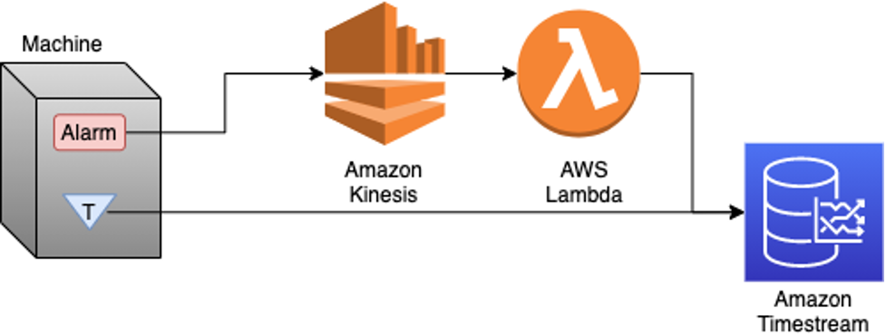

# Build Your First Timestream Enabled Python App

Use this repo to create a setup Amazon Timestream and Amazon Kinesis. Then connect to them both using the available scripts. You are able to stream metrics to Timestream using Kinesis or directly to Timestream. 

- **alarm_sensor.py**: A script that generates random alarm states
- **cleanup.py**: A script that cleans up all resouces created
- **initial_lambda_function.py**: The skeleton of the AWS Lambda Function to process records from Amazon kinesis to Amazon Timestream
- **Lambda-Role-Trust-Policy.json**: The trust policy for the AWS Lambda function
- **lambda_function.py**: The finalized AWS Lambda function
- **setup_kinesis.py**: A script that sets up Amazon Kinesis
- **setup_timestream.py**: A script that sets up Amazon Timestream
- **wave_sensor.py**: A script that generates sensor readings in a wave form


## Introduction
Amazon Timestream is a fast, scalable, and serverless time-series database service for IoT and operational applications that makes it easy to store and analyze trillions of events per day up to 1,000 times faster and at as little as 1/10th the cost of relational databases. Timestream is a great fit for IoT applications like sensors and alerts, DevOps applications including application metrics, analytics such as clickstream, and any other time-series data source.

Organizations have been working for years to find the right solution for time-series data. Often times the bar to entry for time-series databases can be set very high. Some of those difficulties include: setting up your time-series database, properly sizing your database, ingesting your data in a way that lets you query it efficiently and expiring your old data. I am going to lower that bar for Amazon Timestream. I will show you that you can handle your time-series data easily with a few lines of Python code. When you are done you will be able to set up a Timestream database, create a Timestream table, send data to Timestream using the Python SDK, send data to Timestream using Amazon Kinesis, and tear down everything that you built. 

## Solution Overview
Below is the architecture you will build. You will be simulating a sensor and an alarm with Python code. The code in this tutorial is written for simplicity and illustration and is not designed for production or elegance. 



## Prerequisites
1)	Installed AWS CLI
2)	Understanding of AWS Lambda
3)	Understanding of AWS Identity and Access Management (IAM) 
4)	User with AmazonTimestreamFullAccess, AmazonKinesisFullAccess, AWSLambda_FullAccess and programmatic access
5)	Python 3 installed

## Walkthrough
To begin, you need to configure your AWS CLI to use the credentials for your user. 
1)	Enter into the command line: aws configure
2)	Enter your Access Key: XXXXXXXXXXXXXXXXXXXX
3)	Enter your Secret Access Key: XXXXXXXXXXXXXXXXXXXXXXXXXXXXXXXXXXXXXXX
4)	Enter the region you want to work in, I recommend: us-east-1
5)	Enter your output format: json
Next, you need to set up the Timestream Database. You will use boto3 to do this so that it is repeatable and documented in the same project. Setting up a Timestream database is simple to do using Python. In this case you are going to create a script to create the database, and a single table.

```python
#setup_timestream.py
import boto3
from botocore.config import Config

DATABASE_NAME = "DemoDatabase"
TABLE_NAME1 = "WeatherMetrics"
MEMORY_STORE_HOURS=1
MAGNETIC_STORE_PERIOD_DAYS=7

def create_database(client):
    print("Creating Database")
    try:
        client.create_database(DatabaseName=DATABASE_NAME)
        print("Database {} created successfully.".format(DATABASE_NAME))
    except client.exceptions.ConflictException:
        print("Database {} exists. Skipping database creation".format(DATABASE_NAME))
    except Exception as err:
        print("Create database failed:", err)

def create_table(client):
    print("Creating table")
    retention_properties = {
        'MemoryStoreRetentionPeriodInHours': MEMORY_STORE_HOURS,
        'MagneticStoreRetentionPeriodInDays': MAGNETIC_STORE_PERIOD_DAYS
        }
    try:
        client.create_table(DatabaseName=DATABASE_NAME, TableName=TABLE_NAME1,
                            RetentionProperties=retention_properties)
        print("Table {} successfully created.".format(TABLE_NAME1))
    except client.exceptions.ConflictException:
        print("Table {} exists on database {}. Skipping table creation".format(
        TABLE_NAME1, DATABASE_NAME))
    except Exception as err:
        print("Create table failed:", err)

def authenticate():
    session = boto3.Session()
    client = session.client('timestream-write', config=Config(read_timeout=20, 
                                                              max_pool_connections=5000,
                                                              retries={'max_attempts': 10}))
    return client

if __name__ == "__main__":
    client = authenticate()
    create_database(client)
    create_table(client)
```

Executing `python setup_timestream.py` will create a Timestream database. The database will contain a single table called WeatherMetrics for you to publish metrics to. 

The next piece of serverless infrastructure you need is Amazon Kinesis. In general, most of your metrics can be sent directly to Timestream. Free text on the other hand can generate large amounts of data that is not a very good fit for time-series. You want to process that data using AWS Lambda. You will pull out the relevant time-series data from the free text. Then store the time-series data in Timestream and store the free text in a database designed specifically for free text, like the Amazon Elasticsearch Service. To set up Kinesis you follow a very similar process to setting up Timestream.

```python
#setup_kinesis.py
import boto3
from botocore.config import Config
import json

STREAM_NAME = "TUTORIAL"
SHARD_COUNT = 1

def create_stream(client):
    print("Creating Stream")
    try:
        client.create_stream(StreamName=STREAM_NAME,
                             ShardCount=SHARD_COUNT)
        print("Stream {} created successfully.".format(STREAM_NAME))
    except client.exceptions.ResourceInUseException:
        print("Stream {} exists. Skipping Stream creation".format(STREAM_NAME))
    except Exception as err:
        print("Create stream failed:", err)

def add_tags(client):
    print("Adding Tags")
    try:
        client.add_tags_to_stream(StreamName=STREAM_NAME,
                                  Tags=build_tags())
        print("Tags added")
    except exeption as e:
        print("Could not add tags: {}".format(e))

def build_tags():
    return {"ENVIRONMENT":"TUTORIAL"}

def authenticate():
    session = boto3.Session()
    client = session.client('kinesis', config=Config(read_timeout=20, 
						        max_pool_connections=5000,
                                                     retries={'max_attempts': 10}))
    return client

if __name__ == "__main__":
        client = authenticate()
        create_stream(client)
        add_tags(client)

```

In this case when you issue the command python setup_kinesis.py you will create a Kinesis data stream called TUTORIAL with a single shard. In production use cases you will want to size your number of shards based on your expected throughput. For the demo you do not need any more than a single shard. You also add a tag to your data stream labeling the environment TUTORIAL.
Next, you need to create the skeleton for your AWS Lambda function. Because Lambda does not currently support Timestream you will have to go through creating a role, and trust policy and a python virtual environment. When you issue the create-function in the AWS Command Line Interface name the function kinesis-log-consumer. When you create the role you need to assign the following Policies: AmazonKinesisReadOnlyAccess, AmazonTimestreamFullAccess, AmazonLambdaBasicExecutionRole. Instructions can be found here: Build AWS Lambda functions using Amazon Timestream with Python Use the following code as the skeleton for the lambda function. 

```python
# lambda_function.py
import json
import boto3
from botocore.config import Config
import time
import base64

DATABASE_NAME = "DemoDatabase"
TABLE_NAME = "WeatherMetrics"

def lambda_handler(event, context):
    session = boto3.Session()

    write_client = session.client('timestream-write', 
                                  config=Config(read_timeout=20, 
                                                max_pool_connections=5000,
                                                retries={'max_attempts': 10}))
    records = event.get("Records")
    for record in records:
        try:
            # Process your record
            data = base64.b64decode(record["kinesis"]["data"])
            print(data)
        except Exception as e:
            # Return failed record's sequence number
            print("error: {}".format(e))

Currently, this lambda function does not appear to do anything. To test it you will need to use the following JSON:
{
    "Records": [
        {
            "kinesis": {
                "kinesisSchemaVersion": "1.0",
                "partitionKey": "1",
                "sequenceNumber": "49590338271490256608559692538361571095921575989136588898",
                "data": "aWQ9YidceDljXHg4N3Y+XHg5MVx4YThceDExXHhlYlx4OTRceGUyXHhhY1x4ZGVIXHgwMFx4MTEiJ3x8c3RhdHVzPU5vcm1hbHx8dGltZT0xNjE3MTQzODkzMTU4fHxsb2NhdGlvbj1CTE9HfHxzZW5zb3I9QWxhcm0=",
                "approximateArrivalTimestamp": 1607497475.000
            }
        }
    ]
}
```

Next, you need to connect the Lambda function to your Kinesis data stream. The easiest way to do that is with the AWS CLI. 


`aws lambda create-event-source-mapping --function-name kinesis-log-consumer \`
`--batch-size 10 --starting-position TRIM_HORIZON \`
`--event-source-arn arn:aws:kinesis:<region>:<accountnumber>:stream/TUTORIAL`

This command will create the trigger for your lambda function and connect the lambda to the kinesis data stream you created earlier. 

To get data into Timestream you can build an iterator for the sensor metrics.

```python
#wave_sensor.py
import time
import boto3
from botocore.config import Config

DATABASE_NAME = "DemoDatabase"
TABLE_NAME = "WeatherMetrics"

def create_record(measurement):
    dimensions = [{"Name":"Location","Value":"Tutorial"},
		 {"Name":"Sensor","Value":"1"}]
    measurement['Dimensions'] = dimensions
    measurements = []
    measurements.append(measurement)
    return measurements

def create_measurement(metric):
    result = {}
    result["MeasureName"] = "Temperature"
    result["MeasureValue"] = metric
    result["MeasureValueType"] = "DOUBLE"
    result["Time"] = str(int(time.time()*1000))
    result["TimeUnit"] = "MILLISECONDS"
    return result


def generate_wave(high, low, start, client):
    x = start
    y = 1
    while True:
        if y > 0 and x < high - 2:
            y = 1
        elif y > 0 and x > high -2:
            y = -1
        elif y < 0 and x < low + 2:
            y = 1
        x = x + y
        measurement = create_measurement(str(x))
        records = create_record(measurement)
        print(records)
        result = client.write_records(DatabaseName=DATABASE_NAME,
                                      TableName=TABLE_NAME,
                                      Records=records,
                                      CommonAttributes={})
        print(result)
        time.sleep(1)


def authenticate():
    session = boto3.Session()
    client = session.client('timestream-write', config=Config(read_timeout=20,
                                                              max_pool_connections=5000,
                                                              retries={'max_attempts': 10}))
    return client

if __name__ == "__main__":
    client = authenticate()
    generate_wave(100, 32, 60, client)
```

This script will generate measurements ranging from 32 to 100. The measurements will be created once per second and published to Timestream. Important things to notice in this script are that the time and the measure values are both strings. Another important part of this script is the common attributes. If you had the ability to aggregate sensor measures or were getting data from multiple sensors, you could use the Common Attributes to reduce your payload and optimize your costs. You would do this by removing the dimensions that are repeated across measurements and instead, store them in Common Attributes. This saves on ingestion costs by reducing the ingestion payload, thus lowing ingestion costs. While common attributes do not fit with this specific example, it is something to keep in mind moving forward. In this script you can speed up or slow down the rate at which you generate the sensor reading by adjusting the sleep time. To have more sensors you can duplicate this file and change the sensor value in the dimensions. To see your data you can log into the AWS Management Console, Navigate to the Timestream query editor and issue the following query:

`select * from DemoDatabase.WeatherMetrics where time >= ago(1m)`

You will see your sensor readings from the script you just ran. It is important to always bound your queries with a time range. This prevents the query from scanning data that does not need to be scanned and incurring extra charges. 

Next, you need to get alarm data. This data will go through Kinesis where you will process the data using lambda before storing analyzed data in Timestream.

```python
#alarm_sensor.py
import time
import random
import uuid
import boto3
from botocore.config import Config
import base64

STREAM_NAME = "TUTORIAL"

def generate_reading(client):
    while True:
        x = int(random.uniform(0,25))
        if x <= 20:
            status = "Normal"
        if x > 20 < 24:
            status = "Elevated"
        if x >= 24:
            status = "Alarm"

        uid = repr(uuid.uuid1().bytes)

        tm = str(int(time.time()*1000))

        data = "id={}||status={}||time={}||location={}||sensor={}".format(uid, 
                                                                          status, 
                                                                          tm, 
                                                                          "TUTORIAL", 
                                                                          "Alarm-1")
        byte_payload = base64.b64encode((data).encode('ascii'))
        result = client.put_record(StreamName=STREAM_NAME,
                                       Data=byte_payload,
                                       PartitionKey="0")
        print(result)
        time.sleep(1)


def authenticate():
    session = boto3.Session()
    client = session.client('kinesis', config=Config(read_timeout=20,
                                                     max_pool_connections=5000,
                                                     retries={'max_attempts': 10}))
    return client

if __name__ == "__main__":
        client = authenticate()
        generate_reading(client)
```

This script will generate log data that is double pipe delimited. 

`id='\xcf\xf0f\x18\xa2\x18\x11\xeb\xa8H\x065A\xa8\xc1'||status=Normal||time=1618951301648||location=TUTORIAL||sensor=Alarm-1`

The log data is sent to the kinesis data stream you created earlier. Some of the data in these logs makes sense to be stored in Timestream. The values like location and sensor you will turn into dimensions. The measure value in these logs is status. You can turn that into an enum or store it as plain text. The time will be stored as the timestamp. And id will be discarded as you do not have a need for it in Timestream. If necessary, you could store this entire log record in another solution like Amazon Elasticsearch in addition to Timestream but that is outside the scope of this tutorial. 

Now you have all main pieces of your infrastructure to generate, store and process your data. You just need to update your lambda function to process your alarm data in kinesis so you can store your alarm state in Timestream. 

```python
# lambda_function.py
import json
import boto3
from botocore.config import Config
import time
import base64

DATABASE_NAME = "DemoDatabase"
TABLE_NAME = "WeatherMetrics"

def create_record(measurement, location, sensor):
    dimensions = [{"Name":"Location","Value":location},
                  {"Name":"Sensor","Value":sensor}]
    measurement['Dimensions'] = dimensions
    measurements = []
    measurements.append(measurement)
    return measurements

def create_measurement(status, timestamp):
    result = {}
    result["MeasureName"] = "Alarm"
    result["MeasureValue"] = status
    result["MeasureValueType"] = "VARCHAR"
    result["Time"] = timestamp
    result["TimeUnit"] = "MILLISECONDS"
    return result

def lambda_handler(event, context):
    session = boto3.Session()

    write_client = session.client('timestream-write',
                                  config=Config(max_pool_connections=5000,
                                                retries={'max_attempts': 10}))
    records = event.get("Records")
    for record in records:
        try:
            # Process your record
            data = record["kinesis"]["data"]
            print(data)
            data = str(base64.b64decode(base64.b64decode(data)))[2:-1]
            data_split = data.split("||")
            new_dict = {}
            for entry in data_split:
                key, value = entry.split("=")
                new_dict[key] = value
            measurement = create_measurement(new_dict['status'], new_dict['time'])
            records = create_record(measurement, new_dict['location'], new_dict['sensor'])
            result = write_client.write_records(DatabaseName=DATABASE_NAME,
                                                TableName=TABLE_NAME,
                                                Records=records,
                                                CommonAttributes={})
            print(result)

        except Exception as e:
            # Return failed record's sequence number
            print("error: {}".format(e))
            return {"batchItemFailures":[{"itemIdentifier":record["kinesis"]["sequenceNumber"]}]}

    return {"batchItemFailures":[]}
```

This function decodes the data you stored in Kinesis. Then, splits the data and stores it in a dictionary. The dictionary is then used to generate the dimensions and measure for your alarm status. You then push the alarm state to Timestream. You set the timestamp of the measurement using the timestamp that you store in kinesis, not the timestamp that the message was delivered. Start the alarm_sensor.py script to generate data in Kinesis. Then to see your data you can log into the AWS console, navigate to the Timestream query editor and issue the following query:
select * from DemoDatabase.WeatherMetrics where time >= ago(1m)
You will see your sensor readings from the script you just ran. With both the alarm_sensor.py script and wave_sensor.py script you will be able to issue queries and correlate data using Timestream. 

## Clean Up
Now you need to clean up all the resources and services you created. The following script will help you do that. 

```python
#cleanup.py
import boto3
import argparse
from botocore.config import Config
import json

STREAM_NAME = "TUTORIAL"
DATABASE_NAME = "DemoDatabase"
TABLE_NAME1 = "WeatherMetrics"
FUNCTION_NAME = "kines:wqis-log-consumer"

def delete_stream(client):
	print("Deleting stream")
	try:
	    result = client.delete_stream(StreamName=STREAM_NAME)
	except client.exceptions.ResourceNotFoundException:
	    print("Stream doesn't exist")
	except Exception as err:
		print("Delete stream failed:", err)

def delete_database(client):
	print("Deleting database")
	try:
	    result = client.delete_database(DatabaseName=DATABASE_NAME)
	except client.exceptions.ResourceNotFoundException:
	    print("Database doesn't exist")
	except Exception as err:
	    print("Describe database failed:", err)

def delete_table(client):
	print("Deleting table")
	try:
		client.delete_table(DatabaseName=DATABASE_NAME, TableName=TABLE_NAME1)
		print("Table {} successfully deleted.".format(TABLE_NAME1))
	except Exception as err:
		print("Delete table failed:", err)

def delete_lambda(client):
	print("Deleting function")
	try:
		client.delete_function(FunctionName=FUNCTION_NAME)
		print("Function {} successfully deleted.".format(FUNCTION_NAME))
	except Exception as err:
		print("Delete function failed:", err)

def authenticate_kinesis():
	session = boto3.Session()
	client = session.client('kinesis')
	return client

def authenticate_timestream():
	session = boto3.Session()
	global client
	client = session.client('timestream-write', config=Config())
	return client

def authenticate_lambda():
	session = boto3.Session()
	global client
	client = session.client('lambda', config=Config())
	return client


if __name__ == "__main__":
	parser = argparse.ArgumentParser()
	args = parser.parse_args()
	kinesis_client = authenticate_kinesis()
	delete_stream(kinesis_client)
	timestream_client = authenticate_timestream()
	delete_table(timestream_client)
	delete_database(timestream_client)
	lambda_client = authenticate_lambda()
	delete_lambda(lambda_client)
```

Executing python cleanup.py will delete the Timestream table and database, the Kinesis stream and the Lambda function you created earlier. This will also delete any data associated with the tables and streams.

## Conclusion
Now you know how to setup Timestream, setup Kinesis, connect Kinesis to Timestream using Lambda, send data to Timestream using Python, and send data to Timestream through Kinesis. You can take that knowledge and start to build out new solutions that solve time-series based problems that would have been difficult before. You can now solve problems where data is both in key-value pairs or stored inside text that must be parsed. Now try ingesting data from a real application. For additional reading about Timestream check out these blogs here: AWS Blog - Timestream. 